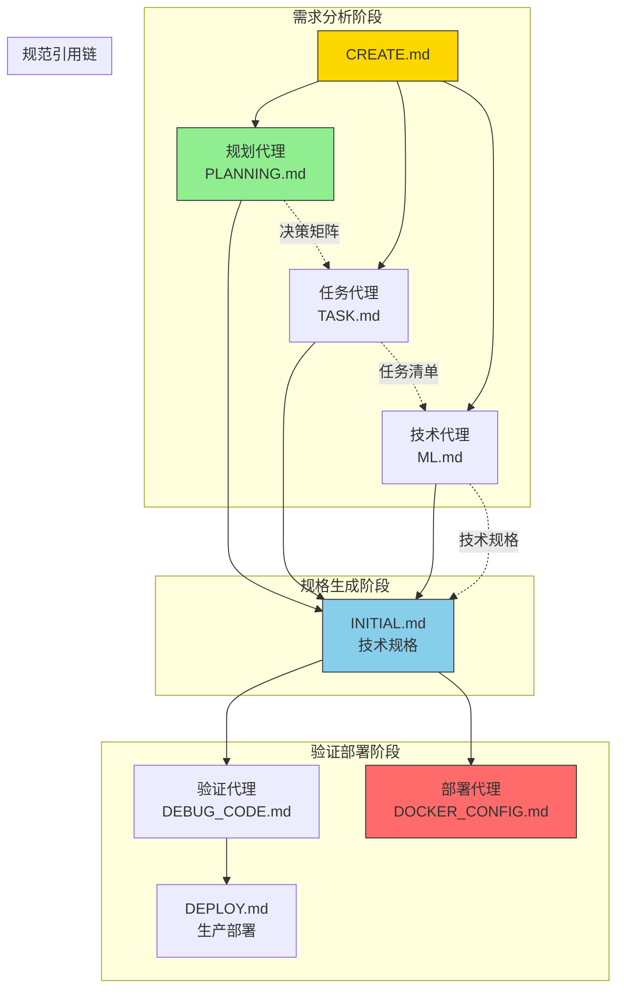
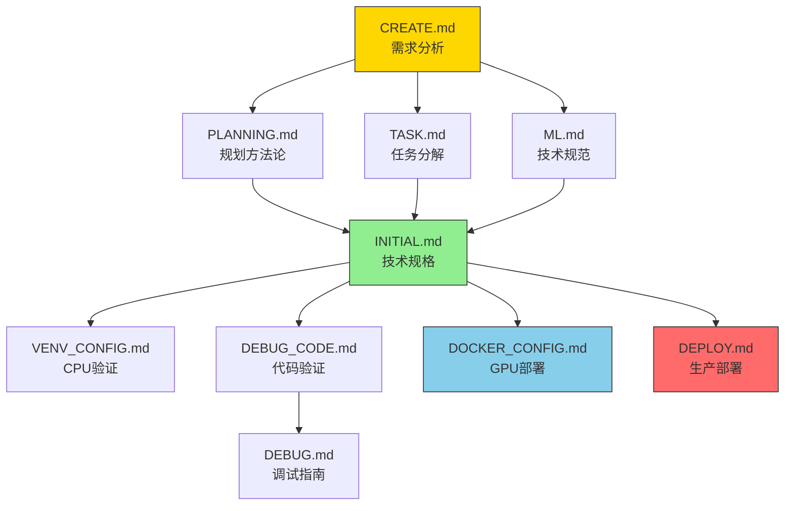
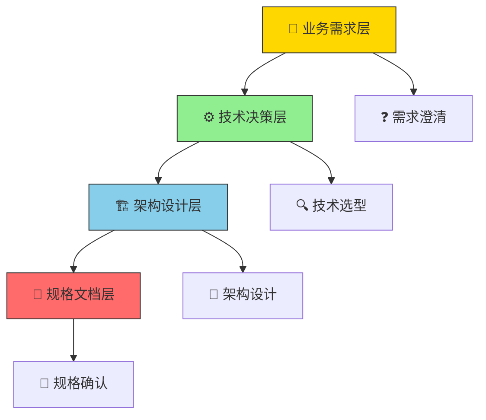
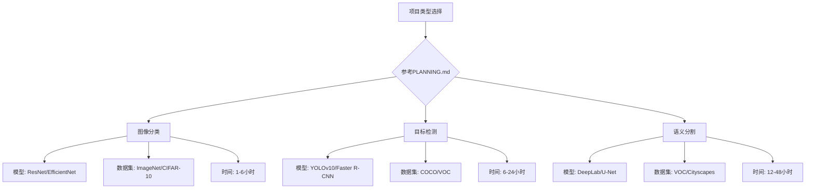
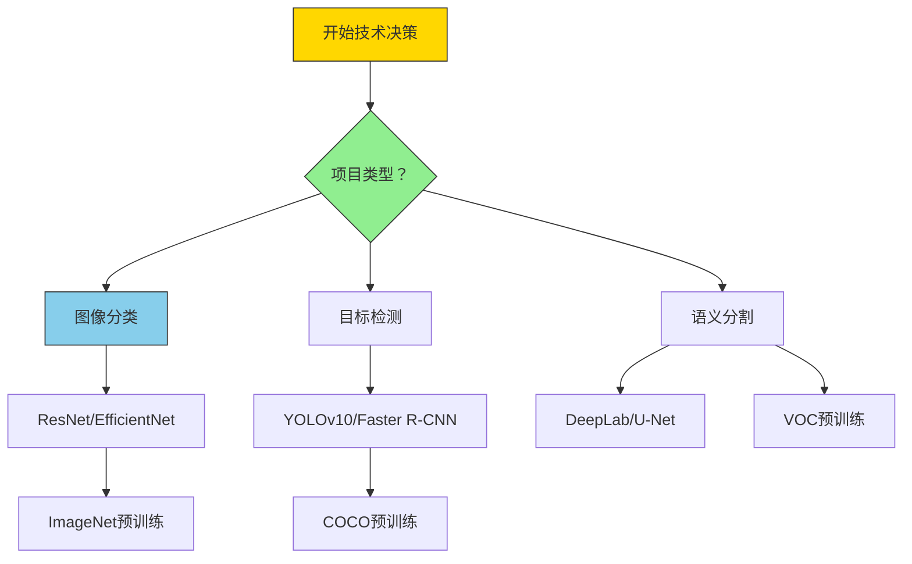
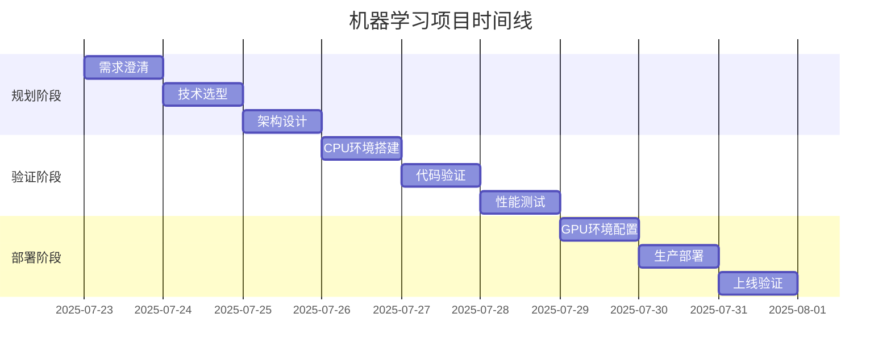

# 🎯 项目创建规划指南

> **革命性的15分钟深度思考法** - 通过系统化文字规划避免90%的项目返工，让每个技术决策都有据可依。

## 🤖 多智能体规范引用体系（Spec-Driven Multi-Agent System）

### 🎯 智能体协作架构

本规划指南是**多智能体规范驱动系统**的核心入口，通过精确的规范引用确保AI代理团队的高效协作。每个智能体都有明确的职责边界和引用规范。

#### 📊 多智能体职责矩阵

| 智能体角色 | 核心文档 | 规范引用位置 | 输入规范 | 输出规范 | 验证标准 |
|------------|----------|--------------|----------|----------|----------|
| **规划代理** | [PLANNING.md](./PLANNING.md) | 第2章"Think Hard框架" | CREATE.md需求描述 | 技术决策矩阵 | 15分钟标准流程 |
| **任务代理** | [TASK.md](./TASK.md) | 第3章"任务分解模板" | PLANNING.md决策结果 | 任务分解清单 | 100%覆盖率 |
| **技术代理** | [ML.md](./ML.md) | 第1章"框架版本矩阵" | TASK.md任务规格 | 技术选型方案 | 性能基准验证 |
| **验证代理** | [DEBUG_CODE.md](./DEBUG_CODE.md) | 全程验证清单 | INITIAL.md技术规格 | 验证报告 | 零配置漂移 |
| **部署代理** | [DOCKER_CONFIG.md](./DOCKER_CONFIG.md) | 第4章"部署规范" | 验证报告通过 | 部署清单 | GPU利用率>90% |

#### 🔄 智能体协作流程图



#### 📋 规范引用精确位置

**规划代理规范引用**:
- 📍 使用PLANNING.md第2章"Think Hard框架"进行15分钟深度分析
- 📍 引用ML.md第1章"框架版本矩阵"进行技术选型
- 📍 依据TASK.md第3章"任务分解模板"制定实施计划

**任务代理规范引用**:
- 📍 基于PLANNING.md的技术决策进行任务分解
- 📍 使用ML.md的硬件需求评估制定资源计划
- 📍 输出符合INITIAL.md标准的任务清单

**技术代理规范引用**:
- 📍 根据CREATE.md的需求澄清选择技术栈
- 📍 使用ML.md的性能基准验证技术可行性
- 📍 生成INITIAL.md中的技术规格文档

### 🎯 智能体使用指南

#### 对于AI编码代理
1. **需求分析阶段**: 从CREATE.md开始，引用PLANNING.md进行15分钟Think Hard
2. **技术选型阶段**: 参考ML.md的框架版本矩阵进行决策
3. **任务分解阶段**: 使用TASK.md的任务模板确保完整性
4. **验证阶段**: 按照DEBUG_CODE.md的清单逐项验证
5. **部署阶段**: 遵循DOCKER_CONFIG.md和DEPLOY.md的规范

#### 对于用户
每个决策点都有对应的规范文档支撑，每个技术选择都有明确的验证标准，每个实现步骤都有规范化的检查清单。

### 📊 规范驱动验证标准

| 验证阶段 | 规范文档 | 智能体职责 | 验收标准 | 时间限制 |
|----------|----------|------------|----------|----------|
| **需求澄清** | CREATE.md+PLANNING.md | 规划代理 | 15分钟Think Hard完成 | 15分钟 |
| **技术选型** | ML.md+TASK.md | 技术代理 | 框架决策有理有据 | 10分钟 |
| **任务分解** | TASK.md+PLANNING.md | 任务代理 | 任务清单100%覆盖 | 5分钟 |
| **规格确认** | INITIAL.md | 所有代理 | 技术规格完整准确 | 5分钟 |

#### 🔄 规范（Spec）驱动流程图



#### 📋 规范（Spec）使用指南

**对于编码智能体（AI Agent）**：
1. **需求分析阶段**：从CREATE.md开始，引用PLANNING.md的方法论
2. **技术选型阶段**：参考ML.md的框架版本矩阵进行决策
3. **任务分解阶段**：使用TASK.md的任务模板确保完整性
4. **验证阶段**：按照DEBUG_CODE.md的清单逐项验证
5. **部署阶段**：遵循DOCKER_CONFIG.md和DEPLOY.md的规范

**对于用户**：
- 每个决策点都有对应的规范（Spec）文档支撑
- 每个技术选择都有明确的验证标准
- 每个实现步骤都有规范（Spec）化的检查清单

## 🧠 核心规划理念

### 💡 为什么需要深度思考？

传统项目创建的四大痛点：
- **盲目启动**：直接复制代码，后期发现架构缺陷
- **技术债累积**：框架选型失误导致项目重构
- **性能瓶颈**：硬件资源评估不足，训练无法完成
- **维护困难**：技术栈与团队能力不匹配

**深度思考的价值**：15分钟系统规划 = 节省15天返工时间

### 🎯 三层决策架构



## 🧠 深度思考决策框架

### 📊 15分钟黄金分配法则

| 决策维度 | 时间分配 | 核心问题 | 决策影响 |
|----------|----------|----------|----------|
| **业务价值** | 5分钟 | 解决什么核心问题？ | 确定项目方向 |
| **技术可行性** | 4分钟 | 技术栈能否支撑？ | 规避技术风险 |
| **资源评估** | 3分钟 | 计算资源需求？ | 控制项目成本 |
| **时间规划** | 3分钟 | 预期交付周期？ | 管理项目进度 |

### 🎯 业务价值澄清（5分钟黄金思考）

#### **核心价值三问法**

1. **问题定义**（2分钟）
   ```markdown
   - 具体解决什么问题？
   - 现有解决方案的痛点？
   - 解决后带来什么价值？
   
   示例：
   问题：医疗CT影像肺结节检测人工阅片耗时
   痛点：医生需要30分钟/例，易疲劳漏诊
   价值：减少到3分钟/例，提高早期诊断率
   ```

2. **场景分析**（2分钟）
   ```markdown
   - 使用场景：实时还是离线？
   - 用户群体：医生、工程师、普通用户？
   - 使用频率：每天几次、持续多久？
   
   示例：
   场景：医院放射科，离线批量处理
   用户：放射科医生，医学背景
   频率：每天100例，持续使用
   ```

3. **成功标准**（1分钟）
   ```markdown
   - 量化指标：准确率、速度、内存占用
   - 验收标准：什么算项目成功？
   - 失败条件：什么情况下需要停止？
   
   示例：
   指标：mAP@0.5 ≥ 0.85，推理时间 ≤ 200ms/张
   标准：医生认可，临床试用成功
   失败：准确率低于80%或内存超过8GB
   ```

### ⚙️ 技术可行性评估（4分钟技术决策）

#### 📋 规范（Spec）驱动技术选型

**技术选型必须遵循以下规范（Spec）文档**：

1. **框架选择** → 参考[ML.md](./ML.md)的【框架版本矩阵】
2. **模型架构** → 参考[PLANNING.md](./PLANNING.md)的【项目类型决策树】
3. **硬件需求** → 参考[ML.md](./ML.md)的【硬件需求评估表】
4. **配置验证** → 参考[DEBUG_CODE.md](./DEBUG_CODE.md)的【环境检查】章节

#### **任务类型决策树（规范（Spec）引用）**

基于[PLANNING.md](./PLANNING.md)的规范（Spec），项目类型选择如下：



#### **任务类型决策树**



#### **框架选择决策矩阵**

| 评估维度 | 权重 | PyTorch评分 | Paddle评分 | 决策逻辑 |
|----------|------|-------------|------------|----------|
| **团队能力** | 35% | ★★★★☆ (4.0) | ★★★☆☆ (3.0) | 学习成本vs开发效率 |
| **部署生态** | 25% | ★★★★☆ (4.0) | ★★★★☆ (4.0) | 生产环境成熟度 |
| **性能表现** | 25% | ★★★☆☆ (3.0) | ★★★★☆ (4.0) | 推理优化能力 |
| **社区支持** | 15% | ★★★★★ (5.0) | ★★★☆☆ (3.0) | 问题解决效率 |
| **综合得分** | 100% | **3.95** | **3.45** | **推荐PyTorch** |

### 📐 资源评估策略（3分钟精确计算）

#### **GPU内存需求计算**

```markdown
# 内存需求计算公式
GPU内存 = 模型参数 + 激活值 + 优化器状态 + 数据缓存

示例计算（YOLOv10-nano）:
- 模型参数：5MB
- 激活值：batch_size × 特征图 × 通道数 ≈ 2GB (batch=16)
- 优化器状态：参数 × 2 ≈ 10MB
- 数据缓存：500MB
- 总计：~3GB (安全余量：6GB)

结论：RTX 3060 8GB显存充足，可支持batch_size=32
```

#### **训练时间估算**

```markdown
# 训练时间计算
epoch_time = (数据量 / batch_size) × 单批次时间

示例：
- 数据集：COCO2017，118k张图片
- batch_size：16
- 单批次时间：500ms (RTX 3060)
- epoch_time = (118000/16) × 0.5s ≈ 1小时

300 epochs ≈ 300小时 ≈ 12.5天
优化策略：使用预训练模型，减少至50 epochs ≈ 2天
```

### 📅 时间规划框架（3分钟里程碑设计）

#### **项目时间线**



## 🎯 需求收集文字化模板

### 📋 项目基础信息（文字描述版）

#### **项目身份定义**
```markdown
项目名称：[简洁明确的名称，如yolov10_medical]
项目类型：[classification|detection|segmentation]
应用领域：[医疗影像|自动驾驶|工业质检|安防监控]
一句话描述：[用20字以内描述项目核心目标]
```

#### **场景化需求描述**
```markdown
# 场景描述模板
使用场景：
- 时间：[实时/离线批处理/定时任务]
- 地点：[云端服务器/本地设备/边缘计算]
- 用户：[技术背景/使用频率/操作复杂度]

业务价值：
- 当前痛点：[具体描述现有问题]
- 解决效果：[量化改善指标]
- 成功标准：[可测量的验收条件]

约束条件：
- 硬件限制：[GPU型号/内存大小/计算能力]
- 时间要求：[开发周期/上线时间]
- 成本预算：[计算成本/人力成本]
```

### 🎯 算法功能需求（文字精确描述）

#### **输入输出规格**
```markdown
输入规格描述：
- 数据格式：[图像/文本/音频/视频]
- 分辨率/尺寸：[如512×512 RGB图像]
- 数据量：[训练集大小/验证集大小/测试集大小]
- 质量要求：[分辨率要求/噪声容忍度/缺失值处理]

输出规格描述：
- 输出格式：[类别概率/边界框坐标/分割掩码]
- 精度要求：[准确率/mAP/F1-score的具体数值]
- 延迟要求：[单样本处理时间/吞吐量]
- 可靠性：[99%可用性/错误恢复机制]
```

#### **性能目标设定**
```markdown
# SMART原则设定性能目标
具体(Specific)：
- 检测准确率：mAP@0.5 ≥ 0.85
- 推理速度：单张图像 ≤ 200ms
- 内存占用：GPU显存 ≤ 6GB

可衡量(Measurable)：
- 使用标准测试集评估
- 性能指标可重复验证
- 提供置信区间

可达成(Achievable)：
- 基于现有技术能力
- 考虑硬件资源限制
- 预留优化空间

相关性(Relevant)：
- 直接关联业务价值
- 用户可感知的改善
- 符合行业标准

时限(Time-bound)：
- 开发周期：2周
- 验证周期：1周
- 上线周期：1周
```

## 🎯 技术选型决策框架

### 📊 决策矩阵文字化应用

#### **框架选择文字决策过程**

```markdown
# PyTorch vs PaddlePaddle 文字决策记录

**项目背景**：医疗影像检测，团队2人，1人有PyTorch经验

**评估维度**（权重基于项目特点）：

1. **团队熟悉度**（权重40%）
   - PyTorch：★★★★☆（4分）- 1人有经验，学习成本低
   - Paddle：★★☆☆☆（2分）- 需要学习，但中文文档优势
   
2. **部署便利性**（权重30%）
   - PyTorch：★★★☆☆（3分）- Docker部署成熟
   - Paddle：★★★★☆（4分）- 服务器端优化更好
   
3. **医疗生态**（权重20%）
   - PyTorch：★★★★★（5分）- 医疗AI开源模型丰富
   - Paddle：★★★☆☆（3分）- 医疗案例相对较少
   
4. **性能优化**（权重10%）
   - PyTorch：★★★☆☆（3分）- 通用优化
   - Paddle：★★★★☆（4分）- 针对中文数据优化

**决策计算**：
- PyTorch：4×0.4 + 3×0.3 + 5×0.2 + 3×0.1 = 3.8分
- Paddle：2×0.4 + 4×0.3 + 3×0.2 + 4×0.1 = 3.0分

**最终决策**：选择PyTorch，原因：
1. 团队学习成本最低
2. 医疗AI生态最丰富
3. 部署方案成熟可靠
```

## 🎯 架构设计文字指导

### 🏗️ 目录结构文字描述

#### **标准项目架构**

```markdown
项目根目录/[your_project_name]/
├── src/                           # 核心代码（≤200行高层API）
│   ├── models/                    # 模型定义（框架无关接口）
│   │   ├── pytorch/              # PyTorch实现（≤150行）
│   │   └── paddle/               # PaddlePaddle实现（≤150行）
│   ├── datasets/                  # 数据处理（统一接口）
│   └── utils/                     # 工具函数（≤50行）
├── configs/                       # 配置管理（OmegaConf驱动）
│   ├── config.yaml               # 主配置入口
│   ├── model/                    # 模型配置模板
│   ├── data/                     # 数据集配置
│   └── trainer/                  # 训练策略配置
├── scripts/                       # 训练脚本（简洁入口）
├── deploy/                        # 部署配置（Docker化）
└── tests/                         # 验证测试
```

### 📋 规格确认检查清单

#### **技术规格文字确认**

```markdown
✅ 项目基础信息确认
- [ ] 项目名称：简洁明确，易于理解
- [ ] 项目类型：分类/检测/分割，选择准确
- [ ] 应用场景：具体清晰，避免模糊描述
- [ ] 目标用户：明确使用者和受益者

✅ 技术方案确认
- [ ] 框架选择：有明确的决策依据
- [ ] 模型架构：符合任务特点
- [ ] 数据策略：可获取且质量可控
- [ ] 性能目标：基于实际测试数据

✅ 资源需求确认
- [ ] 计算资源：GPU型号、内存需求明确
- [ ] 存储资源：数据量、模型大小估算
- [ ] 开发时间：各阶段里程碑清晰
- [ ] 维护成本：长期运营考虑周全

✅ 风险评估确认
- [ ] 技术风险：备选方案准备
- [ ] 数据风险：质量、版权、隐私
- [ ] 资源风险：硬件、人力、时间
- [ ] 交付风险：验收标准明确
```

## 🎯 项目计划生成

### 📄 INITIAL.md文字模板

完成Think Hard后，将以下信息用**精确文字描述**写入INITIAL.md：

```markdown
# 项目创建规划记录

## 需求分析（文字精确描述）
**项目定义**：
- 名称：[具体项目名称]
- 类型：[classification/detection/segmentation]
- 场景：[详细使用场景描述]
- 价值：[量化业务价值]

**性能目标**：
- 准确率：[具体数值及测试方法]
- 速度：[单样本处理时间]
- 资源：[GPU内存/CPU核心要求]

## 技术决策（文字决策记录）
**框架选择**：
- 选择：[PyTorch/PaddlePaddle]
- 理由：[基于决策矩阵的详细分析]
- 备选：[如果主方案失败的后备方案]

**模型架构**：
- 主模型：[具体模型名称及版本]
- 输入规格：[分辨率/通道数/数据类型]
- 输出规格：[类别数/格式/精度要求]

## 实施策略（文字时间规划）
**阶段划分**：
- 规划阶段：[需求澄清 + 技术选型，1天]
- 验证阶段：[CPU环境 + 代码验证，2天]
- 部署阶段：[GPU优化 + 生产上线，2天]

**风险控制**：
- 技术风险：[具体风险点及应对措施]
- 资源风险：[硬件/数据/人力风险应对]
- 时间风险：[延期预案和里程碑调整]
```

---

## 🎯 立即开始你的Think Hard旅程

**下一步行动**：
1. **准备15分钟专注时间**：关闭手机，准备纸笔
2. **回答关键问题**：按照上述模板逐条思考
3. **记录决策过程**：每个选择都要有文字依据
4. **生成INITIAL.md**：将思考结果写成精确文字规格

**记住**：> **15分钟的深度思考，胜过15天的盲目开发！**

## 🔍 需求收集模板

### 1. 项目基础信息

```yaml
# 回答以下问题，将答案填入INITIAL.md
project_questions:
  name: "你的项目名称？（如yolov10）"
  type: "项目类型？[classification|detection|segmentation]"
  domain: "应用领域？（如医疗、自动驾驶、安防）"
  description: "一句话描述项目目标"
  priority: "优先级？[high|medium|low]"
```

### 2. 算法功能需求

```yaml
# 算法规格定义
core_functionality:
  task_definition: "具体要解决什么问题？"
  input_format: "输入数据格式？（如RGB图像640x640）"
  output_format: "输出数据格式？（如边界框+类别+置信度）"
  performance_target: "关键性能指标？"
  constraints: "运行环境限制？"
```

### 3. 技术栈选择

```yaml
# 技术选型决策矩阵
framework_choice:
  pytorch:
    pros: ["生态丰富", "研究友好", "部署成熟"]
    cons: ["内存占用大", "移动端支持有限"]
  paddlepaddle:
    pros: ["中文文档", "产业优化", "推理加速"]
    cons: ["生态相对较小", "国际支持有限"]
  
selection_criteria:
  - "团队熟悉度 > 性能需求 > 部署环境 > 学习成本"
```

## 🎯 Think Hard决策框架

### 阶段1: 需求澄清（5分钟思考）

**思考维度：**
1. **业务价值**：这个项目解决了什么实际问题？
2. **技术可行性**：当前技术栈能否支持？
3. **资源评估**：需要多少计算资源？
4. **时间成本**：预期开发周期多久？

**决策记录模板：**
```markdown
## 需求澄清记录
- **问题定义**：需要检测图像中的哪些目标？
- **场景分析**：实时处理还是离线分析？
- **精度要求**：mAP@0.5需要达到多少？
- **速度要求**：单张图片处理时间上限？
```

### 阶段2: 技术选型（10分钟评估）

**评估矩阵：**
| 维度 | PyTorch | PaddlePaddle | 权重 |
|------|---------|--------------|------|
| 团队熟悉度 | ★★★★☆ | ★★★☆☆ | 0.3 |
| 部署便利性 | ★★★☆☆ | ★★★★☆ | 0.25 |
| 性能优化 | ★★★☆☆ | ★★★★☆ | 0.25 |
| 社区支持 | ★★★★★ | ★★★☆☆ | 0.2 |

**选择标准：**
- 总分 > 3.5：选择该技术栈
- 考虑团队长期维护成本

### 阶段3: 架构设计（15分钟设计）

**目录结构设计思考：**
```
项目根目录/
├── src/                    # 核心代码（≤200行高层API）
│   ├── models/            # 模型定义
│   ├── datasets/          # 数据处理
│   └── utils/             # 工具函数
├── configs/               # 配置管理（OmegaConf）
├── scripts/               # 训练/评估脚本
├── deploy/                # 部署配置
└── tests/                 # 测试代码
```

**关键设计决策：**
1. **模型层抽象**：使用PyTorch Lightning或Paddle高层API
2. **数据管道**：统一DataModule接口
3. **配置管理**：YAML + OmegaConf动态配置
4. **日志系统**：TensorBoard + WandB双轨记录

## 📝 规划记录模板

### 将以下信息写入INITIAL.md

```markdown
# 项目创建规划记录

## 1. 需求分析
- **项目名称**：[填入具体名称]
- **项目类型**：[classification/detection/segmentation]
- **应用场景**：[具体描述]
- **性能目标**：
  - 准确率：mAP@0.5 ≥ [目标值]
  - 速度：[X]ms/张 @[分辨率]
  - 内存：< [X]GB GPU内存

## 2. 技术选型决策
- **主框架**：[PyTorch/PaddlePaddle/both]
- **选择理由**：
  1. [理由1]
  2. [理由2]
  3. [理由3]

## 3. 算法规格
- **模型架构**：[具体模型名称]
- **输入规格**：[分辨率×通道×类型]
- **输出规格**：[具体输出格式]
- **损失函数**：[具体损失函数]
- **优化器**：[AdamW/SGD等]

## 4. 数据需求
- **数据集**：[COCO2017/ImageNet等]
- **数据量**：[训练/验证/测试集大小]
- **预处理**：[标准化/增强策略]
- **标注格式**：[COCO/VOC等]

## 5. 训练策略
- **batch_size**：[根据GPU内存确定]
- **学习率**：[初始值+调度策略]
- **epoch数**：[根据数据集大小确定]
- **正则化**：[Dropout/权重衰减等]

## 6. 部署配置
- **推理框架**：[ONNX/TensorRT等]
- **硬件要求**：[GPU型号/内存要求]
- **服务方式**：[REST API/批处理]
- **监控指标**：[延迟/吞吐量/内存使用]
```

## 🚀 规划执行流程

### Step 1: 需求收集（用户交互）

```bash
# 启动规划模式
python scripts/plan.py --interactive

# 系统会询问：
1. 你的项目名称是什么？
2. 属于什么任务类型？
3. 主要应用场景？
4. 性能指标要求？
5. 团队技术栈偏好？
6. 部署环境限制？
```

### Step 2: 自动生成规划

```bash
# 基于用户输入生成规划
python scripts/plan.py --generate --output INITIAL.md

# 生成内容包括：
- 项目规格文档
- 技术选型建议
- 目录结构设计
- 性能基准预期
```

### Step 3: 规划验证

```bash
# 验证规划合理性
python scripts/plan.py --validate INITIAL.md

# 检查项：
- 技术可行性
- 资源需求合理性
- 性能目标可达性
- 部署方案完整性
```

## 🎯 决策支持工具

### 项目类型选择指南

| 项目类型 | 适用场景 | 推荐模型 | 数据集 | 计算需求 |
|----------|----------|----------|--------|----------|
| 分类 | 图像标签预测 | ResNet/EfficientNet | ImageNet/CIFAR | 中等 |
| 检测 | 目标定位+分类 | YOLOv10/Faster R-CNN | COCO/VOC | 高 |
| 分割 | 像素级分类 | DeepLab/U-Net | VOC/Cityscapes | 很高 |

### 硬件需求评估

```yaml
# 基于batch_size的内存需求
memory_requirements:
  yolov10n:
    batch_16: "8GB GPU"
    batch_32: "12GB GPU"
    batch_64: "24GB GPU"
  resnet50:
    batch_32: "8GB GPU"
    batch_64: "12GB GPU"
    batch_128: "24GB GPU"
```

## 📋 规划检查清单

### 需求明确性检查
- [ ] 项目目标清晰定义
- [ ] 性能指标具体量化
- [ ] 应用场景详细描述
- [ ] 技术约束充分考虑

### 技术选型合理性
- [ ] 框架选择有理有据
- [ ] 模型架构匹配需求
- [ ] 数据集选择合适
- [ ] 部署方案可行

### 资源需求评估
- [ ] 计算资源需求明确
- [ ] 存储需求合理评估
- [ ] 开发时间可接受
- [ ] 维护成本可控

## 🔍 下一步

完成规划后：
1. 将详细规格写入INITIAL.md
2. 开始VENV_CONFIG.md的CPU环境配置
3. 按DEBUG_CODE.md验证代码
4. 最终DOCKER_CONFIG.md部署

---
**规划时间**: 15-30分钟 | **决策记录**: INITIAL.md | **验证时间**: 5分钟

## 📊 项目类型模板

### 目标检测项目
```bash
python scripts/init.py --name yolov10 --type detection \
    --dataset coco2017 \
    --framework both
```

### 图像分类项目
```bash
python scripts/init.py --name resnet50 --type classification \
    --dataset imagenet \
    --framework pytorch
```

### 语义分割项目
```bash
python scripts/init.py --name deeplab --type segmentation \
    --dataset voc2012 \
    --framework paddle
```

## 🔍 模板验证检查清单

### 文档系统完整性
- [ ] CREATE.md 规划指南完整
- [ ] INITIAL.md 规格模板就绪
- [ ] VENV_CONFIG.md CPU配置指南
- [ ] DOCKER_CONFIG.md GPU配置指南
- [ ] DEPLOY.md 部署检查清单

### 配置模板存在
- [ ] 模型配置模板 (configs/model/*.yaml)
- [ ] 数据配置模板 (configs/data/*.yaml)
- [ ] 训练器配置模板 (configs/trainer/*.yaml)

### 部署模板就绪
- [ ] CPU Dockerfile 模板 (deploy/cpu/)
- [ ] GPU Dockerfile 模板 (deploy/gpu/)
- [ ] docker-compose.yml 模板

## 🚨 常见错误及解决

### 错误1: 项目已存在
```bash
# 错误信息: Directory already exists
# 解决方案:
rm -rf your_project
python scripts/init.py --name your_project --force
```

### 错误2: 权限不足
```bash
# 错误信息: Permission denied
# 解决方案:
chmod -R 755 your_project/
```

### 错误3: 配置文件错误
```bash
# 错误信息: Config validation failed
# 解决方案:
python -c "from omegaconf import OmegaConf; OmegaConf.load('configs/config.yaml')"
```

## 📚 下一步

完成项目创建后：
1. 查看 [VENV_CONFIG.md](./VENV_CONFIG.md) 配置CPU环境
2. 运行 [DEBUG_CODE.md](./DEBUG_CODE.md) 验证代码
3. 配置 [DOCKER_CONFIG.md](./DOCKER_CONFIG.md) 部署GPU环境

---
**创建时间**: 立即 | **预计用时**: 2分钟