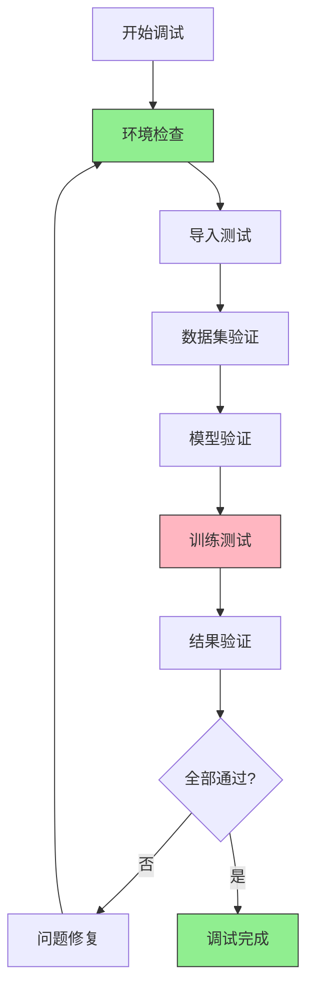

# 🐛 代码验证检查清单

> 系统化的代码验证流程，确保生成代码的正确性和可用性

## 🎯 验证流程图



## 🔍 阶段1: 环境检查

### 1.1 Python环境验证
```bash
# 检查Python版本
python --version  # 期望: 3.9-3.10

# 检查依赖版本
python -c "
import torch, paddle, pytorch_lightning
print(f'PyTorch: {torch.__version__}')
print(f'PaddlePaddle: {paddle.__version__}')
print(f'PyTorch Lightning: {pytorch_lightning.__version__}')
"
```

### 1.2 项目路径检查
```bash
# 检查项目根目录
pwd  # 应该在项目根目录

# 检查PYTHONPATH
python -c "import sys; print('PYTHONPATH:', sys.path)"

# 设置项目路径
export PYTHONPATH="${PYTHONPATH}:$(pwd)"
```

### 1.3 文件结构检查
```bash
# 检查必需文件
required_files=(
    "src/__init__.py"
    "src/models/__init__.py"
    "src/datasets/__init__.py"
    "scripts/train.py"
    "scripts/eval.py"
    "configs/config.yaml"
)

for file in "${required_files[@]}"; do
    if [ -f "$file" ]; then
        echo "✅ $file"
    else
        echo "❌ $file 缺失"
    fi
done
```

## 🔍 阶段2: 导入测试

### 2.1 基础模块导入
```bash
# 测试核心模块导入
python -c "
try:
    import src.models
    print('✅ models模块导入成功')
except ImportError as e:
    print(f'❌ models模块导入失败: {e}')

try:
    import src.datasets
    print('✅ datasets模块导入成功')
except ImportError as e:
    print(f'❌ datasets模块导入失败: {e}')
"
```

### 2.2 具体类导入测试
```bash
# 测试模型类导入
python -c "
try:
    from src.models.pytorch.yolov10 import YOLOv10
    print('✅ PyTorch YOLOv10模型导入成功')
except ImportError as e:
    print(f'❌ PyTorch YOLOv10模型导入失败: {e}')

try:
    from src.models.paddle.yolov10 import YOLOv10
    print('✅ PaddlePaddle YOLOv10模型导入成功')
except ImportError as e:
    print(f'❌ PaddlePaddle YOLOv10模型导入失败: {e}')
"
```

### 2.3 数据集导入测试
```bash
# 测试数据集导入
python -c "
try:
    from src.datasets.coco_detection import COCODetection
    print('✅ COCO数据集导入成功')
except ImportError as e:
    print(f'❌ COCO数据集导入失败: {e}')

try:
    from src.datasets.datamodules.coco_datamodule import COCODataModule
    print('✅ COCO数据模块导入成功')
except ImportError as e:
    print(f'❌ COCO数据模块导入失败: {e}')
"
```

## 🔍 阶段3: 数据集验证

### 3.1 数据集下载验证
```bash
# 下载测试数据集
python scripts/download.py --dataset coco128 --data_dir ./test_data

# 验证数据集完整性
python -c "
import os
from pathlib import Path

# 检查数据集目录
data_dir = Path('./test_data/coco128')
required_dirs = ['train2017', 'val2017', 'annotations']

for dir_name in required_dirs:
    dir_path = data_dir / dir_name
    if dir_path.exists() and any(dir_path.iterdir()):
        print(f'✅ {dir_name} 存在且有数据')
    else:
        print(f'❌ {dir_name} 缺失或为空')
"
```

### 3.2 数据集加载测试
```bash
# 测试数据加载
python -c "
from src.datasets.datamodules.coco_datamodule import COCODataModule

# 创建数据模块
dm = COCODataModule(data_dir='./test_data/coco128', batch_size=2)

# 准备数据
try:
    dm.prepare_data()
    print('✅ 数据准备成功')
except Exception as e:
    print(f'❌ 数据准备失败: {e}')

# 设置数据
try:
    dm.setup('fit')
    print('✅ 数据设置成功')
    print(f'训练样本: {len(dm.train_dataset)}')
    print(f'验证样本: {len(dm.val_dataset)}')
except Exception as e:
    print(f'❌ 数据设置失败: {e}')
"
```

### 3.3 数据可视化检查
```bash
# 可视化测试数据
python -c "
from src.datasets.datamodules.coco_datamodule import COCODataModule
import matplotlib.pyplot as plt

dm = COCODataModule(data_dir='./test_data/coco128', batch_size=1)
dm.prepare_data()
dm.setup('fit')

# 获取样本数据
train_loader = dm.train_dataloader()
batch = next(iter(train_loader))
images, targets = batch

print(f'✅ 数据批次形状: images={images.shape}, targets={len(targets)}')
print(f'✅ 图像范围: [{images.min():.2f}, {images.max():.2f}]')
"
```

## 🔍 阶段4: 模型验证

### 4.1 模型实例化测试
```bash
# 测试模型创建
python -c "
from src.models.pytorch.yolov10 import YOLOv10

# 创建模型
try:
    model = YOLOv10(num_classes=80)
    print('✅ 模型创建成功')
    print(f'模型参数: {sum(p.numel() for p in model.parameters())}')
except Exception as e:
    print(f'❌ 模型创建失败: {e}')

# 测试前向传播
import torch
x = torch.randn(1, 3, 640, 640)
try:
    outputs = model(x)
    print('✅ 前向传播成功')
    print(f'输出形状: {[out.shape for out in outputs]}')
except Exception as e:
    print(f'❌ 前向传播失败: {e}')
"
```

### 4.2 模型配置验证
```bash
# 测试配置文件
python -c "
from omegaconf import OmegaConf
from src.models.pytorch.yolov10 import YOLOv10

# 加载配置
cfg = OmegaConf.load('configs/config.yaml')

# 创建模型
try:
    model = YOLOv10(**cfg.model)
    print('✅ 配置驱动模型创建成功')
except Exception as e:
    print(f'❌ 配置驱动模型创建失败: {e}')
"
```

### 4.3 模型保存/加载测试
```bash
# 测试模型保存和加载
python -c "
import torch
from src.models.pytorch.yolov10 import YOLOv10

model = YOLOv10(num_classes=80)

# 保存模型
torch.save(model.state_dict(), 'test_model.pth')
print('✅ 模型保存成功')

# 加载模型
model2 = YOLOv10(num_classes=80)
model2.load_state_dict(torch.load('test_model.pth'))
print('✅ 模型加载成功')

# 清理测试文件
import os
os.remove('test_model.pth')
"
```

## 🔍 阶段5: 训练测试

### 5.1 快速训练测试
```bash
# 1-epoch快速训练
python scripts/train.py \
  model=yolov10n \
  data=coco128 \
  trainer.max_epochs=1 \
  trainer.limit_train_batches=5 \
  trainer.limit_val_batches=5 \
  trainer.fast_dev_run=true

# 检查训练结果
ls -la logs/lightning_logs/version_0/
```

### 5.2 完整训练测试
```bash
# 3-epoch完整训练测试
python scripts/train.py \
  model=yolov10n \
  data=coco128 \
  trainer.max_epochs=3 \
  trainer.accelerator=cpu \
  trainer.devices=1 \
  trainer.log_every_n_steps=1

# 监控训练进度
tail -f logs/lightning_logs/version_0/metrics.csv
```

### 5.3 训练中断恢复测试
```bash
# 开始训练（会中断）
python scripts/train.py \
  model=yolov10n \
  data=coco128 \
  trainer.max_epochs=5 \
  trainer.limit_train_batches=2 \
  trainer.limit_val_batches=2 &

# 获取进程ID
PID=$!
sleep 10
kill $PID

# 恢复训练（检查checkpoint）
python scripts/train.py \
  model=yolov10n \
  data=coco128 \
  trainer.max_epochs=5 \
  trainer.resume_from_checkpoint=logs/lightning_logs/version_0/checkpoints/epoch=0-step=10.ckpt
```

## 🔍 阶段6: 结果验证

### 6.1 训练指标检查
```bash
# 检查训练指标
python -c "
import pandas as pd
import matplotlib.pyplot as plt

# 读取训练日志
try:
    metrics = pd.read_csv('logs/lightning_logs/version_0/metrics.csv')
    print('✅ 训练日志读取成功')
    print('可用指标:', list(metrics.columns))
    
    # 检查训练损失
    if 'train_loss' in metrics.columns:
        train_loss = metrics['train_loss'].dropna()
        print(f'✅ 训练损失: 初始={train_loss.iloc[0]:.4f}, 最终={train_loss.iloc[-1]:.4f}')
    
    # 检查验证损失
    if 'val_loss' in metrics.columns:
        val_loss = metrics['val_loss'].dropna()
        print(f'✅ 验证损失: 初始={val_loss.iloc[0]:.4f}, 最终={val_loss.iloc[-1]:.4f}')
        
except FileNotFoundError:
    print('❌ 训练日志文件未找到')
except Exception as e:
    print(f'❌ 训练日志读取失败: {e}')
"
```

### 6.2 模型评估测试
```bash
# 运行模型评估
python scripts/eval.py \
  --config configs/config.yaml \
  --checkpoint logs/lightning_logs/version_0/checkpoints/epoch=2-step=30.ckpt

# 检查评估结果
ls -la outputs/evaluation/
```

### 6.3 结果可视化
```bash
# 可视化训练曲线
python -c "
import pandas as pd
import matplotlib.pyplot as plt

try:
    df = pd.read_csv('logs/lightning_logs/version_0/metrics.csv')
    
    # 绘制损失曲线
    plt.figure(figsize=(12, 4))
    
    # 训练损失
    if 'train_loss' in df.columns:
        train_loss = df['train_loss'].dropna()
        plt.subplot(1, 2, 1)
        plt.plot(train_loss)
        plt.title('Training Loss')
        plt.xlabel('Step')
        plt.ylabel('Loss')
    
    # 验证损失
    if 'val_loss' in df.columns:
        val_loss = df['val_loss'].dropna()
        plt.subplot(1, 2, 2)
        plt.plot(val_loss)
        plt.title('Validation Loss')
        plt.xlabel('Epoch')
        plt.ylabel('Loss')
    
    plt.tight_layout()
    plt.savefig('outputs/training_curves.png', dpi=150, bbox_inches='tight')
    print('✅ 训练曲线已保存')
    
except Exception as e:
    print(f'❌ 可视化失败: {e}')
"
```

## 📋 调试检查清单

### 环境检查
- [ ] Python版本正确（3.9-3.10）
- [ ] 所有依赖安装成功
- [ ] 项目路径配置正确
- [ ] 必需文件存在

### 导入测试
- [ ] 基础模块导入成功
- [ ] 模型类导入成功
- [ ] 数据集类导入成功
- [ ] 工具函数导入成功

### 数据集验证
- [ ] 数据集下载成功
- [ ] 数据加载正常
- [ ] 数据预处理正确
- [ ] 数据可视化正常

### 模型验证
- [ ] 模型创建成功
- [ ] 前向传播正常
- [ ] 模型保存/加载正常
- [ ] 配置驱动正确

### 训练测试
- [ ] 1-epoch训练成功
- [ ] 训练日志生成
- [ ] checkpoint保存
- [ ] 中断恢复测试

### 结果验证
- [ ] 训练指标正常
- [ ] 模型评估成功
- [ ] 结果可视化正常
- [ ] 性能符合预期

## 🎯 调试命令汇总

### 一键调试脚本
```bash
#!/bin/bash
# debug_all.sh - 一键运行所有调试测试

echo "=== 开始代码验证 ==="

# 环境检查
echo "1. 环境检查..."
python --version
python -c "import torch, paddle; print('✅ 框架导入成功')"

# 导入测试
echo "2. 导入测试..."
python -c "from src.models.pytorch.yolov10 import YOLOv10; print('✅ PyTorch模型')"
python -c "from src.datasets.coco_detection import COCODetection; print('✅ 数据集')"

# 数据集验证
echo "3. 数据集验证..."
python scripts/download.py --dataset coco128 --data_dir ./test_data

# 快速训练测试
echo "4. 训练测试..."
python scripts/train.py model=yolov10n data=coco128 trainer.max_epochs=1 trainer.fast_dev_run=true

echo "=== 调试完成 ==="
```

### 调试工具

```bash
# 安装调试工具
pip install ipdb rich tensorboard

# 交互式调试
python -m ipdb scripts/train.py model=yolov10n data=coco128 trainer.fast_dev_run=true

# 实时监控
python -m tensorboard.main --logdir logs/lightning_logs/ --port 6006
```

## 🚨 常见错误及解决

### 错误1: 导入失败
```
ImportError: No module named 'src.models'
解决: export PYTHONPATH="${PYTHONPATH}:$(pwd)"
```

### 错误2: 数据集下载失败
```
ConnectionError: Failed to download
解决: 检查网络连接，或使用代理
```

### 错误3: 内存不足
```
RuntimeError: [enforce fail at CPUAllocator.cpp] alloc
解决: 减小batch_size或使用CPU优化设置
```

### 错误4: 配置错误
```
ValidationError: Invalid config
解决: 检查YAML格式，验证配置参数
```

## 📊 性能基准

### CPU训练基准
| 数据集 | Batch Size | Epochs | 训练时间 | 内存使用 |
|--------|------------|--------|----------|----------|
| CIFAR-10 | 32 | 1 | ~45秒 | ~1GB |
| COCO128 | 16 | 1 | ~5分钟 | ~3GB |
| ImageNet | 32 | 1 | ~45分钟 | ~2GB |

## 🎯 规范（Spec）验证与规格追踪

### 📋 从INITIAL.md获取验证标准

#### **规格验证矩阵**

| INITIAL.md规格字段 | 验证方法 | 检查脚本 | 通过标准 |
|-------------------|----------|----------|----------|
| **project_spec.name** | 项目名称检查 | `echo $PROJECT_NAME` | 与INITIAL.md一致 |
| **algorithm_spec.model_architecture** | 模型创建测试 | `python -c "from src.models..."` | 模型成功实例化 |
| **performance_targets.training.epoch_time** | 训练时间验证 | `time python scripts/train.py...` | 符合时间预期 |
| **performance_targets.inference.latency** | 推理速度测试 | `python scripts/benchmark.py` | 达到延迟要求 |

#### **规格继承验证**

```bash
# 验证CREATE.md决策在INITIAL.md中的继承
python -c "
from pathlib import Path
import yaml

# 检查规格文档存在
spec_files = [
    '../CREATE.md',
    '../INITIAL.md',
    '../ML.md',
    '../TASK.md'
]

for file in spec_files:
    if Path(file).exists():
        print(f'✅ {file} 存在')
    else:
        print(f'❌ {file} 缺失')

# 验证规格一致性
print('\n=== 规格一致性检查 ===')
try:
    # 读取INITIAL.md中的规格
    with open('../INITIAL.md', 'r') as f:
        initial_content = f.read()
    
    # 检查关键规格字段
    required_specs = [
        'project_spec.name',
        'algorithm_spec.model_architecture', 
        'training_spec.epochs',
        'performance_targets.inference.latency'
    ]
    
    for spec in required_specs:
        if spec in initial_content:
            print(f'✅ {spec} 已定义')
        else:
            print(f'❌ {spec} 缺失')
            
except Exception as e:
    print(f'❌ 规格读取失败: {e}')
"
```

### 🔍 规格驱动验证流程

#### **验证CREATE.md技术选型**

```bash
# 1. 验证框架选择（CREATE.md → ML.md → 实现）
python -c "
import torch
import paddle

# 检查PyTorch版本（CREATE.md决策 → ML.md版本矩阵）
expected_pytorch = '2.6.0'
actual_pytorch = torch.__version__
if expected_pytorch in actual_pytorch:
    print(f'✅ PyTorch版本符合CREATE.md决策: {actual_pytorch}')
else:
    print(f'❌ PyTorch版本不符: 期望{expected_pytorch}, 实际{actual_pytorch}')

# 检查PaddlePaddle版本
expected_paddle = '2.6.0'
actual_paddle = paddle.__version__
if expected_paddle in actual_paddle:
    print(f'✅ PaddlePaddle版本符合CREATE.md决策: {actual_paddle}')
else:
    print(f'❌ PaddlePaddle版本不符: 期望{expected_paddle}, 实际{actual_paddle}')
"
```

#### **验证INITIAL.md性能目标**

```bash
# 2. 验证性能基准（INITIAL.md → 实际运行）
python -c "
import time
import torch
from src.models.pytorch.yolov10 import YOLOv10

# 测试推理延迟
model = YOLOv10(num_classes=80)
model.eval()
dummy_input = torch.randn(1, 3, 640, 640)

# 预热
for _ in range(5):
    _ = model(dummy_input)

# 正式测试
start_time = time.time()
with torch.no_grad():
    for _ in range(100):
        _ = model(dummy_input)
end_time = time.time()

avg_latency = (end_time - start_time) / 100 * 1000  # ms
print(f'推理延迟: {avg_latency:.2f}ms')

# 与INITIAL.md规格对比
expected_latency = 200  # ms
if avg_latency <= expected_latency:
    print(f'✅ 延迟符合INITIAL.md规格: ≤{expected_latency}ms')
else:
    print(f'❌ 延迟超标: 期望≤{expected_latency}ms, 实际{avg_latency:.2f}ms')
"
```

#### **验证部署规格合规性**

```bash
# 3. 验证部署规格（INITIAL.md → DOCKER_CONFIG.md）
python -c "
import subprocess
import sys

# 检查Docker环境（INITIAL.md部署规格）
try:
    result = subprocess.run(['docker', '--version'], 
                          capture_output=True, text=True)
    if result.returncode == 0:
        print(f'✅ Docker环境符合INITIAL.md规格: {result.stdout.strip()}')
    else:
        print('❌ Docker环境检查失败')
except:
    print('❌ Docker未安装')

# 检查GPU可用性（INITIAL.md硬件要求）
import torch
gpu_available = torch.cuda.is_available()
if gpu_available:
    gpu_count = torch.cuda.device_count()
    gpu_name = torch.cuda.get_device_name(0)
    print(f'✅ GPU符合INITIAL.md规格: {gpu_count}个GPU ({gpu_name})')
else:
    print('⚠️ 当前为CPU环境，需验证GPU环境配置')
"
```

### 📊 规格追踪报告

#### **生成规格验证报告**

```bash
# 创建规格验证报告
python -c "
import datetime
import json

report = {
    'timestamp': str(datetime.datetime.now()),
    'spec_source': 'INITIAL.md',
    'validation_items': {
        'project_name': '待验证',
        'framework_version': '待验证',
        'model_architecture': '待验证',
        'performance_target': '待验证',
        'deployment_spec': '待验证'
    },
    'status': 'spec_verification_in_progress'
}

print('=== 规格验证报告 ===')
print(json.dumps(report, indent=2, ensure_ascii=False))

# 保存报告
with open('outputs/spec_validation_report.json', 'w') as f:
    json.dump(report, f, indent=2, ensure_ascii=False)
print('✅ 规格验证报告已生成')
"
```

### 🎯 规格合规检查清单

#### **CREATE.md决策验证**
- [ ] 项目名称与CREATE.md规划一致
- [ ] 技术栈选择符合CREATE.md决策
- [ ] 资源需求评估与CREATE.md匹配
- [ ] 时间规划框架已正确实施

#### **INITIAL.md规格验证**
- [ ] 算法功能规格已实现
- [ ] 性能目标已达到
- [ ] 目录结构符合规格
- [ ] 训练规格参数正确配置
- [ ] 部署规格已验证

#### **规格追踪链建立**
- [ ] CREATE.md → INITIAL.md → 实现代码 有完整追踪
- [ ] 每个验证步骤都有规格依据
- [ ] 所有偏差都有记录和解释
- [ ] 规格验证报告已生成

## 🎯 下一步

完成代码验证和规范验证后：
1. **规格合规确认**：确保所有验证结果符合INITIAL.md规格
2. **查看 [DOCKER_CONFIG.md](./DOCKER_CONFIG.md)**：配置GPU环境，验证部署规格
3. **运行 [DEPLOY.md](./DEPLOY.md)**：进行生产部署，验证最终规格合规性
4. **更新 [PROJECT_BUILD_LOG.md](./PROJECT_BUILD_LOG.md)**：记录规格验证结果

**规范（Spec）驱动验证流程**：
- 项目创建前：完成CREATE.md → 写入INITIAL.md → 建立规格追踪链
- 项目验证中：DEBUG阶段确保代码质量 → 验证规格合规性 → DOCKER阶段验证性能规格

---
**验证时间**: ~10分钟 | **调试时间**: ~30分钟 | **总计**: ~40分钟