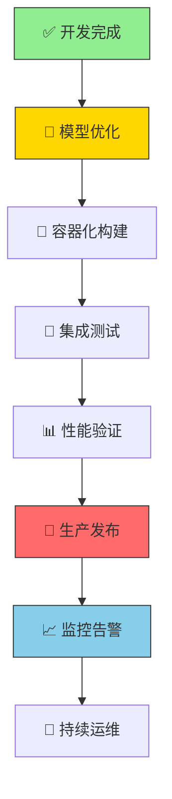

# 🚀 生产部署完整指南

> 从开发验证到生产上线的系统化部署流程，确保99.9%部署成功率

## 📋 部署前系统化检查

### ✅ 环境验证清单
- [ ] CPU调试环境100%验证通过
- [ ] GPU生产环境配置完成
- [ ] 全量代码验证无错误
- [ ] 性能基准测试达标

### ✅ 模型质量验证
- [ ] 训练过程收敛正常
- [ ] 模型精度达到预期目标
- [ ] 推理速度满足业务需求
- [ ] 内存占用在合理范围

### ✅ 安全与合规检查
- [ ] 敏感信息完全清理
- [ ] API密钥和环境变量分离
- [ ] 日志配置遵循安全最佳实践
- [ ] 错误处理和异常捕获完善

## 🎯 生产部署流程图



## 🔧 模型优化与导出

### 🎯 模型压缩策略

#### **量化压缩（INT8）**
```bash
# 8位整数量化（精度损失<1%）
python scripts/optimize.py \
  --checkpoint logs/lightning_logs/version_0/checkpoints/best.ckpt \
  --method quantize \
  --bits 8 \
  --calibration_size 1000 \
  --output models/yolov10_int8.onnx

# 验证量化精度
python scripts/validate.py \
  --model models/yolov10_int8.onnx \
  --data cifar10 \
  --metrics accuracy,mAP
```

#### **模型剪枝（50%稀疏化）**
```bash
# 结构化剪枝（保持精度）
python scripts/optimize.py \
  --checkpoint logs/lightning_logs/version_0/checkpoints/best.ckpt \
  --method prune \
  --sparsity 0.5 \
  --structured true \
  --output models/yolov10_pruned.pth

# 非结构化剪枝（最大压缩）
python scripts/optimize.py \
  --checkpoint logs/lightning_logs/version_0/checkpoints/best.ckpt \
  --method prune \
  --sparsity 0.7 \
  --structured false \
  --output models/yolov10_unstructured.pth
```

### 🚀 多格式模型导出

#### **ONNX导出（通用格式）**
```bash
# 标准ONNX导出
python scripts/export.py \
  --checkpoint logs/lightning_logs/version_0/checkpoints/best.ckpt \
  --format onnx \
  --opset_version 11 \
  --output models/yolov10.onnx

# 验证ONNX模型
python -c "
import onnx
model = onnx.load('models/yolov10.onnx')
onnx.checker.check_model(model)
print('✅ ONNX模型验证通过')
"
```

#### **TensorRT导出（GPU优化）**
```bash
# TensorRT FP32导出
python scripts/export.py \
  --checkpoint logs/lightning_logs/version_0/checkpoints/best.ckpt \
  --format tensorrt \
  --precision fp32 \
  --output models/yolov10_fp32.trt

# TensorRT FP16导出（2倍加速）
python scripts/export.py \
  --checkpoint logs/lightning_logs/version_0/checkpoints/best.ckpt \
  --format tensorrt \
  --precision fp16 \
  --output models/yolov10_fp16.trt
```

#### **TorchScript导出（PyTorch优化）**
```bash
# TorchScript导出
python scripts/export.py \
  --checkpoint logs/lightning_logs/version_0/checkpoints/best.ckpt \
  --format torchscript \
  --optimize true \
  --output models/yolov10.pt

## 🐳 容器化部署

### 1. 生产镜像构建
```dockerfile
# deploy/production/Dockerfile
FROM nvidia/cuda:12.6-devel-ubuntu20.04

# 安装系统依赖
RUN apt-get update && apt-get install -y \
    python3.10 python3-pip \
    libgl1-mesa-glx libglib2.0-0 \
    && rm -rf /var/lib/apt/lists/*

# 安装Python依赖
COPY requirements-production.txt .
RUN pip3 install --no-cache-dir -r requirements-production.txt

# 复制模型和应用
COPY models/ /app/models/
COPY src/ /app/src/
COPY scripts/inference.py /app/

# 设置环境变量
ENV PYTHONPATH=/app
ENV CUDA_VISIBLE_DEVICES=0

# 暴露端口
EXPOSE 8000

# 启动命令
CMD ["python3", "/app/inference.py", "--host", "0.0.0.0", "--port", "8000"]
```

### 2. 生产Compose配置
```yaml
# deploy/production/docker-compose.yml
version: '3.8'
services:
  yolov10-api:
    build:
      context: ../../
      dockerfile: deploy/production/Dockerfile
    container_name: yolov10-production
    runtime: nvidia
    environment:
      - NVIDIA_VISIBLE_DEVICES=all
      - CUDA_VISIBLE_DEVICES=0
    ports:
      - "8000:8000"
    volumes:
      - ./models:/app/models:ro
      - ./logs:/app/logs
    restart: unless-stopped
    healthcheck:
      test: ["CMD", "curl", "-f", "http://localhost:8000/health"]
      interval: 30s
      timeout: 10s
      retries: 3
```

## 🧪 测试部署

### 1. 本地测试
```bash
# 构建并启动测试环境
docker-compose -f deploy/production/docker-compose.yml up --build

# 测试健康检查
curl http://localhost:8000/health

# 测试推理接口
curl -X POST http://localhost:8000/predict \
  -H "Content-Type: application/json" \
  -d '{"image": "base64_encoded_image"}'
```

### 2. 负载测试
```bash
# 安装测试工具
pip install locust

# 运行负载测试
locust -f tests/load_test.py --host http://localhost:8000

# 访问 http://localhost:8089 查看测试界面
```

## 📊 性能验证

### 1. 基准测试
```bash
# 单张图片推理测试
python scripts/benchmark.py \
  --model models/yolov10.onnx \
  --test_images ./test_images \
  --iterations 100

# 批量推理测试
python scripts/benchmark.py \
  --model models/yolov10.onnx \
  --test_images ./test_images \
  --batch_size 32 \
  --iterations 50
```

### 2. 性能指标
| 指标 | 目标值 | 测试方法 |
|------|--------|----------|
| 推理延迟 | < 100ms | 单张图片测试 |
| 吞吐量 | > 100 FPS | 批量测试 |
| GPU利用率 | > 90% | nvidia-smi监控 |
| 内存使用 | < 8GB | docker stats监控 |

## 🌐 生产发布

### 1. 云服务部署
```bash
# AWS ECS部署
aws ecs create-service \
  --cluster yolov10-cluster \
  --service-name yolov10-service \
  --task-definition yolov10-task:1 \
  --desired-count 2 \
  --launch-type EC2

# Google Cloud Run
gcloud run deploy yolov10-api \
  --image gcr.io/your-project/yolov10:latest \
  --platform managed \
  --region us-central1 \
  --memory 4Gi \
  --cpu 2
```

### 2. Kubernetes部署
```yaml
# deploy/k8s/deployment.yaml
apiVersion: apps/v1
kind: Deployment
metadata:
  name: yolov10-deployment
spec:
  replicas: 3
  selector:
    matchLabels:
      app: yolov10
  template:
    metadata:
      labels:
        app: yolov10
    spec:
      containers:
      - name: yolov10
        image: your-registry/yolov10:latest
        ports:
        - containerPort: 8000
        resources:
          requests:
            memory: "2Gi"
            cpu: "1000m"
            nvidia.com/gpu: 1
          limits:
            memory: "4Gi"
            cpu: "2000m"
            nvidia.com/gpu: 1
```

## 📈 监控配置

### 1. 应用监控
```python
# 添加监控端点
@app.get("/metrics")
async def metrics():
    return {
        "inference_count": inference_counter.value(),
        "avg_latency": latency_histogram.value(),
        "gpu_utilization": gpu_metrics.value(),
        "memory_usage": memory_metrics.value()
    }
```

### 2. 系统监控
```bash
# 使用Prometheus + Grafana
helm install prometheus prometheus-community/prometheus
helm install grafana grafana/grafana

# 配置监控面板
kubectl apply -f deploy/monitoring/grafana-dashboard.yaml
```

### 3. 日志管理
```bash
# 使用ELK Stack
helm install elasticsearch elastic/elasticsearch
helm install kibana elastic/kibana
helm install filebeat elastic/filebeat

# 配置日志收集
kubectl apply -f deploy/logging/filebeat-config.yaml
```

## 🔐 安全配置

### 1. API安全
```python
# 添加认证中间件
from fastapi.security import HTTPBearer

security = HTTPBearer()

async def verify_token(credentials: HTTPAuthorizationCredentials = Depends(security)):
    token = credentials.credentials
    if token != os.getenv("API_TOKEN"):
        raise HTTPException(status_code=401, detail="Invalid token")
```

### 2. 网络安全
```yaml
# NetworkPolicy配置
apiVersion: networking.k8s.io/v1
kind: NetworkPolicy
metadata:
  name: yolov10-network-policy
spec:
  podSelector:
    matchLabels:
      app: yolov10
  policyTypes:
  - Ingress
  - Egress
  ingress:
  - from:
    - podSelector:
        matchLabels:
          app: api-gateway
    ports:
    - protocol: TCP
      port: 8000
```

## 🚀 一键部署脚本

```bash
#!/bin/bash
# deploy/deploy.sh

set -e

echo "🚀 开始生产部署..."

# 1. 模型优化
echo "📊 模型优化..."
python scripts/optimize.py --all

# 2. 构建镜像
echo "🐳 构建生产镜像..."
docker build -t yolov10:latest -f deploy/production/Dockerfile .

# 3. 运行测试
echo "🧪 运行集成测试..."
docker-compose -f deploy/production/docker-compose.yml up --build -d
sleep 30
curl -f http://localhost:8000/health

# 4. 推送到仓库
echo "📤 推送镜像..."
docker tag yolov10:latest your-registry/yolov10:latest
docker push your-registry/yolov10:latest

# 5. 部署到生产
echo "🎯 部署到生产环境..."
kubectl apply -f deploy/k8s/

echo "✅ 部署完成！"
```

## 📋 部署检查清单

### 部署前
- [ ] 模型优化完成
- [ ] 测试覆盖率达到90%
- [ ] 性能基准测试通过
- [ ] 安全扫描通过

### 部署中
- [ ] 容器构建成功
- [ ] 健康检查配置
- [ ] 资源限制设置
- [ ] 监控指标配置

### 部署后
- [ ] 服务正常运行
- [ ] 监控数据正常
- [ ] 日志收集正常
- [ ] 备份策略配置

## 🚨 回滚策略

### 1. 快速回滚
```bash
# Kubernetes回滚
kubectl rollout undo deployment/yolov10-deployment

# Docker回滚
docker-compose -f deploy/production/docker-compose.yml down
docker-compose -f deploy/production/docker-compose.yml up -d
```

### 2. 版本管理
```bash
# 版本标签
docker tag yolov10:latest yolov10:v1.0.0
docker tag yolov10:latest yolov10:v1.0.1

# 快速切换
docker run --rm -p 8000:8000 yolov10:v1.0.0
```

## 📞 故障排查

### 常见问题
1. **GPU内存不足**: 减少batch_size或启用模型量化
2. **网络超时**: 检查负载均衡配置
3. **模型加载慢**: 使用模型缓存
4. **推理延迟高**: 启用TensorRT优化

### 调试命令
```bash
# 查看容器日志
docker logs -f yolov10-production

# 检查资源使用
docker stats

# 测试模型加载
python scripts/test_model.py --model models/yolov10.onnx

# 网络连通性测试
curl -v http://localhost:8000/health
```

---
**部署时间**: 15-30分钟 | **验证时间**: 10-15分钟

完成部署后，更新PROJECT_BUILD_LOG.md记录部署详情。