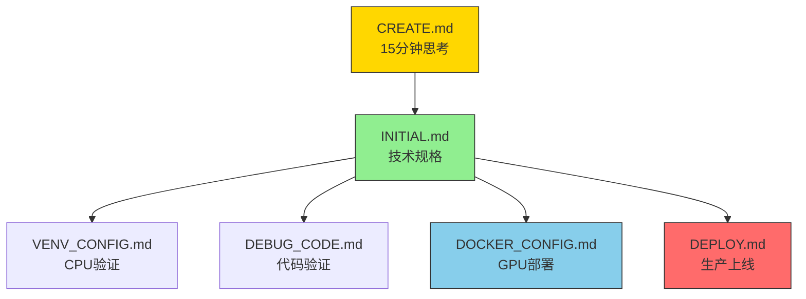

# 🎯 目标项目创建规格文档

> **项目规格的终极文字模板** - 将15分钟Think Hard的决策结果转化为可执行的技术规格，成为项目开发的唯一真实来源。

## 📊 规范（Spec）继承框架

### 🎯 从CREATE.md的规范（Spec）继承

本规格文档完整继承CREATE.md的think hard规划结果，建立从需求分析到技术规格的映射关系：

#### 📋 规范（Spec）映射表

| CREATE.md决策点 | INITIAL.md规格继承 | 验证标准 |
|-----------------|-------------------|----------|
| **业务价值澄清** | [需求规格定义](#1-需求规格定义) | 项目目标可量化 |
| **技术选型决策** | [技术栈规格](#2-技术栈规格) | 框架选择有依据 |
| **资源评估结果** | [性能基准](#5-训练规格) | 计算需求可承受 |
| **时间规划框架** | [训练规格](#5-训练规格) | 里程碑可达成 |

#### 🔄 规范（Spec）驱动流程



#### 📊 规格验证矩阵

| 规格类别 | 来源文档 | 继承字段 | 验证方法 |
|----------|----------|----------|----------|
| **需求规格** | CREATE.md:业务价值 | 项目类型、目标指标 | 与CREATE.md决策一致性 |
| **技术规格** | CREATE.md:技术选型 | 框架版本、依赖版本 | 与ML.md版本矩阵匹配 |
| **架构规格** | CREATE.md:架构设计 | 目录结构、代码约束 | 符合CLAUDE.md约束 |
| **验证规格** | CREATE.md:时间规划 | 训练参数、性能基准 | 与DEBUG_CODE.md验证清单对应 |

### 🎯 AI智能体使用指南

**对于编码智能体**：
1. **读取顺序**：先CREATE.md做需求分析 → 再INITIAL.md获取技术规格
2. **继承验证**：确保INITIAL.md的每个规格都能在CREATE.md找到决策依据
3. **规格追踪**：建立CREATE.md决策 → INITIAL.md规格 → 实现代码的完整追踪链

**对于用户**：
- 每个技术决策都有CREATE.md的思考依据
- 每个规格参数都有明确的业务价值支撑
- 整个开发流程遵循CREATE.md→INITIAL.md→实现的规范（Spec）路径

## 📊 项目概况

### 基础信息
- **文档用途**：接收CREATE.md的think hard规划结果
- **目标项目**：由模板项目创建的最终产物
- **创建方式**：VENV→DEBUG→DOCKER两阶段验证
- **规范（Spec）遵循**：CLAUDE.md定义的20行核心约束

## 🎯 项目规格模板

### 1. 需求规格定义

#### 核心需求
```yaml
project_spec:
  name: "[项目名称]"                    # 如：yolov10_medical
  type: "detection"                    # classification/detection/segmentation
  domain: "medical_imaging"           # 具体应用领域
  version: "v1.0"
  
  problem_statement: |
    在医疗CT影像中自动检测肺结节，
    减少医生阅片时间，提高早期诊断准确率。
  
  success_criteria:
    - mAP@0.5 ≥ 0.85（肺结节检测）
    - 推理时间 ≤ 200ms/张（512×512）
    - GPU内存 ≤ 8GB（RTX 3060）
    - 支持DICOM格式输入
```

#### 算法功能规格
```yaml
algorithm_spec:
  task_definition: "2D目标检测"
  
  input_spec:
    format: "DICOM医学影像"
    resolution: "512×512×1"
    channels: "单通道灰度图"
    preprocessing: [
      "窗宽窗位调整(-1000, 400)",
      "归一化到[0,1]",
      "数据增强(旋转、翻转)"
    ]
  
  output_spec:
    format: "边界框+置信度+类别"
    bbox_format: "[x_min, y_min, x_max, y_max]"
    classes: ["nodule", "mass"]  # 结节、肿块
    confidence_threshold: 0.5
  
  model_architecture: "YOLOv10-nano"
  backbone: "CSPDarkNet"
  neck: "FPN+PAN"
  head: "Decoupled Head"
  
  loss_function: "CIoU Loss + Focal Loss"
  optimizer: "AdamW"
  scheduler: "Cosine Annealing"
```

### 2. 技术栈规格

#### 框架选择
```yaml
tech_stack:
  primary_framework: "PyTorch"      # 基于CREATE.md决策
  version: "2.6.0"
  
  rationale: |
    选择PyTorch原因：
    1. 医疗AI社区生态丰富
    2. 支持DICOM格式处理
    3. 部署方案成熟（TorchScript/ONNX）
  
  secondary_framework: "PaddlePaddle"
  compatibility: "代码结构支持双栈"
```

#### 依赖规格
```yaml
dependencies:
  pytorch:
    - torch==2.6.0+cu126
    - torchvision==0.15.0+cu126
    - pytorch-lightning==2.0.0
  
  medical:
    - pydicom==2.4.0
    - nibabel==5.1.0
    - SimpleITK==2.3.0
  
  utility:
    - omegaconf==2.3.0
    - albumentations==1.3.0
    - wandb==0.15.0
```

### 3. 目录结构规格

#### 标准目录结构
```
[项目名称]/                          # 根目录（≤200行核心代码）
├── src/                           # 核心代码（高层API）
│   ├── models/
│   │   ├── pytorch/
│   │   │   ├── __init__.py
│   │   │   └── yolov10.py        # YOLOv10实现（≤150行）
│   │   └── paddle/
│   │       ├── __init__.py
│   │       └── yolov10.py        # Paddle版本（≤150行）
│   ├── datasets/
│   │   ├── __init__.py
│   │   └── medical_detection.py  # 医疗数据集（≤100行）
│   └── utils/
│       ├── __init__.py
│       └── medical_utils.py      # 医疗工具函数（≤50行）
├── configs/                       # 配置管理
│   ├── config.yaml               # 主配置
│   ├── model/
│   │   └── yolov10_nano.yaml     # 模型配置
│   ├── data/
│   │   └── medical_dataset.yaml  # 数据集配置
│   └── trainer/
│       └── default.yaml          # 训练器配置
├── scripts/                       # 训练脚本
│   ├── train.py                  # 训练入口（≤50行）
│   ├── eval.py                   # 评估入口（≤50行）
│   └── download.py               # 数据下载（≤50行）
├── tests/                         # 测试代码
│   ├── test_models.py
│   └── test_datasets.py
├── deploy/                        # 部署配置
│   ├── cpu/
│   ├── gpu/
│   └── shared/
└── docs/                          # 项目文档
    ├── README.md
    └── PROJECT_BUILD_LOG.md
```

### 4. 数据集规格

#### 医疗数据集配置
```yaml
dataset_spec:
  name: "LIDC-IDRI_medical"
  format: "DICOM"
  
  train_set:
    count: 888
    source: "LIDC-IDRI公开数据集"
    annotation: "XML格式标注"
  
  val_set:
    count: 222
    split: "20%训练集作为验证"
  
  test_set:
    count: 200
    source: "独立测试集"
  
  preprocessing:
    - window_level: "[-1000, 400]"
    - resize: "512×512"
    - normalization: "z-score"
    - augmentation: [
        "random_rotation_15",
        "horizontal_flip",
        "elastic_deformation"
      ]
```

### 5. 训练规格

#### 训练策略
```yaml
training_spec:
  epochs: 300
  
  optimizer:
    name: "AdamW"
    lr: 0.001
    weight_decay: 0.0001
  
  scheduler:
    name: "CosineAnnealingLR"
    T_max: 300
    eta_min: 1e-6
  
  batch_size:
    train: 16          # 基于8GB GPU
    val: 32
  
  early_stopping:
    patience: 50
    monitor: "val_mAP"
  
  checkpointing:
    save_top_k: 3
    monitor: "val_mAP"
    mode: "max"
```

#### 性能基准
```yaml
performance_targets:
  training:
    - epoch_time: "~5分钟 (RTX 3060)"
    - convergence: "100 epochs达到mAP@0.5=0.8"
  
  inference:
    - latency: "200ms/张 (512×512)"
    - throughput: "5 FPS (RTX 3060)"
    - memory: "4GB GPU峰值"
```

### 6. 部署规格

#### 生产环境配置
```yaml
deployment_spec:
  environment: "Docker + CUDA 12.6"
  
  container:
    base_image: "nvidia/cuda:12.6-devel-ubuntu20.04"
    python: "3.10"
    dependencies: "requirements-gpu.txt"
  
  service:
    type: "REST API"
    framework: "FastAPI"
    port: 8000
    workers: 1
  
  monitoring:
    - metrics: "prometheus"
    - logging: "structured JSON"
    - health_check: "/health"
  
  scaling:
    - horizontal: "k8s HPA"
    - vertical: "GPU memory based"
```

## 🎯 项目类型模板库

### 1. 医疗影像检测（YOLOv10-Medical）
```yaml
medical_detection:
  spec:
    task: "肺结节检测"
    model: "YOLOv10-nano"
    dataset: "LIDC-IDRI"
    classes: ["nodule", "mass"]
    input: "512×512 DICOM"
    output: "边界框+置信度"
  
  special_requirements:
    - DICOM格式支持
    - 医疗级精度要求
    - 可解释性需求
    - 监管合规性
```

### 2. 自动驾驶检测（YOLOv10-Auto）
```yaml
autonomous_detection:
  spec:
    task: "多目标检测"
    model: "YOLOv10-s"
    dataset: "nuScenes"
    classes: ["car", "pedestrian", "cyclist", "truck"]
    input: "1280×720 RGB"
    output: "3D边界框+速度"
  
  special_requirements:
    - 实时处理（30 FPS）
    - 多传感器融合
    - 恶劣天气适应
    - 功能安全认证
```

### 3. 工业质检分类（ResNet-Industrial）
```yaml
industrial_classification:
  spec:
    task: "缺陷分类"
    model: "ResNet50"
    dataset: "自定义工业数据集"
    classes: ["normal", "scratch", "dent", "corrosion"]
    input: "224×224 RGB"
    output: "类别概率"
  
  special_requirements:
    - 高分辨率支持
    - 小样本学习
    - 在线增量训练
    - 边缘设备部署
```

## 🛠️ 规格验证清单

### 需求验证
- [ ] 项目目标明确具体
- [ ] 性能指标可量化
- [ ] 应用场景清晰定义
- [ ] 约束条件充分考虑

### 技术验证
- [ ] 技术选型合理
- [ ] 架构设计可行
- [ ] 资源需求可承受
- [ ] 部署方案完整

### 合规验证
- [ ] 数据隐私合规
- [ ] 算法公平性
- [ ] 安全标准满足
- [ ] 监管要求达标

## 📋 使用流程

### 1. 从CREATE.md获取规划
1. 运行CREATE.md的think hard流程
2. 记录所有决策点到本文件
3. 确认技术选型和规格

### 2. 基于规格创建项目
1. 按照目录结构规格创建项目
2. 实现≤200行的高层API代码
3. 配置OmegaConf驱动的YAML文件
4. 建立两阶段验证流程

### 3. 验证规格实现
1. VENV阶段：CPU验证代码正确性
2. DEBUG阶段：系统性代码验证
3. DOCKER阶段：GPU性能验证
4. DEPLOY阶段：生产部署验证

## 📊 规格模板示例

### 完整示例：yolov10_medical

```yaml
# 基于本规格创建的实际项目配置
project: yolov10_medical
spec_source: INITIAL.md
version: v1.0.0

# 所有配置都来源于本规格的实例化
# - 模型：YOLOv10-nano医疗版
# - 数据：LIDC-IDRI肺结节
# - 训练：300epochs，AdamW优化器
# - 部署：Docker+FastAPI，200ms推理延迟
```

---

**文档用途**：接收CREATE.md规划结果，生成最终规格
**更新频率**：每次项目创建时实例化
**维护者**：项目创建团队
**模板版本**：v2.0