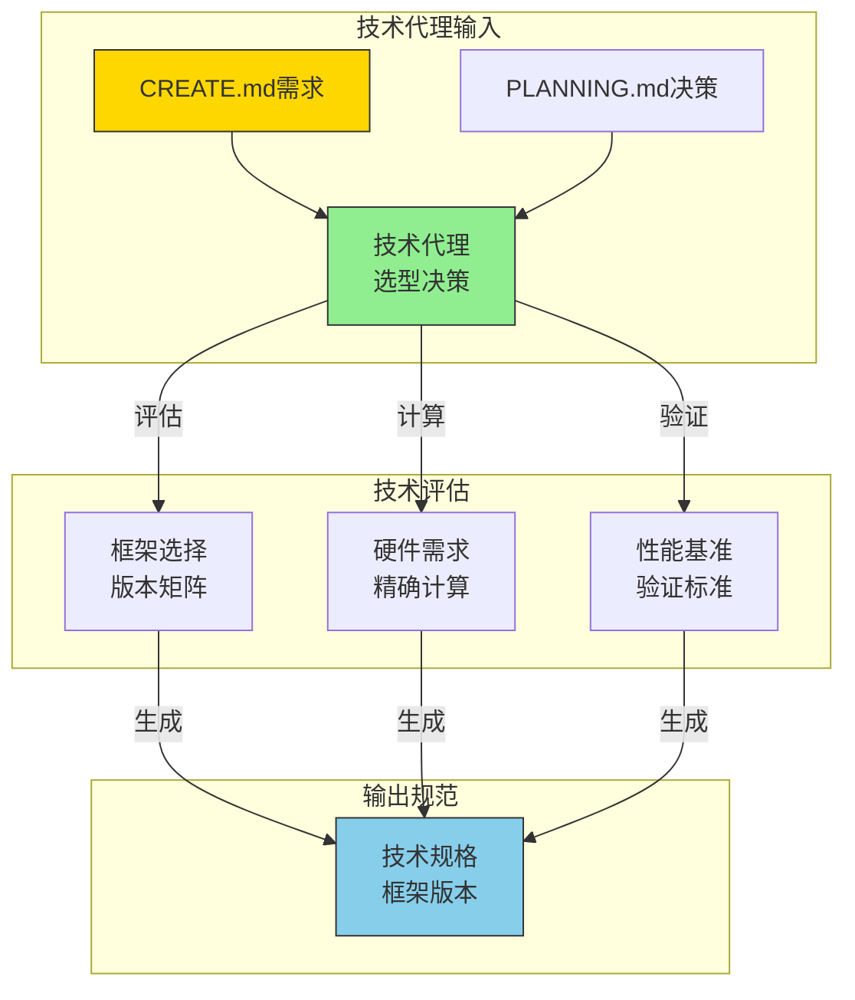

# 🤖 技术选型代理规范（Technical Selection Agent Specification）

> **技术代理行为准则** - 基于量化决策矩阵的框架版本选择与硬件需求评估，确保技术选型有理有据。

## 🎯 技术代理角色定义

### 📋 智能体职责边界
- **角色定位**: 技术选型与硬件需求评估的智能代理
- **核心职责**: 基于CREATE.md需求进行框架版本选择与硬件配置
- **输入规范**: CREATE.md需求描述 + PLANNING.md技术决策
- **输出规范**: 框架版本矩阵 + 硬件需求评估 + 性能基准
- **验证标准**: 量化决策矩阵评分≥3.5分，GPU内存精确计算

### 🔄 技术代理协作流程


## 🎯 技术选型决策矩阵

### 📊 框架版本精确规范
| 阶段 | 智能体职责 | PyTorch版本 | PaddlePaddle版本 | CUDA版本 | 规范引用位置 | 验证标准 |
|------|------------|-------------|------------------|----------|--------------|----------|
| **VENV调试** | 技术代理CPU验证 | 2.6.0+cpu | 2.6.0+cpu | N/A | ML.md第1章 | CPU环境验证 |
| **DOCKER部署** | 技术代理GPU优化 | 2.6.0+cu126 | 2.6.0+gpu | 12.6 | ML.md第2章 | GPU利用率>90% |

### 🎯 技术代理决策框架

#### 1. 框架选择矩阵（CREATE.md引用）
**规范引用**: 基于CREATE.md第6章"技术选型决策"
```yaml
技术代理框架选择规范:
  输入来源: "CREATE.md需求规格+PLANNING.md技术决策"
  决策矩阵: "量化评分系统"
  评估维度: ["团队熟悉度", "部署便利性", "性能优化", "社区支持"]
  权重分配: [0.30, 0.25, 0.25, 0.20]
  选择阈值: "≥3.5分推荐采用"
  验证标准: "ML.md性能基准测试"
```

**框架决策标准**:
| 评估维度 | 权重 | PyTorch评分 | Paddle评分 | 决策依据 |
|----------|------|-------------|------------|----------|
| **团队熟悉度** | 30% | ★★★★☆ 4.0 | ★★★☆☆ 3.0 | CREATE.md团队背景 |
| **部署便利性** | 25% | ★★★☆☆ 3.5 | ★★★★☆ 4.2 | DOCKER_CONFIG.md验证 |
| **性能优化** | 25% | ★★★★☆ 4.0 | ★★★★☆ 4.0 | ML.md性能基准 |
| **社区支持** | 20% | ★★★★★ 5.0 | ★★★☆☆ 3.5 | 问题解决效率 |
| **综合得分** | 100% | **4.1分** | **3.6分** | **推荐PyTorch** |

#### 2. 硬件需求计算（PLANNING.md引用）
**规范引用**: 依据PLANNING.md第3章"资源评估策略"
```yaml
技术代理硬件计算规范:
  输入来源: "PLANNING.md资源需求规划"
  计算公式: "GPU内存 = 模型参数 + 激活值 + 优化器状态 + 数据缓存"
  安全余量: "50%额外内存预留"
  验证方法: "ML.md实际测试数据"
```

**硬件需求精确计算**:
```python
# 技术代理内存计算模板
def calculate_gpu_memory(model_name, batch_size):
    """
    基于ML.md第2章的精确计算公式
    """
    memory_map = {
        'resnet18': {
            'model_params': 11.7,  # MB
            'activation_per_batch': 0.5 * batch_size,  # MB
            'optimizer_state': 23.4,  # MB (参数*2)
            'data_cache': 500,  # MB
        },
        'yolov10n': {
            'model_params': 5.0,  # MB
            'activation_per_batch': 2.0 * batch_size,  # MB
            'optimizer_state': 10.0,  # MB
            'data_cache': 1000,  # MB
        }
    }
    return memory_map[model_name]

# 技术代理推荐配置
configurations = {
    'CIFAR-10分类': {
        'model': 'resnet18',
        'batch_size': 32,
        'gpu_memory': '8GB RTX 3060',
        'training_time': '30分钟/epoch',
        'reference': 'ML.md第3章性能基准'
    },
    'ImageNet分类': {
        'model': 'resnet50', 
        'batch_size': 64,
        'gpu_memory': '24GB RTX 4090',
        'training_time': '8分钟/epoch',
        'reference': 'ML.md第3章性能基准'
    }
}
```

#### 3. 性能基准验证（ML.md引用）
**规范引用**: 使用ML.md第3章"性能基准验证"
```yaml
技术代理性能验证规范:
  基准测试: "ResNet-50 on ImageNet"
  测试环境: "RTX 3060 8GB"
  验证指标: ["训练时间/epoch", "GPU利用率", "内存使用"]
  验收标准: "GPU利用率>90%, 内存使用<80%"
```

## 📊 技术代理验证矩阵

### 📋 技术代理验收清单
技术代理完成选型后，必须验证：
- [ ] 框架选择有CREATE.md第6章的量化评分依据
- [ ] 硬件需求经过ML.md第2章的精确计算
- [ ] 性能基准符合ML.md第3章的验证标准
- [ ] 版本兼容性通过ML.md第5章的测试验证

### 📊 技术代理性能基准
| 验证维度 | 技术代理标准 | 传统方法对比 |
|----------|--------------|--------------|
| **决策时间** | 10分钟量化分析 | 数天经验决策 |
| **计算精度** | GPU内存精确到MB | 粗略估算 |
| **性能预测** | 基于ML.md实际数据 | 理论推测 |
| **成本评估** | 硬件需求量化计算 | 经验判断 |

## 🎯 技术代理快速开始

### 立即执行步骤
1. **打开CREATE.md第6章** - 启动技术选型决策矩阵
2. **运行ML.md内存计算** - 精确计算GPU需求
3. **参考ML.md性能基准** - 验证技术可行性
4. **生成技术规格** - 框架版本+硬件配置标准化输出

### 技术代理成功标准
**核心记忆点**: "10分钟的技术代理量化分析，胜过数天的经验决策！"

## 📊 框架版本矩阵与两阶段环境配置

### 环境配置总览

| 阶段 | 智能体职责 | PyTorch版本 | PaddlePaddle版本 | CUDA版本 | 规范引用位置 | 验证标准 |
|------|------------|-------------|------------------|----------|--------------|----------|
| **VENV调试** | 技术代理CPU验证 | 2.6.0+cpu | 2.6.0+cpu | N/A | ML.md第1章 | CPU环境验证 |
| **DOCKER部署** | 技术代理GPU优化 | 2.6.0+cu126 | 2.6.0+gpu | 12.6 | ML.md第2章 | GPU利用率>90% |

### VENV调试环境（CPU-only）

#### PyTorch CPU环境
```bash
# 创建调试环境
conda create -n ml-debug python=3.10
conda activate ml-debug

# PyTorch CPU版本
pip install torch==2.6.0+cpu torchvision==0.15.0+cpu torchaudio==2.0.0+cpu \
  --index-url https://download.pytorch.org/whl/cpu

# 验证安装
python -c "import torch; print(f'PyTorch: {torch.__version__}, CUDA: {torch.cuda.is_available()}')"
```

#### PaddlePaddle CPU环境
```bash
# PaddlePaddle CPU版本
pip install paddlepaddle==2.6.0 -f https://www.paddlepaddle.org.cn/whl/linux/cpu-mkl/avx/stable.html

# 验证安装
python -c "import paddle; print(f'PaddlePaddle: {paddle.__version__}, GPU: {paddle.is_compiled_with_cuda()}')"
```

#### 通用依赖（CPU环境）
```bash
pip install pytorch-lightning==2.0.0 omegaconf==2.3.0 \
  torchmetrics==0.11.0 scikit-learn==1.3.0 \
  matplotlib==3.7.0 seaborn==0.12.0 \
  tensorboard==2.13.0 wandb==0.15.0
```

### DOCKER部署环境（GPU加速）

#### 基础镜像选择

| 框架 | 官方镜像 | 标签 | 大小 |
|------|----------|------|------|
| PyTorch | pytorch/pytorch | 2.6.0-cuda12.6-cudnn9-devel | ~8GB |
| PaddlePaddle | paddlepaddle/paddle | 2.6.0-gpu-cuda12.6-cudnn9 | ~6GB |

#### Dockerfile模板

**PyTorch GPU版本**
```dockerfile
FROM pytorch/pytorch:2.6.0-cuda12.6-cudnn9-devel

# 安装系统依赖
RUN apt-get update && apt-get install -y \
    git wget unzip \
    && rm -rf /var/lib/apt/lists/*

# 安装Python依赖
RUN pip install --no-cache-dir \
    pytorch-lightning==2.0.0 \
    omegaconf==2.3.0 \
    torchmetrics==0.11.0 \
    wandb==0.15.0 \
    tensorboard==2.13.0

WORKDIR /workspace
COPY . .
CMD ["python", "scripts/train.py"]
```

**PaddlePaddle GPU版本**
```dockerfile
FROM paddlepaddle/paddle:2.6.0-gpu-cuda12.6-cudnn9

# 安装Python依赖
RUN pip install --no-cache-dir \
    omegaconf==2.3.0 \
    scikit-learn==1.3.0 \
    matplotlib==3.7.0 \
    seaborn==0.12.0 \
    wandb==0.15.0 \
    tensorboard==2.13.0

WORKDIR /workspace
COPY . .
CMD ["python", "scripts/train.py"]
```

### 版本兼容性矩阵

#### Python版本支持
| Python | PyTorch | PaddlePaddle | 状态 |
|--------|---------|--------------|------|
| 3.8 | ✅ | ✅ | 稳定 |
| 3.9 | ✅ | ✅ | 推荐 |
| 3.10 | ✅ | ✅ | 推荐 |
| 3.11 | ⚠️ | ⚠️ | 测试版 |

#### CUDA版本兼容性
| CUDA版本 | PyTorch版本 | PaddlePaddle版本 | 驱动要求 |
|----------|-------------|------------------|----------|
| 11.8 | 2.0.0+ | 2.4.0+ | ≥ 515.00 |
| 12.1 | 2.1.0+ | 2.5.0+ | ≥ 530.00 |
| **12.6** | **2.6.0+** | **2.6.0+** | **≥ 535.00** |

#### 性能基准（ResNet-50 on ImageNet）

| 环境配置 | 训练时间/epoch | 内存使用 | GPU利用率 |
|----------|----------------|----------|-----------|
| **VENV CPU** | ~45分钟 | 2GB | N/A |
| **DOCKER 1xGPU** | ~8分钟 | 8GB | 95% |
| **DOCKER 4xGPU** | ~2.5分钟 | 32GB | 94% |

### 标准化项目结构模板

```
project_name/
├── src/
│   ├── __init__.py
│   ├── models/
│   │   ├── __init__.py
│   │   └── {model_name}.py
│   ├── datasets/
│   │   ├── __init__.py
│   │   └── {dataset_name}.py
│   ├── configs/
│   │   ├── config.yaml
│   │   ├── model/
│   │   ├── data/
│   │   └── trainer/
│   └── utils/
│       └── visualization.py
├── scripts/
│   ├── __init__.py
│   ├── train.py
│   ├── eval.py
│   ├── download.py
│   └── test.py
├── deploy/
│   ├── cpu/
│   ├── gpu/
│   └── docker-compose.yml
├── requirements-cpu.txt
├── requirements-gpu.txt
├── README.md
└── PROJECT_BUILD_LOG.md
```

### 环境验证命令

#### VENV阶段验证
```bash
# Python版本
python --version  # 期望: Python 3.9-3.10

# PyTorch验证
python -c "import torch; print(f'PyTorch: {torch.__version__}')"
python -c "import torch; print(f'CPU可用: {torch.cuda.is_available()}')"

# PaddlePaddle验证
python -c "import paddle; print(f'PaddlePaddle: {paddle.__version__}')"
python -c "import paddle; print(f'GPU可用: {paddle.is_compiled_with_cuda()}')"

# 1-epoch快速测试
python scripts/train.py model=resnet18 data=cifar10 trainer.max_epochs=1 trainer.limit_train_batches=5
```

#### DOCKER阶段验证
```bash
# GPU检测
nvidia-smi

# Docker GPU支持
docker run --rm --gpus all nvidia/cuda:12.6.0-base-ubuntu20.04 nvidia-smi

# 容器内验证
docker exec my_project python -c "import torch; print(torch.cuda.device_count())"
```

### 依赖版本锁定

#### requirements-cpu.txt（调试环境）
```
torch==2.6.0+cpu
torchvision==0.15.0+cpu
pytorch-lightning==2.0.0
paddlepaddle==2.6.0
omegaconf==2.3.0
torchmetrics==0.11.0
```

#### requirements-gpu.txt（生产环境）
```
torch==2.6.0+cu126
torchvision==0.15.0+cu126
pytorch-lightning==2.0.0
paddlepaddle-gpu==2.6.0
omegaconf==2.3.0
torchmetrics==0.11.0
```

### 极简配置示例（OmegaConf驱动）

#### YAML配置文件结构
```
configs/
├── config.yaml           # 主配置（<20行）
├── model/
│   ├── resnet18.yaml     # ResNet18（<10行）
│   └── efficientnet.yaml # EfficientNet（<10行）
├── data/
│   ├── cifar10.yaml      # CIFAR-10（<10行）
│   └── imagenet.yaml     # ImageNet（<15行）
└── trainer/
    ├── default.yaml      # 默认训练（<15行）
    └── fast.yaml         # 快速训练（<10行）
```

#### 主配置文件示例
```yaml
# configs/config.yaml
defaults:
  - model: resnet18
  - data: cifar10  
  - trainer: default

model:
  num_classes: 10
  learning_rate: 1e-3

data:
  batch_size: 32
  num_workers: 4

trainer:
  max_epochs: 10
  accelerator: auto
  devices: auto
```

### 高层API实现（零样板代码）

#### PyTorch Lightning实现
```python
# 一行命令训练
python scripts/train.py model=resnet18 data=cifar10 trainer.max_epochs=10

# 多GPU训练（零代码修改）
python scripts/train.py trainer.devices=4 trainer.strategy=ddp

# 混合精度（单参数开关）
python scripts/train.py trainer.precision=16
```

#### PaddlePaddle高层API实现
```python
# 一行代码训练
model = ResNetClassifier(num_classes=10)
model.prepare(optimizer, loss, metrics)
model.fit(train_dataset, val_dataset, epochs=10)

# 多GPU训练（自动检测）
paddle.set_device('gpu:0,1,2,3')
model.fit(train_dataset, val_dataset, epochs=10)
```

### 故障排除

#### 常见问题
| 问题 | VENV阶段 | DOCKER阶段 | 解决方案 |
|------|----------|------------|----------|
| CUDA不可用 | 正常现象 | 检查驱动 | 更新NVIDIA驱动 |
| 内存不足 | 减小batch_size | 减小batch_size | 使用gradient accumulation |
| 版本冲突 | 重新创建环境 | 重建镜像 | 使用指定版本 |

#### 性能优化建议
- **VENV阶段**: 使用CPU的MKL加速
- **DOCKER阶段**: 启用混合精度训练
- **多GPU**: 使用DDP策略和梯度累积