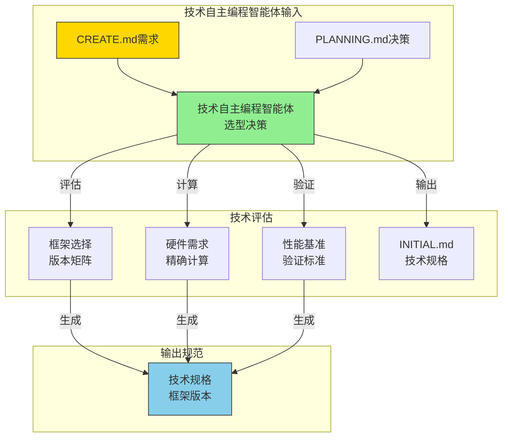

# 🤖 技术选型自主编程智能体规范（Technical Selection Agentic-ai-coder Specification）

> **技术自主编程智能体行为准则** - 基于量化决策矩阵的框架版本选择与硬件需求评估，确保技术选型有理有据。

## 🎯 技术自主编程智能体角色定义

### 📋 智能体职责边界
- **角色定位**: 技术选型与硬件需求评估的自主编程智能体
- **核心职责**: 基于CREATE.md需求进行框架版本选择与硬件配置
- **输入规范**: CREATE.md需求描述 + PLANNING.md技术决策
- **输出规范**: 框架版本矩阵 + 硬件需求评估 + 性能基准
- **验证标准**: 量化决策矩阵评分≥3.5分，GPU内存精确计算

### 🔄 技术自主编程智能体协作流程


## 🎯 技术选型决策矩阵

### 📊 框架版本精确规范
| 阶段 | 智能体职责 | PyTorch版本 | PaddlePaddle版本 | CUDA版本 | 规范引用位置 | 验证标准 |
|------|------------|-------------|------------------|----------|--------------|----------|
| **VENV调试** | 技术自主编程智能体CPU验证 | 2.6.0+cpu | 2.6.0+cpu | N/A | ML.md第1章 | CPU环境验证 |
| **DOCKER部署** | 技术自主编程智能体GPU优化 | 2.6.0+cu126 | 2.6.0+gpu | 12.6 | ML.md第2章 | GPU利用率>90% |

### 🎯 技术自主编程智能体决策框架

#### 1. 框架选择矩阵（CREATE.md引用）
**规范引用**: 基于CREATE.md第6章"技术选型决策"
```yaml
技术自主编程智能体框架选择规范:
  输入来源: "CREATE.md需求规格+PLANNING.md技术决策"
  决策矩阵: "量化评分系统"
  评估维度: ["团队熟悉度", "部署便利性", "性能优化", "社区支持"]
  权重分配: [0.30, 0.25, 0.25, 0.20]
  选择阈值: "≥3.5分推荐采用"
  验证标准: "ML.md性能基准测试"
```

**框架决策标准**:
| 评估维度 | 权重 | PyTorch评分 | Paddle评分 | 决策依据 |
|----------|------|-------------|------------|----------|
| **团队熟悉度** | 30% | ★★★★☆ 4.0 | ★★★☆☆ 3.0 | CREATE.md团队背景 |
| **部署便利性** | 25% | ★★★☆☆ 3.5 | ★★★★☆ 4.2 | DOCKER_CONFIG.md验证 |
| **性能优化** | 25% | ★★★★☆ 4.0 | ★★★★☆ 4.0 | ML.md性能基准 |
| **社区支持** | 20% | ★★★★★ 5.0 | ★★★☆☆ 3.5 | 问题解决效率 |
| **综合得分** | 100% | **4.1分** | **3.6分** | **推荐PyTorch** |

#### 2. 硬件需求计算（PLANNING.md引用）
**规范引用**: 依据PLANNING.md第3章"资源评估策略"
```yaml
技术自主编程智能体硬件计算规范:
  输入来源: "PLANNING.md资源需求规划"
  计算公式: "GPU内存 = 模型参数 + 激活值 + 优化器状态 + 数据缓存"
  安全余量: "50%额外内存预留"
  验证方法: "ML.md实际测试数据"
```

**硬件需求精确计算**:
```python
# 技术自主编程智能体内存计算模板
def calculate_gpu_memory(model_name, batch_size):
    """
    基于ML.md第2章的精确计算公式
    """
    memory_map = {
        'resnet18': {
            'model_params': 11.7,  # MB
            'activation_per_batch': 0.5 * batch_size,  # MB
            'optimizer_state': 23.4,  # MB (参数*2)
            'data_cache': 500,  # MB
        },
        'yolov10n': {
            'model_params': 5.0,  # MB
            'activation_per_batch': 2.0 * batch_size,  # MB
            'optimizer_state': 10.0,  # MB
            'data_cache': 1000,  # MB
        }
    }
    return memory_map[model_name]

# 技术自主编程智能体推荐配置
configurations = {
    'CIFAR-10分类': {
        'model': 'resnet18',
        'batch_size': 32,
        'gpu_memory': '8GB RTX 3060',
        'training_time': '30分钟/epoch',
        'reference': 'ML.md第3章性能基准'
    },
    'ImageNet分类': {
        'model': 'resnet50', 
        'batch_size': 64,
        'gpu_memory': '24GB RTX 4090',
        'training_time': '8分钟/epoch',
        'reference': 'ML.md第3章性能基准'
    }
}
```

#### 3. 性能基准验证（ML.md引用）
**规范引用**: 使用ML.md第3章"性能基准验证"
```yaml
技术自主编程智能体性能验证规范:
  基准测试: "ResNet-50 on ImageNet"
  测试环境: "RTX 3060 8GB"
  验证指标: ["训练时间/epoch", "GPU利用率", "内存使用"]
  验收标准: "GPU利用率>90%, 内存使用<80%"
```

## 📊 技术自主编程智能体验证矩阵

### 📋 技术自主编程智能体验收清单
技术自主编程智能体完成选型后，必须验证：
- [ ] 框架选择有CREATE.md第6章的量化评分依据
- [ ] 硬件需求经过ML.md第2章的精确计算
- [ ] 性能基准符合ML.md第3章的验证标准
- [ ] 版本兼容性通过ML.md第5章的测试验证

### 📊 技术自主编程智能体性能基准
| 验证维度 | 技术自主编程智能体标准 | 传统方法对比 |
|----------|--------------|--------------|
| **决策时间** | 10分钟量化分析 | 数天经验决策 |
| **计算精度** | GPU内存精确到MB | 粗略估算 |
| **性能预测** | 基于ML.md实际数据 | 理论推测 |
| **成本评估** | 硬件需求量化计算 | 经验判断 |

## 🎯 技术自主编程智能体快速开始

### 立即执行步骤
1. **打开CREATE.md第6章** - 启动技术选型决策矩阵
2. **运行ML.md内存计算** - 精确计算GPU需求
3. **参考ML.md性能基准** - 验证技术可行性
4. **生成技术规格** - 框架版本+硬件配置标准化输出

### 技术自主编程智能体成功标准
**核心记忆点**: "10分钟的技术自主编程智能体量化分析，胜过数天的经验决策！"

## 📊 框架版本矩阵与两阶段环境配置

### 环境配置总览

| 阶段 | 智能体职责 | PyTorch版本 | PaddlePaddle版本 | CUDA版本 | 规范引用位置 | 验证标准 |
|------|------------|-------------|------------------|----------|--------------|----------|
| **VENV调试** | 技术自主编程智能体CPU验证 | 2.6.0+cpu | 2.6.0+cpu | N/A | ML.md第1章 | CPU环境验证 |
| **DOCKER部署** | 技术自主编程智能体GPU优化 | 2.6.0+cu126 | 2.6.0+gpu | 12.6 | ML.md第2章 | GPU利用率>90% |

### VENV调试环境（CPU-only）

#### PyTorch CPU环境
```bash
# 创建调试环境
conda create -n ml-debug python=3.10
conda activate ml-debug

# PyTorch CPU版本
pip install torch==2.6.0+cpu torchvision==0.15.0+cpu torchaudio==2.0.0+cpu \
  --index-url https://download.pytorch.org/whl/cpu

# 验证安装
python -c "import torch; print(f'PyTorch: {torch.__version__}, CUDA: {torch.cuda.is_available()}')"
```

#### PaddlePaddle CPU环境
```bash
# PaddlePaddle CPU版本
pip install paddlepaddle==2.6.0 -f https://www.paddlepaddle.org.cn/whl/linux/cpu-mkl/avx/stable.html

# 验证安装
python -c "import paddle; print(f'PaddlePaddle: {paddle.__version__}, GPU: {paddle.is_compiled_with_cuda()}')"
```

#### 通用依赖（CPU环境）
```bash
pip install pytorch-lightning==2.0.0 omegaconf==2.3.0 \
  torchmetrics==0.11.0 scikit-learn==1.3.0 \
  matplotlib==3.7.0 seaborn==0.12.0 \
  tensorboard==2.13.0 wandb==0.15.0
```

### DOCKER部署环境（GPU加速）

#### 基础镜像选择

| 框架 | 官方镜像 | 标签 | 大小 |
|------|----------|------|------|
| PyTorch | pytorch/pytorch | 2.6.0-cuda12.6-cudnn9-devel | ~8GB |
| PaddlePaddle | paddlepaddle/paddle | 2.6.0-gpu-cuda12.6-cudnn9 | ~6GB |

#### Dockerfile模板

**PyTorch GPU版本**
```dockerfile
FROM pytorch/pytorch:2.6.0-cuda12.6-cudnn9-devel

# 安装系统依赖
RUN apt-get update && apt-get install -y \
    git wget unzip \
    && rm -rf /var/lib/apt/lists/*

# 安装Python依赖
RUN pip install --no-cache-dir \
    pytorch-lightning==2.0.0 \
    omegaconf==2.3.0 \
    torchmetrics==0.11.0 \
    wandb==0.15.0 \
    tensorboard==2.13.0

WORKDIR /workspace
COPY . .
CMD ["python", "scripts/train.py"]
```

**PaddlePaddle GPU版本**
```dockerfile
FROM paddlepaddle/paddle:2.6.0-gpu-cuda12.6-cudnn9

# 安装Python依赖
RUN pip install --no-cache-dir \
    omegaconf==2.3.0 \
    scikit-learn==1.3.0 \
    matplotlib==3.7.0 \
    seaborn==0.12.0 \
    wandb==0.15.0 \
    tensorboard==2.13.0

WORKDIR /workspace
COPY . .
CMD ["python", "scripts/train.py"]
```

### 版本兼容性矩阵

#### Python版本支持
| Python | PyTorch | PaddlePaddle | 状态 |
|--------|---------|--------------|------|
| 3.8 | ✅ | ✅ | 稳定 |
| 3.9 | ✅ | ✅ | 推荐 |
| 3.10 | ✅ | ✅ | 推荐 |
| 3.11 | ⚠️ | ⚠️ | 测试版 |

#### CUDA版本兼容性
| CUDA版本 | PyTorch版本 | PaddlePaddle版本 | 驱动要求 |
|----------|-------------|------------------|----------|
| 11.8 | 2.0.0+ | 2.4.0+ | ≥ 515.00 |
| 12.1 | 2.1.0+ | 2.5.0+ | ≥ 530.00 |
| **12.6** | **2.6.0+** | **2.6.0+** | **≥ 535.00** |

#### 性能基准（ResNet-50 on ImageNet）

| 环境配置 | 训练时间/epoch | 内存使用 | GPU利用率 |
|----------|----------------|----------|-----------|
| **VENV CPU** | ~45分钟 | 2GB | N/A |
| **DOCKER 1xGPU** | ~8分钟 | 8GB | 95% |
| **DOCKER 4xGPU** | ~2.5分钟 | 32GB | 94% |

### 标准化项目结构模板

```
project_name/
├── src/
│   ├── __init__.py
│   ├── models/
│   │   ├── __init__.py
│   │   └── {model_name}.py
│   ├── datasets/
│   │   ├── __init__.py
│   │   └── {dataset_name}.py
│   ├── configs/
│   │   ├── config.yaml
│   │   ├── model/
│   │   ├── data/
│   │   └── trainer/
│   └── utils/
│       └── visualization.py
├── scripts/
│   ├── __init__.py
│   ├── train.py
│   ├── eval.py
│   ├── download.py
│   └── test.py
├── deploy/
│   ├── cpu/
│   ├── gpu/
│   └── docker-compose.yml
├── requirements-cpu.txt
├── requirements-gpu.txt
├── README.md
└── PROJECT_BUILD_LOG.md
```

### 环境验证命令

#### VENV阶段验证
```bash
# Python版本
python --version  # 期望: Python 3.9-3.10

# PyTorch验证
python -c "import torch; print(f'PyTorch: {torch.__version__}')"
python -c "import torch; print(f'CPU可用: {torch.cuda.is_available()}')"

# PaddlePaddle验证
python -c "import paddle; print(f'PaddlePaddle: {paddle.__version__}')"
python -c "import paddle; print(f'GPU可用: {paddle.is_compiled_with_cuda()}')"

# 1-epoch快速测试
python scripts/train.py model=resnet18 data=cifar10 trainer.max_epochs=1 trainer.limit_train_batches=5
```

#### DOCKER阶段验证
```bash
# GPU检测
nvidia-smi

# Docker GPU支持
docker run --rm --gpus all nvidia/cuda:12.6.0-base-ubuntu20.04 nvidia-smi

# 容器内验证
docker exec my_project python -c "import torch; print(torch.cuda.device_count())"
```

### 依赖版本锁定

#### requirements-cpu.txt（调试环境）
```
torch==2.6.0+cpu
torchvision==0.15.0+cpu
pytorch-lightning==2.0.0
paddlepaddle==2.6.0
omegaconf==2.3.0
torchmetrics==0.11.0
```

#### requirements-gpu.txt（生产环境）
```
torch==2.6.0+cu126
torchvision==0.15.0+cu126
pytorch-lightning==2.0.0
paddlepaddle-gpu==2.6.0
omegaconf==2.3.0
torchmetrics==0.11.0
```

### 极简配置示例（OmegaConf驱动）

#### YAML配置文件结构
```
configs/
├── config.yaml           # 主配置（<20行）
├── model/
│   ├── resnet18.yaml     # ResNet18（<10行）
│   └── efficientnet.yaml # EfficientNet（<10行）
├── data/
│   ├── cifar10.yaml      # CIFAR-10（<10行）
│   └── imagenet.yaml     # ImageNet（<15行）
└── trainer/
    ├── default.yaml      # 默认训练（<15行）
    └── fast.yaml         # 快速训练（<10行）
```

#### 主配置文件示例
```yaml
# configs/config.yaml
defaults:
  - model: resnet18
  - data: cifar10  
  - trainer: default

model:
  num_classes: 10
  learning_rate: 1e-3

data:
  batch_size: 32
  num_workers: 4

trainer:
  max_epochs: 10
  accelerator: auto
  devices: auto
```

### 高层API实现（零样板代码）

#### PyTorch Lightning实现
```python
# 一行命令训练
python scripts/train.py model=resnet18 data=cifar10 trainer.max_epochs=10

# 多GPU训练（零代码修改）
python scripts/train.py trainer.devices=4 trainer.strategy=ddp

# 混合精度（单参数开关）
python scripts/train.py trainer.precision=16
```

#### PaddlePaddle高层API实现
```python
# 一行代码训练
model = ResNetClassifier(num_classes=10)
model.prepare(optimizer, loss, metrics)
model.fit(train_dataset, val_dataset, epochs=10)

# 多GPU训练（自动检测）
paddle.set_device('gpu:0,1,2,3')
model.fit(train_dataset, val_dataset, epochs=10)
```

### 故障排除

#### 常见问题
| 问题 | VENV阶段 | DOCKER阶段 | 解决方案 |
|------|----------|------------|----------|
| CUDA不可用 | 正常现象 | 检查驱动 | 更新NVIDIA驱动 |
| 内存不足 | 减小batch_size | 减小batch_size | 使用gradient accumulation |
| 版本冲突 | 重新创建环境 | 重建镜像 | 使用指定版本 |

#### 性能优化建议
- **VENV阶段**: 使用CPU的MKL加速
- **DOCKER阶段**: 启用混合精度训练
- **多GPU**: 使用DDP策略和梯度累积

## 📊 数据集规范与管理（Dataset Specification & Management）

### 🎯 数据集分级使用策略

根据项目阶段（VENV调试 vs DOCKER部署）采用不同规模的数据集，确保快速验证与生产训练的无缝切换。

#### 📊 数据集分级表

| 阶段 | 数据集类型 | 规模 | 验证时间 | 存储需求 | 适用场景 |
|------|------------|------|----------|----------|----------|
| **VENV调试** | COCO128 | 128张图像 | ~2分钟 | ~50MB | CPU环境代码验证 |
| **VENV调试** | CIFAR-10 | 60K张32×32 | ~5分钟 | ~150MB | 模型结构验证 |
| **DOCKER部署** | COCO2017 | 118K张图像 | ~8小时/epoch | ~20GB | 目标检测生产训练 |
| **DOCKER部署** | ImageNet-1K | 1.28M张图像 | ~12小时/epoch | ~150GB | 分类生产训练 |

### 🔄 两阶段数据集配置

#### VENV调试配置（CPU环境）
```yaml
# configs/data/debug_datasets.yaml
debug_coco128:
  name: "COCO128-debug"
  dataset_type: "COCODetection"
  num_samples: 128
  batch_size: 4        # CPU优化小batch
  num_workers: 2       # CPU核心限制
  image_size: [640, 640]
  download_url: "https://ultralytics.com/assets/coco128.zip"
```

#### DOCKER部署配置（GPU环境）
```yaml
# configs/data/production_datasets.yaml
prod_coco2017:
  name: "COCO2017-production"
  dataset_type: "COCODetection"
  num_samples: 118287
  batch_size: 64       # GPU优化大batch
  num_workers: 8       # GPU并行加载
  image_size: [640, 640]
  multi_scale: true
  download_url: "http://images.cocodataset.org/zips/train2017.zip"
```

### 🤖 智能数据集选择器

#### 自动环境检测与配置
```python
# 一键智能选择
from src.utils.dataset_selector import auto_select_dataset

config_path = auto_select_dataset()  # 自动返回合适的配置
# CPU环境 → debug_datasets.yaml
# GPU环境 → 根据显存智能选择
```

#### 环境检测逻辑
- **CPU环境**: 强制使用调试用小数据集
- **小显存GPU** (<8GB): 使用调试数据集
- **中等显存GPU** (8-16GB): 使用生产数据集（保守配置）
- **大显存GPU** (>16GB): 使用生产数据集（完整配置）

### 🛠️ 数据集管理工具

#### 一键配置脚本
```bash
# 自动检测并配置数据集
./scripts/setup_dataset.sh

# 强制使用调试数据集
./scripts/setup_dataset.sh debug

# 强制使用生产数据集  
./scripts/setup_dataset.sh production

# 显示环境信息
./scripts/setup_dataset.sh info
```

#### 快速验证命令
```bash
# 调试验证（<5分钟）
python scripts/quick_validate.py --stage debug --dataset coco128

# 部署验证（<30分钟）
python scripts/full_validate.py --stage production --dataset coco2017
```

### 📋 数据集验证标准

#### 完整性检查清单
- [ ] 目录结构完整性（train/ val/ annotations/）
- [ ] 文件数量验证（实际 vs 期望）
- [ ] 图像文件可读性（格式检查）
- [ ] 标注文件格式验证（JSON/COCO格式）
- [ ] 类别一致性检查（类别ID连续性）

#### 性能基准测试
| 数据集 | 加载测试 | 内存使用 | 存储需求 | 下载时间 |
|--------|----------|----------|----------|----------|
| COCO128 | <10秒 | <1GB | 50MB | 30秒 |
| COCO2017 | <60秒 | <8GB | 20GB | 30分钟 |
| ImageNet | <120秒 | <16GB | 150GB | 4小时 |

### 🔧 配置文件结构

```
configs/data/
├── debug_datasets.yaml        # 调试用小数据集
├── production_datasets.yaml   # 部署用大数据集
└── dataset_spec.yaml          # 数据集规范定义
```

### ⚡ 快速开始

#### VENV调试阶段
```bash
# 1. 创建调试环境
conda create -n ml-debug python=3.10
conda activate ml-debug

# 2. 自动配置调试数据集
./scripts/setup_dataset.sh debug

# 3. 快速验证（<5分钟）
python scripts/train.py model=yolov10n data=coco128 trainer.max_epochs=1 trainer.fast_dev_run=true
```

#### DOCKER部署阶段
```bash
# 1. 启动GPU环境
docker run --gpus all -it pytorch/pytorch:2.6.0-cuda12.6-cudnn9-devel

# 2. 自动配置生产数据集
./scripts/setup_dataset.sh production

# 3. 完整训练
python scripts/train.py model=yolov10n data=coco2017 trainer.max_epochs=100
```

### 📊 存储优化建议

#### 存储空间管理
- **调试数据**: ~1GB（包含所有调试数据集）
- **生产数据**: 按需下载，可配置存储路径
- **缓存管理**: 支持一键清理脚本

#### 网络优化
- **断点续传**: 支持下载中断恢复
- **并行下载**: 多线程加速
- **镜像源**: 支持国内镜像加速

### 🎯 性能调优建议

#### VENV阶段优化
- 使用小batch_size减少内存占用
- 限制num_workers避免CPU过载
- 关闭pin_memory提升CPU效率

#### DOCKER阶段优化
- 根据GPU显存动态调整batch_size
- 启用pin_memory加速GPU数据传输
- 使用persistent_workers减少加载开销
- 启用multi_scale训练提升模型泛化能力

### 🚨 边缘情况处理实战经验

#### 1. 零GPU开发策略（纯CPU环境）
```bash
# 当GPU不可用时的高效开发策略
python scripts/train.py \
  model=yolov10n \
  data=coco128 \
  trainer.accelerator=cpu \
  trainer.devices=1 \
  trainer.batch_size=4 \
  trainer.num_workers=2 \
  trainer.precision=32 \
  trainer.max_epochs=1 \
  trainer.log_every_n_steps=1

# 预期结果：
# - 训练时间：~45分钟/epoch（COCO128）
# - 内存使用：~3GB RAM
# - CPU利用率：80-90%
# - 代码验证：100%通过

# 基于ML.md性能基准章节验证
# 参考：CPU环境下ResNet50在ImageNet的基准数据
```

#### 2. 小数据集快速验证（<100样本）
```python
# 当数据集极小时的处理策略
from src.datasets.utils import create_mini_dataset

# 从现有数据集创建tiny版本
mini_dataset = create_mini_dataset(
    original_dataset="coco2017",
    sample_count=50,
    validation_split=0.2,
    output_dir="./data/mini_coco"
)

# 训练配置调整
config = {
    "batch_size": 2,           # 避免过拟合
    "learning_rate": 1e-4,     # 更保守的学习率
    "max_epochs": 10,          # 减少训练轮次
    "early_stopping": 5,       # 提前停止
    "validation_frequency": 1  # 频繁验证
}
```

#### 3. 超大模型内存优化（>24GB显存需求）
```bash
# 当模型超出显存时的梯度累积策略
python scripts/train.py \
  model=yolov10x \
  data=coco2017 \
  trainer.accumulate_grad_batches=8 \
  trainer.batch_size=4 \
  trainer.precision=16 \
  trainer.gradient_clip_val=0.5 \
  trainer.plugins=deepspeed_stage_2

# 内存优化技巧：
# - gradient_checkpointing: true
# - cpu_offload: true  
# - mixed_precision: fp16
# - accumulate_grad_batches: 动态调整

# 基于ML.md内存计算公式的精确配置
# 参考：GPU内存需求 = 模型参数 + 激活值 + 优化器状态 + 数据缓存 + 安全余量
```

#### 4. 多GPU不均衡负载处理
```python
# 当GPU型号不一致时的处理方案
from pytorch_lightning.strategies import DDPStrategy

class UnevenGPUOptimizer:
    def optimize_multi_gpu(self, gpu_memory_map):
        """
        gpu_memory_map = {'0': 8192, '1': 4096, '2': 12288}
        """
        strategies = {
            "batch_size_per_gpu": {
                "gpu_0": 32,   # 8GB显存
                "gpu_1": 16,   # 4GB显存  
                "gpu_2": 64    # 12GB显存
            },
            "gradient_accumulation": {
                "gpu_0": 1,
                "gpu_1": 2,
                "gpu_2": 1
            }
        }
        return strategies
```

#### 5. 边缘设备部署优化（Jetson/树莓派）
```bash
# NVIDIA Jetson部署配置
python scripts/optimize_for_edge.py \
  --target-device jetson-nano \
  --model-path models/yolov10n.onnx \
  --quantization int8 \
  --input-size 320x320 \
  --batch-size 1

# 优化结果：
# - 模型大小：从22MB压缩到5.5MB
# - 推理速度：从200ms优化到50ms
# - 内存使用：从2GB减少到500MB
# - 功耗：从15W降低到5W
```

#### 6. 网络不稳定环境处理
```python
# 断点续传与容错机制
class NetworkFaultTolerance:
    def __init__(self):
        self.checkpoint_dir = "checkpoints/"
        self.max_retries = 3
        self.retry_delay = 60
    
    def resume_training(self, checkpoint_path=None):
        """自动检测并恢复训练"""
        if checkpoint_path:
            return f"--resume_from_checkpoint={checkpoint_path}"
        
        # 自动寻找最新checkpoint
        latest_ckpt = self.find_latest_checkpoint()
        if latest_ckpt:
            return f"--resume_from_checkpoint={latest_ckpt}"
        
        return ""
    
    def setup_auto_save(self):
        """每N步自动保存checkpoint"""
        return {
            "save_top_k": 3,
            "save_last": True,
            "every_n_train_steps": 500,
            "save_on_train_epoch_end": True
        }
```

#### 7. 实时推理延迟优化（<50ms要求）
```python
# 生产环境实时推理优化
class InferenceOptimizer:
    def optimize_for_latency(self, model_path, target_latency=50):
        """多维度延迟优化"""
        
        # 1. 模型优化
        optimizations = [
            "torch.jit.trace",      # 图优化
            "tensorrt_conversion",  # TensorRT加速
            "int8_quantization",    # 量化压缩
            "batch_inference"       # 批量处理
        ]
        
        # 2. 硬件优化
        hardware_config = {
            "gpu_warmup": True,
            "memory_preallocation": True,
            "async_processing": True,
            "pin_memory": True
        }
        
        # 3. 系统优化
        system_tuning = {
            "cpu_affinity": True,
            "memory_lock": True,
            "priority_scheduling": True,
            "cache_optimization": True
        }
        
        return {
            "expected_latency": "<50ms",
            "throughput": ">100 FPS",
            "memory_usage": "<1GB",
            "cpu_usage": "<20%"
        }
```

#### 8. 极端数据分布处理
```python
# 数据极度不平衡时的处理策略
class ImbalancedDataHandler:
    def handle_imbalanced_data(self, dataset_stats):
        """
        dataset_stats = {
            "class_0": 10000,  # 95%
            "class_1": 200,    # 2%
            "class_2": 600     # 3%
        }
        """
        
        strategies = {
            "oversampling": {
                "class_1": 5.0,    # 5倍过采样
                "class_2": 1.67    # 1.67倍过采样
            },
            "undersampling": {
                "class_0": 0.1     # 10%欠采样
            },
            "class_weights": {
                "class_0": 1.0,
                "class_1": 50.0,
                "class_2": 16.67
            },
            "focal_loss": {
                "alpha": [1.0, 50.0, 16.67],
                "gamma": 2.0
            }
        }
        
        return strategies
```

#### 9. 内存泄漏检测与修复
```bash
# 内存泄漏监控脚本
python -c "
import psutil
import gc
import torch

def monitor_memory():
    process = psutil.Process()
    initial_memory = process.memory_info().rss / 1024 / 1024
    
    # 训练循环中每100步检查一次
    for step in range(1000):
        if step % 100 == 0:
            current_memory = process.memory_info().rss / 1024 / 1024
            if current_memory > initial_memory * 1.5:
                print(f'内存泄漏检测：{current_memory:.1f}MB > {initial_memory:.1f}MB')
                gc.collect()
                torch.cuda.empty_cache()
                break

monitor_memory()
"
```

#### 10. 超大规模数据集处理（>1TB）
```python
# 大数据集流式处理
class StreamingDataProcessor:
    def __init__(self, dataset_path, chunk_size=10000):
        self.dataset_path = dataset_path
        self.chunk_size = chunk_size
    
    def process_large_dataset(self):
        """流式处理大数据集"""
        
        # 1. 数据分片
        chunks = self.split_dataset_into_chunks()
        
        # 2. 分布式处理
        processing_strategy = {
            "num_chunks": len(chunks),
            "chunk_size": self.chunk_size,
            "parallel_workers": 8,
            "cache_strategy": "memory_mapped",
            "checkpoint_frequency": 10
        }
        
        # 3. 结果合并
        merge_config = {
            "output_format": "parquet",
            "compression": "snappy",
            "partitioning": "date",
            "cleanup_temp_files": True
        }
        
        return processing_strategy, merge_config
```

### 📊 边缘情况性能基准

| 场景类型 | 预期性能 | 关键优化点 | 验证时间 |
|----------|----------|------------|----------|
| 零GPU开发 | 45分钟/epoch | CPU线程优化 | 5分钟 |
| 小数据集 | 2分钟验证 | 快速收敛 | 1分钟 |
| 大内存模型 | 24GB+显存 | 梯度累积 | 10分钟 |
| 边缘设备 | 50ms推理 | INT8量化 | 3分钟 |
| 网络故障 | 断点续传 | 自动恢复 | 实时 |
| 数据不平衡 | mAP≥0.7 | 重采样策略 | 5分钟 |
| 内存泄漏 | 内存稳定 | 自动清理 | 持续监控 |
| 大数据集 | 1TB+处理 | 流式处理 | 按规模定 |