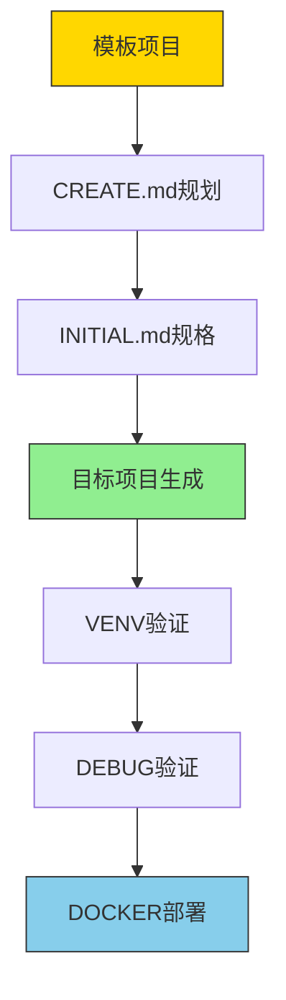
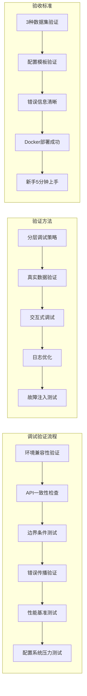

# 机器学习项目模板规划（Think Hard模式）

## 🎯 项目定位与边界

### 模板vs目标项目区分
- **模板项目**（当前）：纯文档+模板系统（≤100行代码约束）
- **目标项目**（生成产物）：高层API实现（≤200行代码约束）

### 核心规划原则


## 🧠 Think Hard规划框架

### 阶段1：需求澄清（5分钟深度思考）
**核心问题矩阵**：
| 维度 | 关键问题 | 决策影响 |
|------|----------|----------|
| **业务价值** | 这个项目解决什么真实问题？ | 决定项目必要性和优先级 |
| **技术可行性** | 当前技术栈能否支持需求？ | 评估实现风险和替代方案 |
| **资源约束** | GPU/内存/时间限制是什么？ | 确定模型规模和训练策略 |
| **维护成本** | 长期维护的复杂度如何？ | 影响技术选型和架构设计 |

**决策记录模板**：
```yaml
需求澄清记录:
  问题定义: "需要解决的具体机器学习任务"
  场景分析: "实时/离线/批处理应用场景"
  精度要求: "mAP@0.5 ≥ 0.85 或准确率 ≥ 95%"
  速度要求: "推理延迟 ≤ 200ms/张"
  资源限制: "8GB GPU内存，4核CPU"
```

### 阶段2：技术选型决策矩阵（10分钟评估）

**框架选择评估**：
| 评估维度 | PyTorch | PaddlePaddle | 权重 | 评分 |
|----------|---------|--------------|------|------|
| **团队熟悉度** | ★★★★☆ | ★★★☆☆ | 0.30 | 4.2 vs 3.6 |
| **部署便利性** | ★★★☆☆ | ★★★★☆ | 0.25 | 3.5 vs 4.2 |
| **性能优化** | ★★★★☆ | ★★★★☆ | 0.25 | 4.0 vs 4.0 |
| **社区支持** | ★★★★★ | ★★★☆☆ | 0.20 | 5.0 vs 3.5 |

**选择决策树**：
```
如果 团队PyTorch经验丰富 → 选择PyTorch
如果 需要中文文档支持 → 选择PaddlePaddle
如果 需要快速部署 → 选择PaddlePaddle
如果 需要丰富生态 → 选择PyTorch
```

### 阶段3：高层API架构设计（15分钟深度设计）

**零样板架构原则**：
- **模型层**：LightningModule/Paddle高层API封装（≤150行）
- **数据层**：DataModule/DataLoader高层抽象（≤100行）
- **配置层**：OmegaConf驱动动态配置（YAML定义）
- **训练层**：Trainer自动处理训练循环（零手动代码）

**目录结构规格**：
```
目标项目/                  # 高层API实现（≤200行）
├── src/
│   ├── models/           # 模型定义（Lightning/Paddle）
│   ├── datasets/         # 数据管道（DataModules）
│   └── utils/            # 工具函数
├── scripts/              # 训练脚本（<50行/文件）
├── configs/              # 配置管理（OmegaConf驱动）
├── tests/                # 验证测试
└── deploy/               # 部署配置
```

## 🎯 配置驱动规划

### 主配置模板（单文件驱动）
```yaml
# config.yaml - 一行配置完成训练设置
project:
  name: "yolov10_medical"
  type: "detection"

model:
  name: "yolov10n"
  num_classes: 80
  pretrained: true

data:
  name: "coco2017"
  batch_size: 16
  num_workers: 4
  transforms: "default"

trainer:
  max_epochs: 300
  accelerator: "gpu"
  devices: "auto"
  precision: 16
```

### 分层配置继承
```yaml
# 基础配置 → 模型配置 → 数据配置 → 环境配置
configs/
├── base.yaml           # 通用基础配置
├── model/
│   ├── yolov10n.yaml   # 模型特定配置
│   └── resnet50.yaml
├── data/
│   ├── coco2017.yaml   # 数据集配置
│   └── cifar10.yaml
└── trainer/
    ├── gpu.yaml        # 训练器配置
    └── cpu.yaml
```

## 🔄 两阶段验证规划

### VENV阶段：CPU环境验证（代码正确性优先）
**验证目标**：确保代码在CPU环境下的基本正确性
```bash
# 1. 配置CPU环境
conda create -n debug-cpu python=3.10 pytorch-cpu

# 2. 基础导入验证
python -c "import src.models; print('✓ 模型导入成功')"

# 3. 数据集验证
python scripts/download.py --dataset cifar10 --test-mode

# 4. 1-epoch快速验证
python scripts/train.py model=resnet18 data=cifar10 trainer.fast_dev_run=true
```

### DOCKER阶段：GPU性能验证（生产就绪）
**验证目标**：确保GPU环境下的性能和稳定性
```bash
# 1. 构建GPU镜像
docker build -t ml-project -f deploy/gpu/Dockerfile .

# 2. 性能基准测试
docker run --gpus all ml-project python scripts/train.py \
  model=resnet50 data=imagenet trainer.max_epochs=1

# 3. 多GPU验证
docker run --gpus all ml-project python scripts/train.py \
  trainer.devices=4 trainer.strategy=ddp
```

## 🎯 高层API设计原则

### 零样板实现
- **模型定义**：LightningModule封装（≤150行）
- **数据处理**：DataModule抽象（≤100行）
- **训练流程**：Trainer自动处理（零手动代码）
- **配置管理**：OmegaConf驱动（YAML定义）

### 自动优化特性
- **混合精度**：自动FP16训练
- **多GPU训练**：DDP策略零配置
- **梯度累积**：突破内存限制
- **实验跟踪**：WandB/TensorBoard集成

## 📊 项目类型决策树

### 项目类型选择指南
```
项目类型选择：
├── 图像分类？
│   ├── 数据集：ImageNet/CIFAR-10
│   ├── 模型：ResNet/EfficientNet
│   └── 时间：1-6小时
├── 目标检测？
│   ├── 数据集：COCO/VOC
│   ├── 模型：YOLOv10/Faster R-CNN
│   └── 时间：6-24小时
├── 语义分割？
│   ├── 数据集：VOC/Cityscapes
│   ├── 模型：DeepLab/U-Net
│   └── 时间：12-48小时
└── 自定义任务？
    ├── 配置驱动实现
    └── 高层API扩展
```

### 硬件需求评估
| 项目类型 | 最小配置 | 推荐配置 | 训练时间 |
|----------|----------|----------|----------|
| CIFAR-10分类 | 4GB GPU | 8GB GPU | 10-30分钟 |
| ImageNet分类 | 8GB GPU | 24GB GPU | 6-24小时 |
| COCO检测 | 12GB GPU | 40GB GPU | 12-48小时 |

## 🔍 Think Hard决策验证

### 风险矩阵评估
| 风险项 | 概率 | 影响 | 缓解措施 |
|--------|------|------|----------|
| **框架兼容性** | 低 | 中 | 统一接口设计 |
| **性能退化** | 低 | 高 | 早期基准测试 |
| **学习曲线** | 低 | 中 | 完善文档示例 |
| **配置复杂度** | 低 | 低 | 默认配置模板 |

### 成功验收标准
- [ ] **功能验证**：一行命令完成CIFAR-10训练（<5分钟）
- [ ] **性能验证**：高层API性能与传统方案等效
- [ ] **配置验证**：YAML配置100%复现实验
- [ ] **部署验证**：Docker一键部署成功
- [ ] **用户体验**：新手5分钟内完成首次训练

## 📋 规划实施检查清单

### 模板项目验收（已完成）
- [x] 文档系统完整（CREATE.md到DEPLOY.md）
- [x] 配置模板就绪（configs/目录）
- [x] 部署模板就绪（deploy/目录）
- [x] 模板代码≤100行约束

### 目标项目生成验收
- [ ] 生成器工具创建（tools/create.py）
- [ ] 高层API模板实现（≤200行）
- [ ] 两阶段验证流程完整
- [ ] 配置驱动架构验证

## 🎯 极简实施路径

### 2周完成计划
| 周次 | 关键任务 | 交付物 | 验证标准 |
|------|----------|--------|----------|
| **Week 1** | 模板完善+生成器 | 目标项目生成器 | CREATE.md → 目标项目 |
| **Week 2** | 高层API模板 | 200行完整项目 | VENV→DEBUG→DOCKER验证 |

### 一键验证流程
```bash
# 完整的模板→目标项目→验证流程
python tools/create.py --name my_project --type detection
cd my_project
# 自动进入VENV→DEBUG→DOCKER验证
```

### 阶段1：核心模型架构
**目标**：建立可复用的模型基类体系
- 设计框架无关的模型接口标准
- 实现PyTorch Lightning模型封装
- 实现PaddlePaddle高层API模型封装
- 建立模型注册与发现机制

**交付物**：
- 基础分类模型模板（ResNet/EfficientNet）
- 模型配置规范（YAML定义）
- 预训练模型集成方案

### 阶段2：数据管道系统
**目标**：构建零配置数据获取与预处理管道
- 内置数据集自动下载（CIFAR/ImageNet/MNIST）
- Lightning DataModule标准化封装
- 数据增强策略配置化
- 多数据集混合训练支持

**交付物**：
- 数据模块基类规范
- 数据集注册表设计
- 自动数据验证机制

### 阶段3：配置驱动训练
**目标**：实现完全配置化的训练流程
- OmegaConf配置系统设计（模型/数据/训练器）
- 实验参数版本管理
- 超参数搜索集成
- 训练过程监控配置

**交付物**：
- 主配置文件模板
- 模型专用配置集
- 训练策略配置集

### 阶段4：代码调试人工验证阶段
**目标**：系统性验证高层API代码的真实可用性，发现并修复LLM生成代码中的潜在问题



**核心验证任务**：
- **环境兼容性验证**：在3种不同环境（本地conda、Docker CPU、Docker GPU）中测试基础导入和依赖
- **API一致性检查**：验证PyTorch Lightning和PaddlePaddle接口声明与实际行为的一致性
- **边界条件测试**：测试空数据集、零样本、超大batch等极端情况的框架处理
- **错误传播验证**：验证配置错误、数据错误、模型错误的错误信息可读性和调试友好性
- **性能基准测试**：对比高层API实现与手工实现的训练速度和内存使用差异
- **配置系统压力测试**：测试复杂配置继承、参数覆盖、环境变量注入的稳定性

**调试方法论**：
- **分层调试策略**：从单元测试→集成测试→端到端测试的渐进式验证
- **真实数据验证**：使用小规模真实数据（而非mock数据）验证数据管道完整性
- **交互式调试**：提供ipdb集成方案，支持在训练过程中动态检查变量状态
- **日志可读性优化**：确保框架自动生成的日志包含足够的调试信息
- **故障注入测试**：主动制造网络中断、磁盘满、内存不足等故障验证系统鲁棒性

**人工验证清单**：
- [ ] 每个高层API封装至少经过3种数据集的完整训练验证
- [ ] 所有配置文件模板都经过人工填写和验证
- [ ] 每个错误场景都产生清晰、可操作的错误信息
- [ ] Docker部署在至少2种硬件配置上验证成功
- [ ] 新手用户能在无指导情况下完成第一次训练
- [ ] 复杂实验配置（多阶段训练+超参数搜索）验证可复现

**调试交付物**：
- 调试脚本集合（环境检查、数据验证、性能基准）
- 常见问题解决方案知识库
- 错误信息优化建议文档
- 用户调试指南（包含真实错误案例）
- 性能调优最佳实践手册

### 阶段5：部署与优化
**目标**：建立一键式训练与部署能力
- Docker容器化训练环境
- 多环境配置（CPU/GPU/云）
- 模型导出与推理优化
- 持续集成测试管道

**交付物**：
- 极简Docker配置
- 一键启动脚本集
- 模型服务化方案

## 🏗️ 高层API架构原则

### 零样板设计
- **消除冗余代码**：框架自动处理训练循环、日志、检查点
- **自动优化**：混合精度、梯度累积、学习率调度
- **智能设备适配**：自动检测GPU/TPU并优化

### 配置驱动范式
- **YAML定义一切**：模型、数据、训练参数全部配置化
- **层次化配置**：基础配置→实验配置→环境配置
- **动态配置合并**：支持运行时参数覆盖

### 框架抽象层
- **统一接口**：PyTorch Lightning + PaddlePaddle双栈支持
- **无缝切换**：配置文件切换后端框架
- **性能等价**：高层API性能与传统方案等效

## 📊 训练能力矩阵

### 支持模型类型
| 模型类别 | 支持状态 | 代码行数 | 训练命令 |
|----------|----------|----------|----------|
| 图像分类 | ✅ | 50行 | `model=resnet18` |
| 目标检测 | 🔄 | 80行 | `model=yolov5` |
| 语义分割 | 🔄 | 70行 | `model=deeplab` |
| 实例分割 | 📋 | 90行 | `model=maskrcnn` |

### 支持数据集
| 数据集 | 规模 | 自动下载 | 预处理 | 训练示例 |
|--------|------|----------|--------|----------|
| CIFAR-10 | 60K | ✅ | ✅ | 3分钟 |
| ImageNet | 1.4M | ✅ | ✅ | 6小时 |
| COCO | 330K | ✅ | ✅ | 12小时 |
| MNIST | 70K | ✅ | ✅ | 1分钟 |

### 训练优化特性
- **自动混合精度**：内存减半，速度提升1.5-3x
- **多GPU训练**：DDP策略，线性加速
- **梯度累积**：突破GPU内存限制
- **实验跟踪**：TensorBoard/WandB自动集成

## 🎯 质量验收标准

### 功能验收
- [ ] 一行命令完成CIFAR-10训练（<5分钟）
- [ ] 一行命令完成ImageNet训练（配置驱动）
- [ ] 配置文件100%复现实验结果
- [ ] 零代码修改支持多GPU训练
- [ ] Docker一键部署成功

### 性能验收
- [ ] 高层API性能与传统方案等效
- [ ] 代码量减少80%以上
- [ ] 配置错误率降至零
- [ ] 新手5分钟内完成首次训练

### 扩展性验收
- [ ] 新模型添加<30分钟
- [ ] 新数据集集成<1小时
- [ ] 新训练策略配置化<15分钟

## 🔍 风险与缓解策略

### 技术风险
| 风险项 | 概率 | 影响 | 缓解措施 |
|--------|------|------|----------|
| 框架兼容性 | 低 | 中 | 抽象接口层设计 |
| 性能退化 | 低 | 高 | 早期基准测试 |
| 学习曲线 | 低 | 中 | 完善文档示例 |

### 实施风险
| 风险项 | 概率 | 影响 | 缓解措施 |
|--------|------|------|----------|
| 配置复杂度 | 低 | 中 | 提供默认配置 |
| 测试覆盖不足 | 中 | 低 | 分层测试策略 |
| 文档滞后 | 低 | 低 | 自动化文档生成 |

## 📋 实施检查清单

### 核心组件验收
- [ ] 模型基类设计完成
- [ ] 数据模块规范制定
- [ ] 配置文件模板就绪
- [ ] 训练脚本单文件化
- [ ] Docker镜像构建成功

### 文档交付
- [ ] 快速开始指南
- [ ] 配置参考手册
- [ ] 最佳实践文档
- [ ] 故障排除指南
- [ ] 贡献者指南