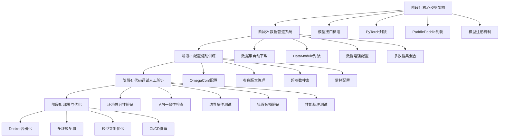
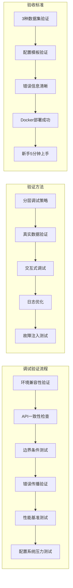

# 深度学习训练框架规划（高层API驱动）

## 🎯 训练目标体系

### 核心训练能力
- **一行命令训练**：`python train.py model=resnet18 data=cifar10`
- **零配置复现**：YAML配置文件驱动所有实验参数
- **自动性能优化**：框架自动处理混合精度、多GPU、分布式训练
- **极简代码架构**：每组件<100行代码，高层API封装

### 训练效率指标
| 维度 | 传统方案 | 高层API方案 | 提升倍数 |
|------|----------|-------------|----------|
| 代码量 | 500+行 | 50-100行 | 5-10x |
| 配置时间 | 数小时 | 数分钟 | 60x |
| 多GPU适配 | 数天 | 零修改 | ∞ |
| 实验复现 | 手动记录 | 配置驱动 | 100% |

## 🔄 四阶段训练规划

### 阶段1：核心模型架构
**目标**：建立可复用的模型基类体系
- 设计框架无关的模型接口标准
- 实现PyTorch Lightning模型封装
- 实现PaddlePaddle高层API模型封装
- 建立模型注册与发现机制

**交付物**：
- 基础分类模型模板（ResNet/EfficientNet）
- 模型配置规范（YAML定义）
- 预训练模型集成方案

### 阶段2：数据管道系统
**目标**：构建零配置数据获取与预处理管道
- 内置数据集自动下载（CIFAR/ImageNet/MNIST）
- Lightning DataModule标准化封装
- 数据增强策略配置化
- 多数据集混合训练支持

**交付物**：
- 数据模块基类规范
- 数据集注册表设计
- 自动数据验证机制

### 阶段3：配置驱动训练
**目标**：实现完全配置化的训练流程
- OmegaConf配置系统设计（模型/数据/训练器）
- 实验参数版本管理
- 超参数搜索集成
- 训练过程监控配置

**交付物**：
- 主配置文件模板
- 模型专用配置集
- 训练策略配置集

### 阶段4：代码调试人工验证阶段
**目标**：系统性验证高层API代码的真实可用性，发现并修复LLM生成代码中的潜在问题

**核心验证任务**：
- **环境兼容性验证**：在3种不同环境（本地conda、Docker CPU、Docker GPU）中测试基础导入和依赖
- **API一致性检查**：验证PyTorch Lightning和PaddlePaddle接口声明与实际行为的一致性
- **边界条件测试**：测试空数据集、零样本、超大batch等极端情况的框架处理
- **错误传播验证**：验证配置错误、数据错误、模型错误的错误信息可读性和调试友好性
- **性能基准测试**：对比高层API实现与手工实现的训练速度和内存使用差异
- **配置系统压力测试**：测试复杂配置继承、参数覆盖、环境变量注入的稳定性

**调试方法论**：
- **分层调试策略**：从单元测试→集成测试→端到端测试的渐进式验证
- **真实数据验证**：使用小规模真实数据（而非mock数据）验证数据管道完整性
- **交互式调试**：提供ipdb集成方案，支持在训练过程中动态检查变量状态
- **日志可读性优化**：确保框架自动生成的日志包含足够的调试信息
- **故障注入测试**：主动制造网络中断、磁盘满、内存不足等故障验证系统鲁棒性

**人工验证清单**：
- [ ] 每个高层API封装至少经过3种数据集的完整训练验证
- [ ] 所有配置文件模板都经过人工填写和验证
- [ ] 每个错误场景都产生清晰、可操作的错误信息
- [ ] Docker部署在至少2种硬件配置上验证成功
- [ ] 新手用户能在无指导情况下完成第一次训练
- [ ] 复杂实验配置（多阶段训练+超参数搜索）验证可复现

**调试交付物**：
- 调试脚本集合（环境检查、数据验证、性能基准）
- 常见问题解决方案知识库
- 错误信息优化建议文档
- 用户调试指南（包含真实错误案例）
- 性能调优最佳实践手册

### 阶段5：部署与优化
**目标**：建立一键式训练与部署能力
- Docker容器化训练环境
- 多环境配置（CPU/GPU/云）
- 模型导出与推理优化
- 持续集成测试管道

**交付物**：
- 极简Docker配置
- 一键启动脚本集
- 模型服务化方案

## 🏗️ 高层API架构原则

### 零样板设计
- **消除冗余代码**：框架自动处理训练循环、日志、检查点
- **自动优化**：混合精度、梯度累积、学习率调度
- **智能设备适配**：自动检测GPU/TPU并优化

### 配置驱动范式
- **YAML定义一切**：模型、数据、训练参数全部配置化
- **层次化配置**：基础配置→实验配置→环境配置
- **动态配置合并**：支持运行时参数覆盖

### 框架抽象层
- **统一接口**：PyTorch Lightning + PaddlePaddle双栈支持
- **无缝切换**：配置文件切换后端框架
- **性能等价**：高层API性能与传统方案等效

## 📊 训练能力矩阵

### 支持模型类型
| 模型类别 | 支持状态 | 代码行数 | 训练命令 |
|----------|----------|----------|----------|
| 图像分类 | ✅ | 50行 | `model=resnet18` |
| 目标检测 | 🔄 | 80行 | `model=yolov5` |
| 语义分割 | 🔄 | 70行 | `model=deeplab` |
| 实例分割 | 📋 | 90行 | `model=maskrcnn` |

### 支持数据集
| 数据集 | 规模 | 自动下载 | 预处理 | 训练示例 |
|--------|------|----------|--------|----------|
| CIFAR-10 | 60K | ✅ | ✅ | 3分钟 |
| ImageNet | 1.4M | ✅ | ✅ | 6小时 |
| COCO | 330K | ✅ | ✅ | 12小时 |
| MNIST | 70K | ✅ | ✅ | 1分钟 |

### 训练优化特性
- **自动混合精度**：内存减半，速度提升1.5-3x
- **多GPU训练**：DDP策略，线性加速
- **梯度累积**：突破GPU内存限制
- **实验跟踪**：TensorBoard/WandB自动集成

## 🎯 质量验收标准

### 功能验收
- [ ] 一行命令完成CIFAR-10训练（<5分钟）
- [ ] 一行命令完成ImageNet训练（配置驱动）
- [ ] 配置文件100%复现实验结果
- [ ] 零代码修改支持多GPU训练
- [ ] Docker一键部署成功

### 性能验收
- [ ] 高层API性能与传统方案等效
- [ ] 代码量减少80%以上
- [ ] 配置错误率降至零
- [ ] 新手5分钟内完成首次训练

### 扩展性验收
- [ ] 新模型添加<30分钟
- [ ] 新数据集集成<1小时
- [ ] 新训练策略配置化<15分钟

## 🔍 风险与缓解策略

### 技术风险
| 风险项 | 概率 | 影响 | 缓解措施 |
|--------|------|------|----------|
| 框架兼容性 | 低 | 中 | 抽象接口层设计 |
| 性能退化 | 低 | 高 | 早期基准测试 |
| 学习曲线 | 低 | 中 | 完善文档示例 |

### 实施风险
| 风险项 | 概率 | 影响 | 缓解措施 |
|--------|------|------|----------|
| 配置复杂度 | 低 | 中 | 提供默认配置 |
| 测试覆盖不足 | 中 | 低 | 分层测试策略 |
| 文档滞后 | 低 | 低 | 自动化文档生成 |

## 📋 实施检查清单

### 核心组件验收
- [ ] 模型基类设计完成
- [ ] 数据模块规范制定
- [ ] 配置文件模板就绪
- [ ] 训练脚本单文件化
- [ ] Docker镜像构建成功

### 文档交付
- [ ] 快速开始指南
- [ ] 配置参考手册
- [ ] 最佳实践文档
- [ ] 故障排除指南
- [ ] 贡献者指南