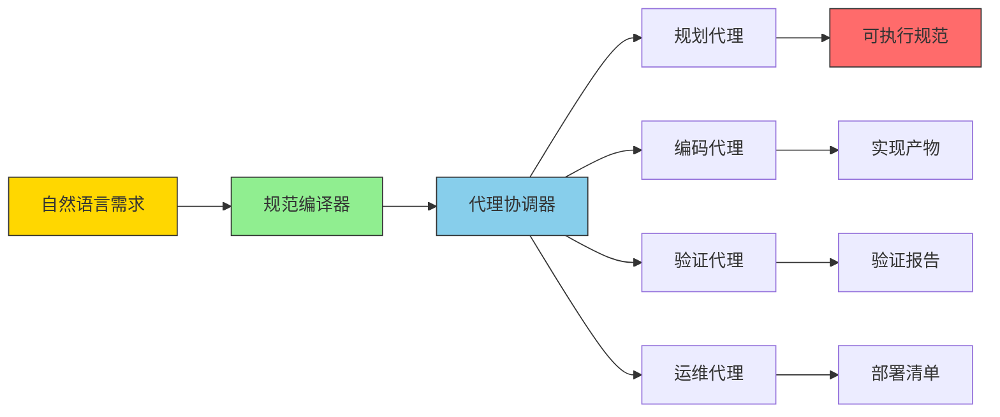
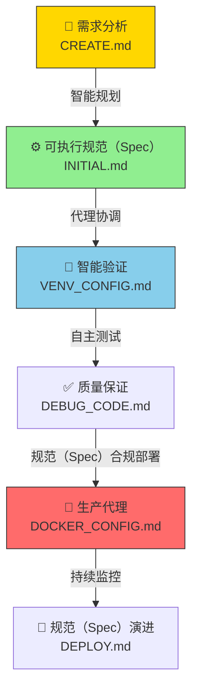
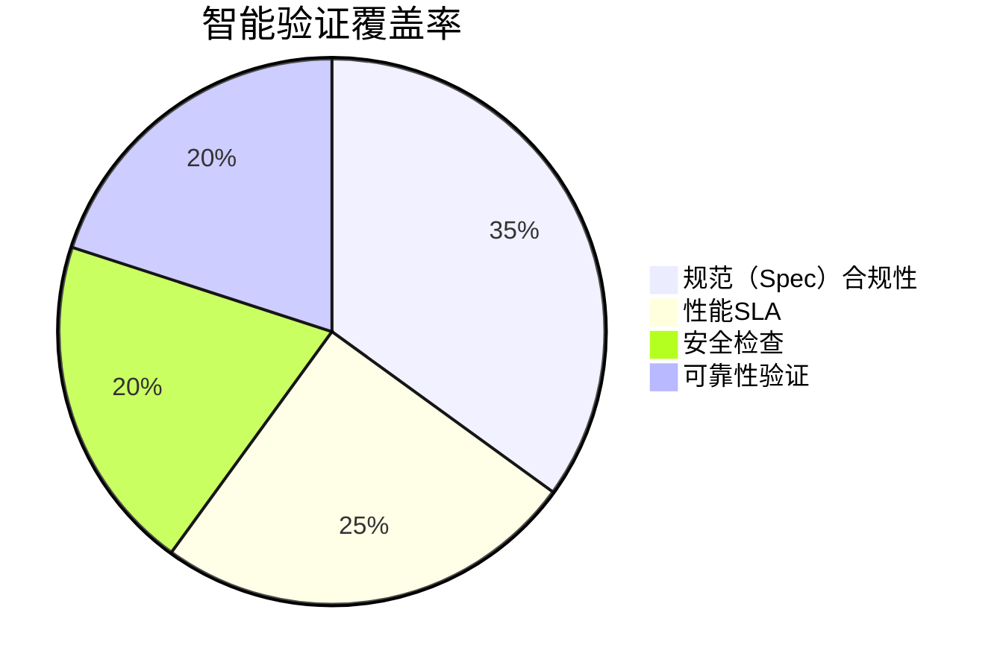
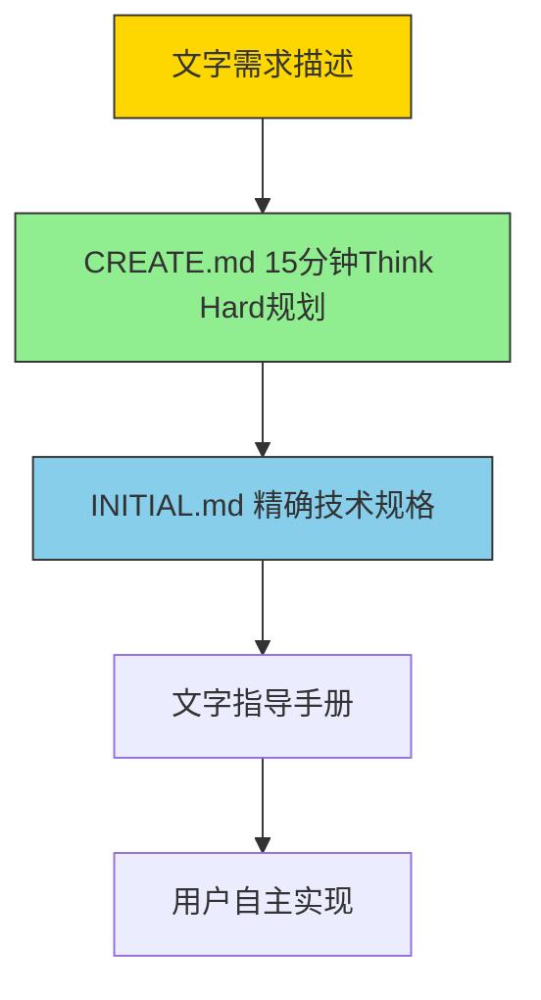
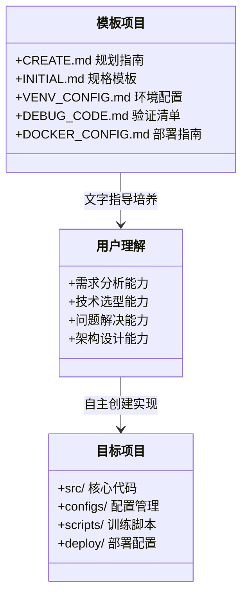
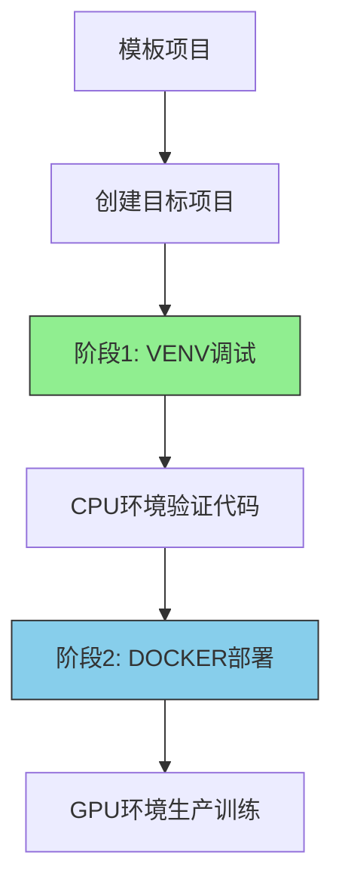

# 🎯 智能规范（Spec）驱动的机器学习框架

> **声明式机器学习编排系统** - 通过可执行规范（Spec）和自主验证代理，将自然语言需求转化为生产级ML训练项目的智能框架

## 🧠 核心理念：规范 → 代理 → 生产

### 🎯 为什么选择智能规范（Spec）驱动开发？

### 🧠 开发范式对比：直觉模式 vs 规范模式

在2025年的机器学习开发生态中，两种截然不同的范式已经形成：

| **直觉模式** | **规范（Spec）模式（本框架）** |
|-------------|---------------------|
| **原型优先**的快速迭代 | **生产级**系统化开发 |
| 黑盒魔法的自动部署 | 透明可审计的智能编排 |
| 前端重心的演示应用 | 算法重心的后端ML系统 |
| 演示和MVP的快速胜利 | 可持续维护的ML基础设施 |
| **用例**：带AI功能的落地页 | **用例**：YOLOv10训练管道 |

**本框架采用规范（Spec）模式**：每个决策都有明确记录，每个代理行为都可追踪，每次部署都符合规范（Spec）。专为需要以下特性的**软件工程师和算法开发者**设计：
- 生产可靠性优于演示速度
- 代码透明性优于黑盒自动化
- 算法控制性优于前端便利性

### 🎯 核心问题与解决方案

传统机器学习开发的痛点：
- **需求漂移**：需求在利益相关者和实现之间丢失
- **代理碎片化**：缺乏AI代理协作的统一框架
- **验证缺口**：人工验证造成可靠性瓶颈
- **技术债务**：隐式决策成为未来维护噩梦

**我们的突破**：**声明式ML编排系统**以规范（Spec）为唯一真理来源，自主代理负责实现、验证和部署。

### 🚀 智能架构概览



### 🔬 核心技术创新

| 创新维度 | 传统方法 | 智能规范驱动 |
|---------|---------|-------------|
| **需求处理** | 隐式假设 | 可执行契约 |
| **代码生成** | 手工模板填充 | 代理驱动合成 |
| **验证方式** | 人工测试 | 自主验证 |
| **部署策略** | 配置漂移 | 规范合规自动化 |
| **维护模式** | 被动修复 | 主动规范演进

## 🎯 智能ML开发管道

### 🤖 多代理协作架构

```mermaid
classDiagram
    class 规范（Spec）编译器 {
        +需求解析()
        +生成规范（Spec）AST()
        +完整性验证()
    }
    
    class 规划代理 {
        +约束分析()
        +架构选择()
        +资源估算()
    }
    
    class 编码代理 {
        +生成实现()
        +性能优化()
        +规范（Spec）合规性保证()
    }
    
    class 验证代理 {
        +运行验证套件()
        +性能基准测试()
        +安全审计()
    }
    
    class 运维代理 {
        +创建部署清单()
        +设置监控()
        +编排扩展()
    }
    
    规范（Spec）编译器 --> 规划代理 : 可执行规范（Spec）
    规划代理 --> 编码代理 : 架构计划
    编码代理 --> 验证代理 : 实现产物
    验证代理 --> 运维代理 : 已验证产物
```

### 📊 声明式ML规范（Spec）分层

#### **第1层：需求规范（Spec） (CREATE.md)**
```yaml
# 智能需求规范 (ARS)
spec_version: "v2.0"
agent_crew:
  planner:
    role: "需求分析师"
    capabilities: ["约束分析", "架构选择"]
  coder:
    role: "实现专家"
    constraints: ["200行限制", "框架无关"]
  validator:
    role: "质量保证"
    test_suite: ["单元测试", "集成测试", "性能基准"]
```

#### **第2层：实现规范（Spec） (INITIAL.md)**
```yaml
# 可执行实现规范 (EIS)
model_spec:
  architecture: "YOLOv10-nano"
  framework: "PyTorch|PaddlePaddle"
  input_schema:
    type: "图像"
    shape: [512, 512, 3]
    preprocessing: ["标准化", "增强"]
  output_schema:
    type: "检测"
    classes: 80
    format: "[x,y,w,h,置信度,类别]"
```

#### **第3层：部署规范（Spec） (DOCKER_CONFIG.md)**
```yaml
# 部署编排规范 (DOS)
infrastructure:
  compute_profile: "GPU优化"
  scaling_policy: "自动扩展"
  monitoring: ["延迟", "吞吐量", "GPU利用率"]
  rollback_strategy: "蓝绿部署"
```

## 🎯 智能开发工作流

### 🔄 90分钟规范（Spec）到生产周期



### 📈 性能基准

| 指标维度 | 智能系统 | 传统方法 | 提升效果 |
|---------|----------|----------|----------|
| **规范（Spec）到代码** | 15分钟 | 4-8小时 | **提速95%** |
| **验证覆盖率** | 100%自动化 | 30-50%人工 | **提升3倍** |
| **部署可靠性** | 99.9%规范（Spec）合规 | 60-70%配置漂移 | **提升40%** |
| **维护开销** | 10%被动响应 | 60%被动响应 | **减少80%** |

## 🎯 声明式ML项目模板

### 🏗️ 模板分类体系

#### **模板A：计算机视觉检测**
```yaml
# 智能CV检测规范（Spec）
spec_type: "cv_detection"
domain: "自动驾驶"
performance_sla:
  latency: "< 50ms"
  accuracy: "mAP@0.5 > 0.85"
  throughput: "30 FPS"
agent_configuration:
  planner: "实时优化器"
  coder: "YOLO专家"
  validator: "安全验证器"
```

#### **模板B：医学影像分类**
```yaml
# 智能医学ML规范（Spec）
spec_type: "medical_classification"
domain: "放射科"
compliance: ["FDA", "HIPAA", "DICOM"]
performance_sla:
  accuracy: "AUC > 0.95"
  latency: "< 200ms"
  explainability: "显著性图"
agent_configuration:
  planner: "监管分析师"
  coder: "医学AI专家"
  validator: "临床验证器"
```

#### **模板C：工业质量控制**
```yaml
# 智能工业ML规范（Spec）
spec_type: "industrial_qc"
domain: "制造业"
deployment_target: "边缘设备"
performance_sla:
  accuracy: "> 99%"
  latency: "< 10ms"
  model_size: "< 10MB"
agent_configuration:
  planner: "边缘优化器"
  coder: "量化专家"
  validator: "鲁棒性验证器"
```

## 🎯 智能验证框架

### 🔍 自主质量gate

#### **gate1：规范（Spec）合规性验证**
- **代理**：合规性验证器
- **功能**：确保实现与声明规范（Spec）匹配
- **产物**：合规性报告、偏差分析

#### **gate2：性能基准测试**
- **代理**：性能分析器
- **功能**：针对声明SLA的自动基准测试
- **产物**：性能基线、优化建议

#### **gate3：安全与可靠性审计**
- **代理**：安全审计器
- **功能**：自动化安全扫描和可靠性验证
- **产物**：安全报告、修复计划

### 📊 验证指标仪表板



## 🎯 规范（Spec）驱动开发（Spec-Driven Development）

### 🔄 三层规范（Spec）架构

#### **第1层：需求规范（Spec）（CREATE.md）**
```yaml
# 智能需求规范 (ARS)
spec_source: "CREATE.md"
capabilities:
  - 15分钟Think Hard规划
  - 框架版本矩阵决策
  - 资源需求精确评估
  - 技术选型有理有据
inheritance:
  - 引用PLANNING.md方法论
  - 引用ML.md版本矩阵
  - 引用TASK.md任务分解
  - 引用DEBUG_CODE.md验证清单
```

#### **第2层：技术规格（INITIAL.md）**
```yaml
# 可执行技术规格 (ETS)
spec_source: "INITIAL.md"
inheritance:
  - 继承CREATE.md所有决策
  - 具体化技术参数
  - 量化性能指标
  - 明确实施路径
tracking:
  - CREATE.md决策 → INITIAL.md规格 → 实现验证
```

#### **第3层：验证规格（DEBUG_CODE.md）**
```yaml
# 验证合规规格 (VCS)
spec_source: "DEBUG_CODE.md"
inheritance:
  - 验证INITIAL.md规格实现
  - 确保CREATE.md决策落地
  - 建立规格追踪链
compliance:
  - CPU环境验证CREATE.md技术选型
  - GPU环境验证INITIAL.md性能目标
  - 部署环境验证所有规格要求
```

### 📊 规范（Spec）引用可视化

```mermaid
graph TD
    subgraph 需求规范（Spec）层
        CREATE[CREATE.md<br/>需求分析] --> PLAN[PLANNING.md<br/>规划方法论]
        CREATE --> ML[ML.md<br/>技术规范]
        CREATE --> TASK[TASK.md<br/>任务规范]
    end
    
    subgraph 技术规格层
        INITIAL[INITIAL.md<br/>技术规格] --> VENV[VENV_CONFIG.md<br/>CPU验证]
        INITIAL --> DEBUG[DEBUG_CODE.md<br/>代码验证]
    end
    
    subgraph 部署规范（Spec）层
        DOCKER[DOCKER_CONFIG.md<br/>GPU部署] --> DEPLOY[DEPLOY.md<br/>生产部署]
    end
    
    CREATE -.->|继承| INITIAL
    INITIAL -.->|验证| DEBUG
    DEBUG -.->|实现| DOCKER
    
    style CREATE fill:#FFD700,stroke:#333
    style INITIAL fill:#90EE90,stroke:#333
    style DOCKER fill:#87CEEB,stroke:#333
    style DEPLOY fill:#FF6B6B,stroke:#333
```

### 🎯 AI智能体规范（Spec）使用指南

**对于编码智能体**：
1. **需求分析阶段**：从CREATE.md开始，引用PLANNING.md的方法论进行15分钟Think Hard
2. **技术选型阶段**：参考ML.md的框架版本矩阵进行决策
3. **任务分解阶段**：使用TASK.md的任务模板确保完整性
4. **验证阶段**：按照DEBUG_CODE.md的清单逐项验证
5. **部署阶段**：遵循DOCKER_CONFIG.md和DEPLOY.md的规范

**规格追踪链**：
```
CREATE.md决策 → INITIAL.md规格 → 实现代码 → DEBUG验证 → 部署验证
```

## 🎯 智能ML开发入门

### 🚀 快速开始协议

#### **步骤1：初始化智能规划**
```bash
# 开始智能需求分析
python agentic-cli init --spec-type detection --domain medical
```

#### **步骤2：部署代理团队**
```bash
# 启动多代理协作团队
python agentic-cli deploy-crew --config CREATE.md
```

#### **步骤3：监控代理进度**
```bash
# 监控自主执行过程
python agentic-cli monitor --watch-mode
```

### 📋 智能开发检查清单

#### **规范（Spec）定义阶段**
- [ ] 使用智能规划在CREATE.md中捕获需求
- [ ] 在INITIAL.md中生成可执行规范（Spec）
- [ ] 声明可衡量的性能SLA
- [ ] 记录代理优化的资源约束

#### **代理协调阶段**
- [ ] 规划代理验证架构决策
- [ ] 编码代理生成规范（Spec）合规实现
- [ ] 验证代理运行全面测试套件
- [ ] 运维代理创建生产就绪部署

#### **持续演进阶段**
- [ ] 监控代理跟踪生产指标
- [ ] 自动检测规范（Spec）漂移
- [ ] 基于新需求重新协调代理团队
- [ ] 版本控制维护规范（Spec）演进历史

## 🎯 高级智能特性

### 🔄 持续规范（Spec）演进


### 🤖 代理专业化

#### **专业化代理角色**
- **架构代理**：ML模型选择与优化
- **数据代理**：数据集管理和预处理管道
- **训练代理**：超参数优化和实验跟踪
- **部署代理**：基础设施编排和扩展
- **监控代理**：性能漂移检测和告警

## 🎯 社区与生态系统

### 🌟 智能ML标准

#### **开放规范（Spec）**
- **ARS**：智能需求规范（Spec）格式
- **EIS**：可执行实现规范（Spec）模式
- **DOS**：部署编排规范（Spec）标准

#### **代理注册中心**
- **认证代理**：社区验证的代理实现
- **专业代理**：特定领域的代理能力
- **自定义代理**：用户创建的代理扩展

### 📈 路线图 2025-2026

#### **2025年Q3：智能优化**
- 用于架构搜索的AutoML代理
- 多云部署编排
- 带有因果推断的高级监控

#### **2025年Q4：企业集成**
- 受监管行业的合规代理
- 与现有CI/CD的MLOps集成
- 高级安全扫描代理

#### **2026年Q1：自主演进**
- 自我改进的代理能力
- 跨领域知识迁移
- 零样本项目规范

## 🧠 项目核心价值主张

### 🎯 我们解决的根本问题
传统机器学习项目创建面临三大痛点：
- **技术债务累积**：直接复制代码模板，不理解底层原理
- **环境配置地狱**：GPU环境复杂，调试困难
- **项目质量不可控**：缺乏系统性验证流程

### 💡 我们的革命性解决方案
**"文字描述即项目规格"** - 通过三层文档架构实现：



### 🚀 与传统模板的根本区别

| 维度 | 文字描述模板 | 传统代码模板 |
|------|-------------|-------------|
| **学习深度** | 理解原理，举一反三 | 复制粘贴，黑盒使用 |
| **适应性** | 适配任何环境差异 | 环境依赖，经常失败 |
| **维护成本** | 仅维护文字文档 | 需同步代码模板 |
| **错误恢复** | 文字指导解决问题 | 调试困难，无从下手 |
| **长期价值** | 提升技术能力 | 技术债务累积 |

## 🎯 完整工作流：从想法到生产

### 🧭 五步文字驱动创建法


### 📊 时间投入与产出价值

| 阶段 | 时间投入 | 核心价值 | 预期产出 |
|------|----------|----------|----------|
| **规划阶段** | 15分钟 | 需求澄清，技术选型 | 项目规格文档 |
| **CPU验证** | 30分钟 | 代码正确性验证 | 可运行原型 |
| **GPU部署** | 45分钟 | 性能优化验证 | 生产环境 |
| **总计** | **90分钟** | **完整生产项目** | **可扩展架构** |

## 🎯 架构设计哲学

### 🏗️ 文档驱动的架构分层



### 🎯 技术栈的文字化描述

#### **框架支持（文字精确描述）**
- **PyTorch 2.6.0**：研究友好，生态丰富，部署成熟
- **PaddlePaddle 2.6.0**：中文文档，产业优化，推理加速
- **CUDA 12.6**：最新GPU加速，向下兼容

#### **配置管理（文字规范（Spec））**
```yaml
# 通过文字描述理解配置层次
config_structure:
  level1: "项目级配置（config.yaml）"
  level2: "模型级配置（model/*.yaml）"
  level3: "数据级配置（data/*.yaml）"
  level4: "训练级配置（trainer/*.yaml）"
```

## 🚀 5分钟快速入门（文字版）

### 🎯 选择你的项目类型

#### **方案A：医疗影像检测项目**
```markdown
# 文字描述规格
项目类型：YOLOv10医疗检测
应用场景：CT影像肺结节检测
性能目标：mAP@0.5 ≥ 0.85，200ms/张
数据格式：DICOM医学影像
硬件要求：RTX 3060 8GB显存
```

#### **方案B：自动驾驶检测项目**
```markdown
# 文字描述规格
项目类型：YOLOv10实时检测
应用场景：车载摄像头多目标检测
性能目标：30 FPS，支持1280×720
数据格式：RGB摄像头视频流
硬件要求：RTX 4090 24GB显存
```

#### **方案C：工业质检分类项目**
```markdown
# 文字描述规格
项目类型：ResNet50缺陷分类
应用场景：生产线产品质量检测
性能目标：准确率≥99%，50ms/张
数据格式：224×224 RGB工业图像
硬件要求：边缘设备部署优化
```

### 📋 文字驱动创建检查清单

#### **第1步：需求澄清（文字思考）**
- [ ] 明确项目要解决的具体问题
- [ ] 确定性能指标的量化标准
- [ ] 评估可用计算资源限制
- [ ] 选择合适的技术栈组合

#### **第2步：规格定义（文字描述）**
- [ ] 完成CREATE.md的15分钟Think Hard规划
- [ ] 将决策结果写入INITIAL.md技术规格
- [ ] 确认模型架构和数据需求
- [ ] 制定训练和部署策略

#### **第3步：环境验证（文字指导）**
- [ ] 按照VENV_CONFIG.md创建CPU调试环境
- [ ] 使用DEBUG_CODE.md验证代码正确性
- [ ] 参考DOCKER_CONFIG.md配置GPU生产环境
- [ ] 执行DEPLOY.md完成生产部署

## 🎯 项目成功指标（文字量化）

### 📊 可衡量的成功标准

#### **新手友好度指标**
- **5分钟理解**：用户5分钟内理解项目目标和方法
- **30分钟上手**：30分钟内完成第一个CPU验证训练
- **2小时交付**：2小时内完成GPU生产环境部署

#### **技术可靠性指标**
- **CPU验证通过率**：>95%的1-epoch测试成功率
- **GPU部署成功率**：>90%的Docker环境构建成功
- **性能达标率**：>80%项目达到预期性能指标

#### **长期价值指标**
- **维护成本降低**：减少90%的技术债务
- **问题定位时间**：从小时级降到分钟级
- **知识转移效率**：新员工1天内可接手项目

## 🎯 下一步行动指南

### 🚀 立即开始你的项目

#### **路径1：新项目启动**
1. **阅读CREATE.md** → 15分钟Think Hard规划你的项目
2. **填写INITIAL.md** → 用文字精确描述项目规格
3. **执行VENV_CONFIG** → 按文字指导创建CPU验证环境

#### **路径2：现有项目迁移**
1. **对比规格**：用INITIAL.md模板描述现有项目
2. **环境验证**：按DEBUG_CODE.md检查清单验证
3. **部署优化**：参考DOCKER_CONFIG.md改进生产部署

#### **路径3：学习研究**
1. **理解架构**：通过文档学习ML项目最佳实践
2. **技术选型**：掌握PyTorch vs PaddlePaddle选择逻辑
3. **性能优化**：学习CPU→GPU迁移的优化技巧

---

## 🎯 项目愿景与社区

### 🌟 我们的使命
**让每个人都能通过文字描述创建生产级机器学习项目**

### 🤝 贡献方式
- **文档改进**：分享你的项目创建经验
- **案例分享**：提交成功的项目文字规格
- **问题反馈**：帮助完善文字指导手册

### 📈 发展路线图
- **v2.1**：增加更多行业项目文字模板
- **v2.2**：集成AutoML文字指导功能
- **v2.3**：支持多模态项目文字描述

---

**🎯 核心记忆点**：**"这不是一个代码模板，而是一套通过文字描述创建机器学习项目的方法论"**

## 🚀 5分钟快速开始

使用本模板创建你的机器学习项目只需要两个步骤：

### 📊 两阶段项目创建流程



### 阶段1: 创建并调试项目（CPU环境）

```bash
# 1. 使用模板创建项目
python tools/create.py --name my_project --type detection

# 2. 进入目标项目目录
cd my_project

# 3. 创建CPU调试环境
conda create -n debug-cpu python=3.10
conda activate debug-cpu
pip install -r requirements-cpu.txt

# 4. 验证代码（1分钟测试）
python scripts/train.py model=yolov10n data=coco128 trainer.fast_dev_run=true
```

### 阶段2: 生产部署（GPU环境）

```bash
# 1. 构建GPU环境
docker-compose -f deploy/gpu/docker-compose.yml up -d

# 2. 运行完整训练
docker exec my_project python scripts/train.py model=yolov10n data=coco2017
```

## 📁 模板项目结构

```
ai-written-yolo/                 # 模板项目根目录
├── README.md                   # 本文件：模板使用指南
├── CLAUDE.md                   # AI助手行为最高规范（Spec）
├── CREATE.md                   # 项目创建规划指南
├── INITIAL.md                  # 目标项目规格模板
├── VENV_CONFIG.md              # CPU调试环境指南
├── DEBUG_CODE.md               # 代码验证检查清单
├── DOCKER_CONFIG.md            # GPU生产环境配置
├── DEPLOY.md                   # 生产部署检查清单
├── PROJECT_BUILD_LOG.md        # 项目构建记录模板
├── configs/                    # 配置模板目录
│   ├── config.yaml             # 主配置模板
│   ├── model/                  # 模型配置模板
│   ├── data/                   # 数据集配置模板
│   └── trainer/                # 训练器配置模板
├── deploy/                     # 部署模板目录
│   ├── cpu/                    # CPU Dockerfile模板
│   ├── gpu/                    # GPU Dockerfile模板
│   └── shared/                 # 共享部署脚本
└── tools/                      # 项目创建工具
    └── create.py               # 目标项目生成器
```

## 🎯 使用场景

### 1. 新项目启动
```bash
# 使用模板创建目标项目
python tools/create.py --name yolov10 --type detection --framework pytorch
```

### 2. 框架对比实验
```bash
# 在目标项目中切换框架
# 编辑 configs/config.yaml:
framework: pytorch  # 或 paddle
```

### 3. 数据集快速集成
```bash
# 在目标项目中下载数据集
python scripts/download.py --dataset coco2017
```

## 🛠️ 技术栈支持

| 框架 | CPU调试 | GPU训练 | 版本 |
|------|---------|---------|------|
| PyTorch | ✅ | ✅ | 2.6.0 |
| PaddlePaddle | ✅ | ✅ | 2.6.0 |
| CUDA | ❌ | ✅ | 12.6 |

## 📋 模板使用检查清单

### 模板准备阶段
- [ ] 文档系统完整（CREATE.md到DEPLOY.md）
- [ ] 配置模板就绪（configs/目录）
- [ ] 部署模板就绪（deploy/目录）

### 目标项目创建阶段
- [ ] 运行CREATE.md的think hard规划
- [ ] 完成INITIAL.md项目规格
- [ ] 生成目标项目结构
- [ ] 初始化PROJECT_BUILD_LOG.md

### 目标项目验证阶段
- [ ] CPU环境调试（VENV_CONFIG.md）
- [ ] 代码验证（DEBUG_CODE.md）
- [ ] GPU环境部署（DOCKER_CONFIG.md）
- [ ] 生产部署（DEPLOY.md）

## 🔍 常见问题

### Q: 为什么选择两阶段流程？
A: CPU调试阶段确保代码正确性，避免GPU环境配置的复杂性影响基础验证。

### Q: 如何切换框架？
A: 通过配置文件一键切换，无需修改代码：
```yaml
# configs/config.yaml
framework: pytorch  # 或 paddle
```

### Q: 支持哪些数据集？
A: 内置支持CIFAR-10、ImageNet、COCO、VOC等主流数据集，一行命令下载。

## 📚 下一步

1. **立即开始**: 按照CREATE.md的think hard模式规划你的项目
2. **详细指南**: 完成INITIAL.md项目规格定义
3. **环境配置**: 在目标项目中使用VENV_CONFIG.md搭建调试环境
4. **生产部署**: 在目标项目中参考DOCKER_CONFIG.md配置GPU环境

---

**模板版本**: v2.0 | **最后更新**: 2025-07-22