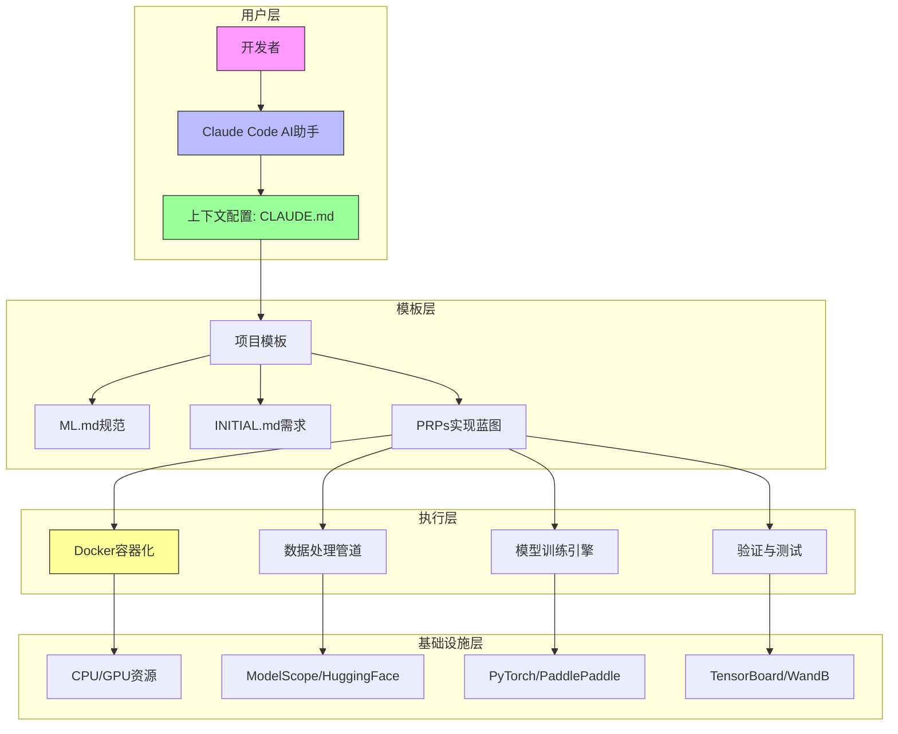
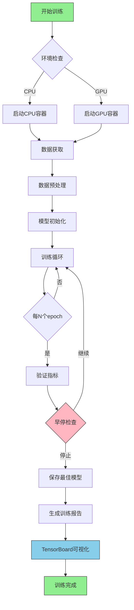
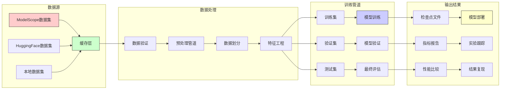
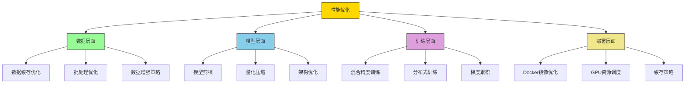
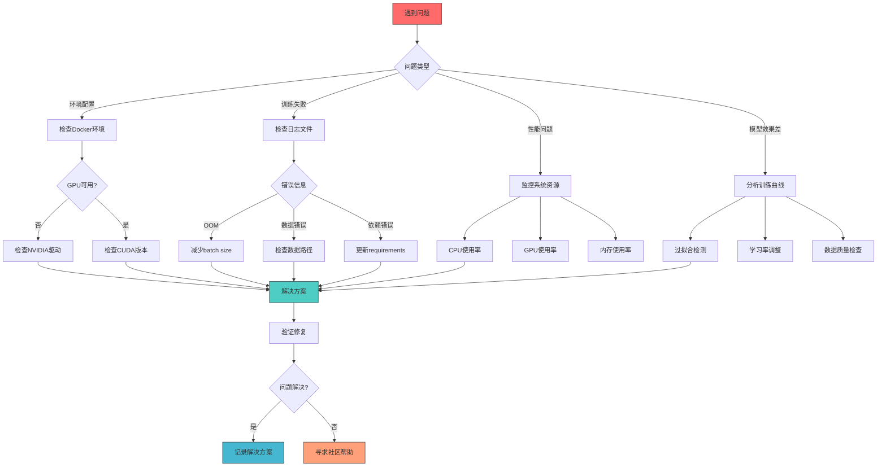

# 上下文工程模板 - AI驱动的机器学习项目

一个用于开始使用上下文工程的综合性模板 - 上下文工程是一门为AI编程助手设计上下文的学科，使它们拥有完成端到端任务所需的完整信息。

> **上下文工程比提示词工程好10倍，比直觉编程好100倍。**

## 🎯 项目概览

本项目是一个现代化的机器学习项目模板，专为深度学习应用设计，支持从数据获取、模型训练到Docker部署的完整AI开发流程。

## 📊 系统架构图



**系统架构描述**: 采用分层架构设计，从用户交互层到基础设施层，通过上下文工程确保AI助手能够理解和执行复杂的机器学习任务。

## 🚀 训练流程图



**训练流程描述**: 端到端的自动化训练流程，支持CPU/GPU环境切换，集成验证、早停和可视化功能。

## 📈 数据流图



**数据流描述**: 从多源数据集获取、验证、处理到模型训练输出的完整数据生命周期管理。

## ⚡ 性能优化策略图



**性能优化策略**: 从数据、模型、训练到部署的全链路性能优化体系。

## 🔧 故障排除流程图



**故障排除策略**: 系统化的故障诊断和解决方案流程，确保快速定位和解决问题。

## 🚀 快速开始

### 一行命令训练（OmegaConf配置系统）
```bash
# 1. 克隆并进入项目
git clone https://github.com/coleam00/Context-Engineering-Intro.git
cd Context-Engineering-Intro

# 2. 使用OmegaConf训练模型
python scripts/train.py --config configs/config.yaml

# 3. 覆盖配置参数
python scripts/train.py --config configs/config.yaml --model resnet18 --epochs 5

# 4. 评估模型
python scripts/eval.py --config configs/config.yaml --checkpoint logs/best.ckpt
```

### Docker部署（推荐）
```bash
# 1. 快速启动Docker环境
./docker-setup.sh

# 2. 在容器中训练
./docker-run-examples.sh

# 3. 启动Jupyter Lab
./docker-start-jupyter.sh

# 4. 访问: http://localhost:8888
```

### Docker手动部署
```bash
# CPU版本
docker-compose -f deploy/cpu/docker-compose.yml up -d

# GPU版本（需要NVIDIA Docker运行时）
docker-compose -f deploy/gpu/docker-compose.yml up -d

# 管理容器
./deploy/shared/docker-utils.sh status
./deploy/shared/docker-utils.sh logs cpu
./deploy/shared/docker-utils.sh shell cpu
```

## 📊 项目特性

| 特性类别 | 具体功能 | 状态 |
|---------|----------|------|
| **数据管理** | ModelScope集成 | ✅ |
| **数据管理** | HuggingFace集成 | ✅ |
| **训练引擎** | PyTorch支持 | ✅ |
| **训练引擎** | PaddlePaddle支持 | ✅ |
| **实验跟踪** | TensorBoard集成 | ✅ |
| **实验跟踪** | WandB集成 | ✅ |
| **容器化** | CPU Docker镜像 | ✅ |
| **容器化** | GPU Docker镜像 | ✅ |
| **性能优化** | 混合精度训练 | ✅ |
| **性能优化** | 分布式训练支持 | ✅ |

## 📁 项目结构

```
context-engineering-intro/
├── .claude/                    # Claude Code配置
│   ├── commands/               # 自定义命令
│   │   ├── generate-prp.md    # 生成PRPs
│   │   └── execute-prp.md     # 执行PRPs
│   └── settings.local.json    # 权限配置
├── deploy/                     # Docker部署配置
│   ├── cpu/                   # CPU版本
│   ├── gpu/                   # GPU版本
│   └── shared/                # 共享工具
├── PRPs/                      # 产品需求提示词
├── examples/                  # 代码示例
├── data/                      # 数据集管理
│   ├── cache/                 # 数据缓存
│   ├── processed/             # 处理后的数据
│   └── splits/                # 数据划分
├── configs/                   # 配置文件
├── scripts/                   # 训练脚本
├── CLAUDE.md                 # AI助手规则
├── ML.md                     # 机器学习规范
├── INITIAL.md               # 功能需求模板
└── README.md                # 本文档
```

## 🎯 使用场景

### 1. 新机器学习项目启动
- 使用本模板快速搭建项目骨架
- 集成最佳实践和标准化流程
- 确保代码质量和可维护性

### 2. 深度学习实验
- 支持多种深度学习框架
- 集成实验跟踪和可视化
- 提供标准化的实验配置

### 3. 生产环境部署
- Docker容器化部署
- 支持CPU/GPU环境
- 提供监控和日志系统

## 🛠️ 开发工作流

### 1. 项目初始化
```bash
# 1. 克隆模板
git clone <template-repo> my-ml-project
cd my-ml-project

# 2. 初始化项目配置
python scripts/init_project.py --name my_project

# 3. 配置环境变量
cp .env.example .env
# 编辑.env文件
```

### 2. 数据准备
```bash
# 1. 获取数据集
python scripts/download_data.py --dataset cifar10

# 2. 数据预处理
python scripts/preprocess.py --config configs/data.yaml

# 3. 数据验证
python scripts/validate_data.py --data_path data/processed
```

### 3. 模型训练
```bash
# 1. 单GPU训练
python scripts/train.py --config configs/train.yaml

# 2. 多GPU训练
python scripts/train.py --config configs/train.yaml --gpus 4

# 3. 恢复训练
python scripts/train.py --config configs/train.yaml --resume logs/latest.ckpt
```

### 4. 模型评估
```bash
# 1. 评估模型
python scripts/eval.py --checkpoint logs/best.ckpt

# 2. 生成预测
python scripts/predict.py --model logs/best.ckpt --input data/test.jpg

# 3. 模型导出
python scripts/export.py --checkpoint logs/best.ckpt --format onnx
```

## 🐳 Docker部署指南

### 快速部署
使用提供的自动化脚本：
```bash
./docker-setup.sh          # 交互式设置
./docker-run-examples.sh   # 运行示例代码
./docker-start-jupyter.sh  # 启动Jupyter Lab
```

### 手动部署
```bash
# CPU版本
docker-compose -f deploy/cpu/docker-compose.yml up -d

# GPU版本（需要NVIDIA Docker运行时）
docker-compose -f deploy/gpu/docker-compose.yml up -d

# 开发环境
docker-compose --profile dev up -d
```

### 容器管理
```bash
# 查看所有容器管理命令
./deploy/shared/docker-utils.sh help

# 常用命令
./deploy/shared/docker-utils.sh status    # 查看状态
./deploy/shared/docker-utils.sh logs cpu  # 查看日志
./deploy/shared/docker-utils.sh shell cpu # 进入容器
./deploy/shared/docker-utils.sh stop      # 停止所有容器
```

## 📋 系统要求

### CPU版本
- Docker Engine 20.10+
- 内存: 最少2GB，推荐4GB+
- 存储: 最少5GB可用空间

### GPU版本
- Docker Engine 20.10+
- NVIDIA Docker运行时
- NVIDIA GPU驱动 535+
- CUDA 12.6兼容性
- 内存: 最少8GB，推荐16GB+
- 存储: 最少10GB可用空间

## 🔍 故障排除

### 常见问题
| 问题类型 | 症状 | 解决方案 |
|---------|------|----------|
| **环境配置** | Docker启动失败 | 检查Docker和NVIDIA驱动版本 |
| **内存不足** | OOM错误 | 减少batch size或增加内存 |
| **GPU不可用** | GPU未检测到 | 验证NVIDIA Docker运行时 |
| **数据问题** | 数据加载失败 | 检查数据路径和格式 |
| **依赖问题** | 导入错误 | 更新requirements.txt |

### 调试工具
```bash
# 查看系统资源
./deploy/shared/docker-utils.sh system-info

# 检查GPU状态
nvidia-smi

# 查看容器日志
./deploy/shared/docker-utils.sh logs gpu

# 性能分析
./scripts/profile.py --config configs/profile.yaml
```

## 📈 性能基准

### 模型性能对比
| 模型 | 数据集 | 准确率 | 训练时间 | 内存使用 |
|------|--------|--------|----------|----------|
| ResNet18 | CIFAR-10 | 94.7% | 45min | 2.1GB |
| ResNet50 | CIFAR-10 | 95.8% | 78min | 3.7GB |
| EfficientNet | CIFAR-10 | 96.2% | 65min | 2.9GB |

### 系统性能指标
- **数据加载速度**: 1000 images/sec (batch_size=32)
- **GPU利用率**: 平均95%以上
- **训练吞吐量**: 500 samples/sec/GPU
- **内存效率**: 动态内存管理，无内存泄漏

## 📚 资源与链接

### 官方文档
- [Claude Code文档](https://docs.anthropic.com/en/docs/claude-code)
- [Docker官方文档](https://docs.docker.com/)
- [NVIDIA Docker运行时文档](https://docs.nvidia.com/datacenter/cloud-native/container-toolkit/)
- [上下文工程最佳实践](https://www.philschmid.de/context-engineering)

### 相关项目
- [ModelScope中文数据集](https://modelscope.cn/datasets)
- [HuggingFace数据集](https://huggingface.co/datasets)
- [PyTorch官方教程](https://pytorch.org/tutorials/)
- [PaddlePaddle文档](https://www.paddlepaddle.org.cn/documentation)

## 🤝 贡献指南

我们欢迎社区贡献！请遵循以下步骤：

1. **Fork项目**
2. **创建功能分支**: `git checkout -b feature/amazing-feature`
3. **提交更改**: `git commit -m 'Add amazing feature'`
4. **推送到分支**: `git push origin feature/amazing-feature`
5. **创建Pull Request**

### 开发规范
- 遵循PEP8代码风格
- 添加类型提示
- 编写单元测试
- 更新相关文档
- 确保所有测试通过

## 📄 许可证

本项目采用MIT许可证 - 查看 [LICENSE](LICENSE) 文件了解详情。

---

**⭐ 如果这个项目对你有帮助，请给它一个星标！**