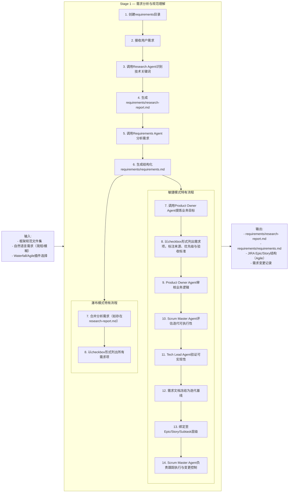
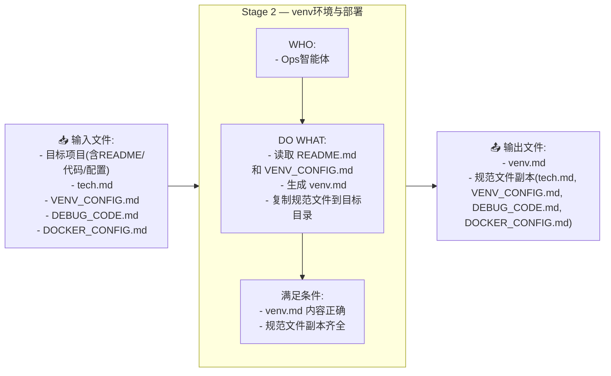
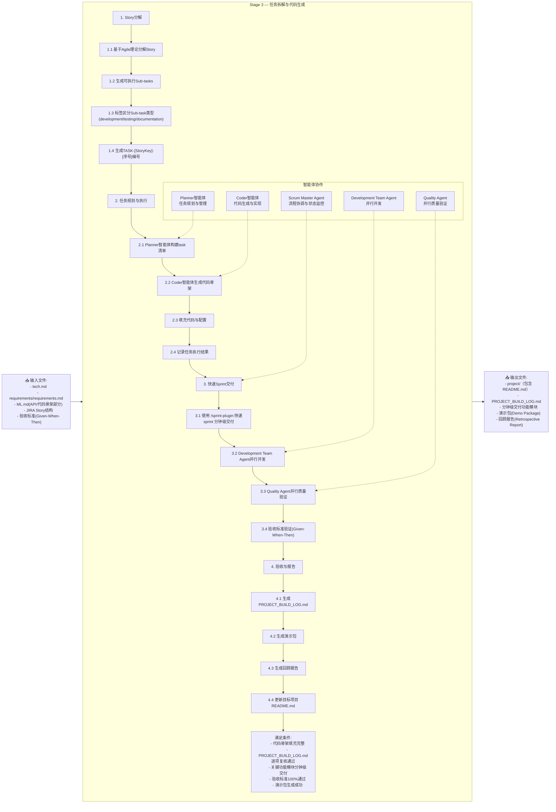
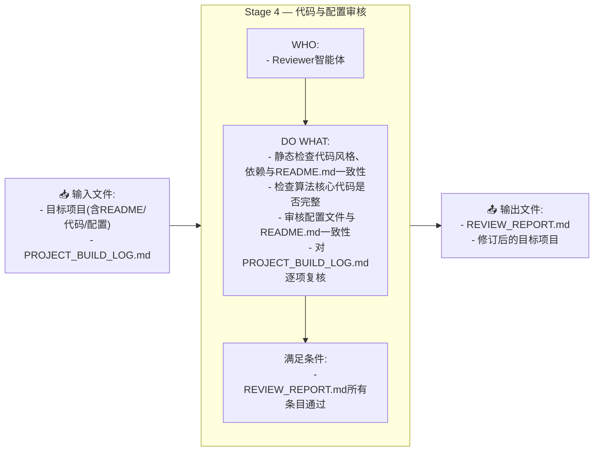
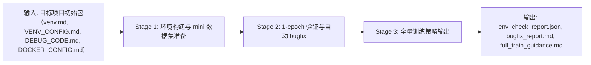

# Spec 驱动的 自主智能体 软件工程 机器学习 框架
**简单几句需求就可以生成完整的各类算法，示例(大模型无需读以下3个示例)：**
1. [规范驱动的自主编程智能体（Spec Driven AI Coder）案例一：机器翻译](https://www.bilibili.com/video/BV1q2hGztE6W/?share_source=copy_web&vd_source=2b795d30f73f247a28f83b4da22b4656) 
2. [规范驱动的自主编程智能体（Spec Driven AI Coder）案例二：人脸识别](https://www.bilibili.com/video/BV1ZStjzcErn/?share_source=copy_web&vd_source=2b795d30f73f247a28f83b4da22b4656)
3. [规范驱动的自主编程智能体（Spec Driven AI Coder）案例三：粤语翻译普通话](https://www.bilibili.com/video/BV1tdtJz9ENj/?share_source=copy_web&vd_source=2b795d30f73f247a28f83b4da22b4656)

> 目标读者：AI agentic Coder、机器学习专家和软件工程专家。
> 要求：同时兼顾大语言模型与人类可读性（便于 AI agent 阅读）。
> 特色：集成敏捷与瀑布双模式插件生态系统，支持分钟级软件交付。

---
> 基于JIRA Scrum Sprint的标准化、可视化软件开发工程管理，包括基于智能体的任务分解、多智能体协作开发与测试、任务自动comment、任务状态自动流转等。

<p align="center">
  
</p>


---

## ChangeLog
* 20251120 修改日志：要求`agile-plugin`的`quality-agent`通过API在JIRA上提bug；修复了utils中规范未关联的bug
* 20251116 修改日志：大幅调整了目录结构，增加specs目录强调基于specs规范的软件工程；优化了`sprint-plugin`；修正了`README.md`
* 20251031 修改日志：基于ClaudeCode Plugin能力，实现了Waterfall和Agile模型，并集成了完整的插件生态系统。

## 目录

1. 简介
2. 核心概念
3. 快速开始
4. 框架架构
5. 开发流程
   * 框架项目
   * 目标项目
   * 生产部署
6. 插件系统
   * agile-marketplace
   * waterfall-marketplace
   * 使用示例与工作流
7. 最佳实践
8. 故障排除
9. 常见问题


---

# 1. 上下文概念与软件工程理论基础

## 1.1 问题陈述与方法论定位

在机器学习算法的工程落地中，需求表述常以简短、模糊的自然语言形式表达。由此产生的问题与挑战：
* 需求漂移（需求在多轮LLM对话传递中变形）
* 实现不可追溯（隐式假设与工程决策未被记录）
* 验证难以自动化（人工主导、覆盖不足）
* 技术债务的累积

**针对这些问题与挑战，本框架提出《Spec 驱动的自主智能体（Spec-driven agentic-ai-coder）》作为新一代的软件工程方法论**：将“可执行规范（Spec）”作为事实（ground truth，GT），由多角色自主智能体依照规范进行规划（plan）、实现（create）、验证（validate）与部署（deploy），从而实现面向机器学习（ML）项目的软件工程方法论的理论科学性、过程透明性、流程可重复性和结果可审计性。

## 1.2 软件工程理论回顾

### 一、瀑布模型（Waterfall）

**核心思想**：线性阶段化：需求 → 设计 → 实现 → 测试 → 部署。
每一阶段以文档化交付物为验收点，按序推进，阶段间变更受控。
**优点**：流程清晰、责任边界明确、适合强监管或合同驱动场景（合规、验收标准明确）。
**缺点**：对需求变更适应性差；反馈周期长；不利于探索性工作，例如：机器学习（ML）算法编程。
**适用情境**：需求稳定、法律/合规要求高（医疗、航空、金融）或外包/合同式交付。

#### 看板（Kanban）

**核心思想**：以流为中心管理工作项，限流（WIP）以降低切换成本，通过可视化与循环时间指标优化交付节奏。
**优点**：对持续发布、运维与小粒度改动非常友好；可平滑化团队负载。
**缺点**：对大型特性或需协调多个团队的交付不如迭代式明确（需要额外的里程碑机制）。
**适用情境**：维护/运维、持续交付环境或变更密集但规模较小的任务流。

---

### 二、V 模型（Verification & Validation）

**核心思想**：在瀑布模型基础上改进，强调每个开发阶段应有对应的验证活动（设计对应单元测试、需求对应验收测试），形成“设计—验证”对偶关系。
**优点**：测试与设计并行规划，提高可验证性与可追溯性；便于形成完整的验证矩阵。
**缺点**：同样对快速变更不友好；需要较强的测试投入与早期规格明确性。
**适用情境**：高安全/高可靠场景，且具有清晰可度量的规格要求。

---

### 三、Scrum（迭代增量式敏捷）

**核心思想**：短周期（Sprint）迭代、跨职能团队、以产品 Backlog 驱动增量交付，强调频繁交付与客户反馈。
**优点**：适应性强、能快速交付可运行增量并通过评审获得反馈；易于组织跨学科协作。
**缺点**：对长期架构一致性与系统化文档化的自然驱动力较弱；对团队自律与产品职责要求高。
**适用情境**：探索性项目、需求经常变化或需频繁验证用户反馈的产品化路线。


---

### 四、极限编程（XP）

**核心思想**：强调工程实践（TDD、结对编程、持续集成、持续重构、小步提交），用工程纪律降低变更风险并提升代码质量。
**优点**：在高变更率环境下，通过严格实践保障质量，减少技术债务。
**缺点**：对团队技能与文化要求高（需要习惯结对、重构与频繁测试）。
**适用情境**：需要频繁重构、快速演化且对质量有严格要求的软件开发场景，尤其适合复杂、实验性强但需高质量产出的工程。


---

# 2. 模式对比：氛围（vibe）编程 vs Spec 驱动

**论述要点**：

* 氛围编程的核心竞争力是速度和创意自由，适合未知问题的探索期；但其隐含假设、随意性和临时性实现会导致难以迁移到生产。
* Spec 驱动将"需求—实现—验证"映射为可被自主编程智能体理解和执行的规范文件，这使得智能体协作变得可控、实现过程可审计，结果可验证，且利于降低长期维护成本。

## 2.1 Spec 驱动的具体实现

### Specs 目录结构
框架通过标准化的 `specs/` 目录结构实现规范的统一管理：

```
specs/
├── machine-learning-specs/      # 机器学习技术栈规范
│               
├── venv-specs/                  # GPU调试环境规范
│         
├── deployment-specs/            # Docker部署规范
│       
├── bugfix-specs/                # 调试代码规范
│
└── config-file-specs/           # 配置文件规范
 
```

### 核心规范文件说明

#### ML.md - 机器学习技术栈规范
- **技术选型决策矩阵**：PyTorch/PaddlePaddle双栈支持
- **两阶段环境配置**：VENV调试（GPU验证）vs DOCKER部署（纯CPU生产）
- **版本兼容性矩阵**：精确的框架版本匹配与CUDA自动适配
- **性能基准验证**：GPU利用率>90%，CPU环境优化部署

#### VENV_CONFIG.md - GPU调试环境规范
- **环境矩阵**：Python 3.9-3.10、PyTorch 2.4.1、PaddlePaddle 2.6.0
- **一键安装**：自动适配CUDA版本的依赖安装
- **Mini数据集**：COCO128等调试用小型数据集
- **1-epoch验证**：快速训练验证与GPU利用率监控

#### DOCKER_CONFIG.md - 部署规范
- **镜像选择指南**：python:3.10-slim轻量级部署
- **CPU优化策略**：纯CPU生产环境配置
- **性能基准**：容器启动时间<5秒，镜像大小<200MB

### Specs 驱动的优势

1. **可执行性**：所有规范文件都是可被智能体理解和执行的
2. **一致性**：确保从开发到部署的环境一致性
3. **可追溯性**：每个决策都有对应的规范文件支持
4. **自动化**：智能体基于规范自动执行相应任务
5. **可验证性**：每个阶段都有明确的验证标准

---

# 3 框架项目、目标项目与生产部署

## 3.1 框架项目（本项目）

> 目标：从框架项目与模糊需求出发，通过插件化的多智能体协作系统，生成目标项目初始包（代码骨架、规范副本、需求/技术/任务文档、mini 数据样本和 venv 规范），作为目标项目启动点。支持敏捷与瀑布双模式开发流程。


### 3.1.1 Stage 1 — 需求分析与规范理解

* **输入**：框架规范文件集，自然语言需求（用户提供，通常简短/模糊），Waterfall/Agile插件选择。
* **WHO**：
  > **公共角色**：requirements-plugin 命令（主导），research-agent（技术调研），requirements-agent（需求分析），用户（回答并澄清问题）；
  > **敏捷模式特有角色**：Product Owner Agent（业务价值管理），Scrum Master Agent（流程协调），Tech Lead Agent（技术可行性验证）；
  > **瀑布模式特有角色**：无额外角色。
* **DO WHAT**：
  > **公共流程**：创建requirements目录，接收用户需求，调用Research Agent识别技术关键词，生成`requirements/research-report.md`，调用Requirements Agent分析需求，生成结构化`requirements/requirements.md`；
  > **敏捷模式特有流程**：调用Product Owner Agent提炼业务目标，以checkbox形式列出需求项并标注来源、优先级与验收标准，Product Owner Agent审核业务逻辑，Scrum Master Agent评估迭代可执行性，Tech Lead Agent验证可实现性，需求文档冻结为迭代基线，绑定至Epic/Story/Subtask层级，Scrum Master Agent负责跟踪执行与变更控制；
  > **瀑布模式特有流程**：合并分析需求（如存在research-report.md），以checkbox形式列出所有需求项。
* **满足条件**：
  > **公共条件**：`requirements/requirements.md`中所有条目和问题的分数都要大于0.6，或存在明确的澄清项与后续处理策略；技术可行性验证通过；
  > **敏捷模式特有条件**：JIRA Epic/Story结构完整创建；
  > **瀑布模式特有条件**：无额外条件。
* **输出**：
  > **公共输出**：`requirements/requirements.md`（结构化需求文档），`requirements/research-report.md`（技术调研报告）；
  > **敏捷模式特有输出**：JIRA Epic/Story结构，需求变更记录；
  > **瀑布模式特有输出**：无额外输出。


### 3.1.2 Stage 2 — venv环境与部署

* **输入**：目标项目(含`README.md`、代码、配置文件)、tech.md、VENV_CONFIG.md、DEBUG_CODE.md、DOCKER_CONFIG.md。

* **WHO**：Ops智能体。

* **DO WHAT**：
    > 读取目标项目`README.md`和`VENV_CONFIG.md`规范文件，生成目标项目的 `venv.md`（包含目标项目的python 版本、requirements-cpu.txt或requirements-gpu.txt）；
    > 把`venv.md`和规范文件副本复制到目标目录中。

* **输出**：`venv.md`、规范文件副本(tech.md, VENV_CONFIG.md, DEBUG_CODE.md, DOCKER_CONFIG.md)。

* **满足条件**：目标项目中包含`venv.md`且内容正确；包含完整的规范文件副本。

### 3.1.3 Stage 3 — 任务拆解与代码生成

* **输入**：`tech.md`、`requirements/requirements.md`、`ML.md`（文件中的API/代码骨架部分）、JIRA Story结构、验收标准(Given-When-Then)。

* **WHO**：
  > **Scrum Master Agent**：流程协调与状态监控；
  > **Planner智能体**：任务规划与管理；
  > **Coder智能体**：代码生成与实现；
  > **Development Team Agent**：并行开发；
  > **Quality Agent**：并行质量验证。

* **活动**：
    >**1. Story分解**：基于Agile理论分解Story，生成可执行Sub-tasks，标签区分Sub-task类型，生成TASK-[StoryKey]-[序号]编号；
    >**2. 任务规划与执行**：Planner智能体构建task清单，Coder智能体生成代码骨架，填充代码与配置，记录任务执行结果；
    >**3. 快速Sprint交付**：使用 `/sprint-plugin:快速sprint` 命令进行分钟级交付，Development Team Agent并行开发，Quality Agent并行质量验证，验收标准验证(Given-When-Then)；
    >**4. 验收与报告**：生成PROJECT_BUILD_LOG.md，生成演示包，生成回顾报告，更新目标项目README.md。

* **输出**：`{xx}_project/`（目标项目,包含：代码骨架，用真实项目名称代替`{xx}_project/`），`PROJECT_BUILD_LOG.md`（任务清单执行结果记录），分钟级交付的功能模块，演示包(Demo Package)，回顾报告(Retrospective Report)。

* **满足条件**：代码骨架填充完整，PROJECT_BUILD_LOG.md逐项复核通过，关键功能模块通过分钟级交付完成，验收标准100%通过，演示包生成成功。

### 3.1.4 Stage 4 — 代码与配置审核

* **输入**：目标项目（包含`README.md`、代码、配置文件）、PROJECT_BUILD_LOG.md。

* **WHO**：Reviewer智能体。

* **DO WHAT**：
    > Reviewer智能体执行代码与配置的静态分析和`README.md`一致性校验；
    > 审核代码逻辑、依赖与`README.md`的匹配情况；
    > 针对`PROJECT_BUILD_LOG.md`逐项检查是否真正完成；
    > 输出`REVIEW_REPORT.md`，必要时修订目标项目。

* **输出**：`REVIEW_REPORT.md`、修订后的目标项目。

* **满足条件**：`REVIEW_REPORT.md`所有条目审核通过，目标项目文档与代码的一致性和完整性相匹配。


---

## 3.2 目标项目（环境准备与 1-epoch 验证）

> **目标**：在目标项目内使用规范文件中的工作流和相关规范文件，完成环境搭建、在 mini 数据集上的 1-epoch 验证与所有 bugfix，最终输出可运行的验证记录与全量训练指导文档。




### 3.2.1 Stage 1 — 环境构建与 mini 数据集准备

* **输入**：`venv.md`、`README.md`、`requirements-cpu.txt`、`requirements-gpu.txt`。
* **DO WHAT**：
    >执行 `python -m venv debug-cpu`，`pip install -r requirements-cpu.txt` 或者执行 `python -m venv debug-gpu`，`pip install -r requirements-gpu.txt`（要求用户二选一）；
    >Dataset 智能体按`venv.md`中规范抽样构建 mini数据集 并生成 `data/mini/`（样本数据、样本数、样本类别和分布等），创建notebook做可视化。
* **输出**：`env_check_report.md`（Python、包版本、可用 GPU 信息）、`data/mini/`（mini 数据集）与 `mini_dataset.md`（mini数据集使用说明和指标）。
* **WHO**：Ops 智能体 + Dataset 智能体
* **满足条件**：`env_check_report.md` 包含 `python_version`、`packages_installed`等环境安装和配置报告；mini 数据可被scripts目录下的notebook可视化。

### 3.2.2 Stage 2 — 1-epoch 验证与自动 bugfix

* **输入**：`scripts/train.py`, `data/mini/`, `DEBUG_CODE.md`。
* **DO WHAT**：
    > 根据`DEBUG_CODE.md`规范,执行`scripts/train.py`, 1-epoch 快速训练（`--fast_dev_run` 或 `--epochs 1`）；
    > Coder智能体自动采集错误信息和修复bug，生成（或更新）bugfix报告；并再次测试直至通过。
* **输出**：`bugfix_report.md`（问题清单、bug摘要、bug修复日志、测试结果）、最终训练输出checkpoint模型文件。
* **WHO**：Coder智能体。
* **满足条件**：1-epoch 运行成功，`bugfix_report.md` 中所有“关键错误”标记为已修复。

### 3.2.3 Stage 3 — 全量训练策略输出

* **输入**：`bugfix_report.md`、技术选型文档-`tech.md`。
* **DO WHAT**：根据`tech.md`生成全量训练指导文档 `full_train_guidance.md`，包括推荐的 batch\_size、learning\_rate schedule、epoch 数、checkpoint 策略、数据增强策略、分布式训练建议与监控点、各种性能配置的训练脚本示例。
* **输出**：全量训练指导文档-`full_train_guidance.md`（可直接用于 GPU 分布式训练环境）。
* **WHO**：Coder 智能体。
* **满足条件**：全量训练指导文档-`full_train_guidance.md` 包含明确的参数范围与部署步骤，且与 `tech.md` 中的资源估计一致。

---

## 3.3 生产部署（容器化、镜像构建、部署与监控）

> 目标：在生产运行时构建并验证 Docker 镜像/Compose 编排，启动服务并通过健康检查与 smoke tests，配置监控与回滚策略。


### 3.3.1 Stage 1 — Docker环境检测与准备

* **输入**：本地/远端节点信息、`DOCKER_CONFIG.md`。
* **DO WHAT**：
>检测 `docker` / `docker-compose` 是否存在并满足版本要求（脚本：`docker --version`、`docker-compose --version`）；若缺失，给出平台化安装步骤并在用户确认下执行安装命令（或提供交互指南）。
>根据`DOCKER_CONFIG.md`,检测 GPU passthrough 能力（NVIDIA Docker 支持）。
* **输出**：`docker_env_report.md`（docker\_version、compose\_version、gpu\_passthrough）。
* **WHO**：Ops智能体，用户确认安装。
* **满足条件**：`docker_env_report.md` 显示符合作业的必要条件（例如 GPU 镜像需 `nvidia-docker` 支持）。

### 3.3.2 Stage 2 — 镜像构建与容器校验

* **输入**：`Dockerfile`（CPU/GPU 变体由 `DOCKER_CONFIG.md` 生成）、docker环境的python依赖`requirements.txt`、模型权重文件（提示用户输入）。
* **DO WHAT**：
>构建镜像（`docker build -t my_project:gpu-v1 .`）；
>运行镜像内校验脚本（例如 `python -c "import torch; print(torch.cuda.is_available())"`）；生成 `container_env_check.log`。
* **输出**：构建的镜像（tag），`container_env_check.log`。
* **WHO**：Ops智能体。
* **满足条件**：若为 GPU 镜像，`container_env_check.log` 必须显示 `cuda_available: true`；镜像体积、层次结构符合规范（例如依赖层最小化）。

### 3.3.3 Stage 3 — 部署启动与 API、Docs、健康与性能检查

* **输入**：构建的镜像、`deploy/docker/`文件夹，包含：`docker-compose.yml`、Dockerfile。
* **DO WHAT**：
>执行 `docker-compose up -d`；
>运行健康检查 `/health`、文档检查`/docs`
>API 调用（推理样例 curl）与性能采样；进行冒烟测试，收集 latency、throughput、memory usage；
>若检测到致命失败，生成 issue 并停止docker容器，撰写报告`docker_error_report_N.md`。
>若成功，撰写报告`deploy_report.md`，将测试结果(含SLAs)更新到`README.md`
* **输出**：`deploy_report.md`（部署时间、服务端点、健康检查结果、smoke tests 结果、resource metrics）。
* **WHO**：Ops智能体。
* **满足条件**：`/health` 返回 OK，smoke test 通过，关键 SLAs（延迟、吞吐）未超过阈值。

### 3.3.4 Stage 4 — Docker运行监控 / 需求回顾

* **输入**：运行的docker容器、`deploy_report.md`、`tech.md` 和`README.md`
* **活动**：
> 配置监控（Prometheus/Grafana 指标、告警规则）、设置规范漂移检测（生产指标触发 Spec 漂移器），定义回滚策略（蓝绿或 Canary）
> 回顾`README.md`中原始需求条目，并根据运行结果，监控结果更新`README.md`。
* **输出**：`docker_running_report.md`；更新`README.md`。
* **责任方**：Tester智能体, Planning智能体。
* **满足条件**：可通过监控仪表盘追踪指标；`README.md`中需求完全实现，API或者功能正常，性能指标正常，测试结果汇总完整。

---
## 3.4 各阶段智能体功能与职责汇总


## 3.5 各阶段通用产物映射（便于追溯）

| 模块           | 阶段                             | 产物                                                   | 说明                                        |
| ------------ | ------------------------------ | ---------------------------------------------------- | ----------------------------------------- |
| **3.1 框架项目** | Stage 1 — 需求分析与规范理解            | `requirements/requirements.md`<br>`requirements/research-report.md`<br>JIRA Epic/Story结构 | 需求文档，包含目标、SLA、约束、澄清问题及评分<br>技术调研报告（如有技术关键词）<br>JIRA项目管理结构 |
|              | Stage 2 — 任务拆解与代码生成            | `project/`、`PROJECT_BUILD_LOG.md`<br>分钟级交付功能模块                    | 生成并执行任务清单、<br>完整项目（含代码、配置、文档）、<br/>任务执行记录、<br/>分钟级交付的关键功能模块 |
|              | Stage 3 — 代码与配置审核              | `REVIEW_REPORT.md`                    | 输出审核报告，所有条目通过      |
|              | Stage 4 — venv环境与部署            | `venv.md`                                            | 虚拟环境规范文件<br>需要拷贝到目标项目的规范文件副本              |
| **3.2 目标项目** | Stage 1 — 环境构建与 mini 数据集准备     | `env_check_report.md`、`data/mini/`、`mini_dataset.md`            | 环境检查报告，mini 数据集及说明                         |
|              | Stage 2 — 1-epoch 验证与自动 bugfix | `bugfix_report.md`、checkpoint 模型文件                   | Bug 修复报告与快速训练模型                           |
|              | Stage 3 — 全量训练策略输出             | `full_train_guidance.md`、`训练准备 checklist`            | 全量训练指导与准备清单                               |
| **3.3 生产部署** | Stage 1 — Docker环境检测与准备        | `docker_env_report.md`                               | Docker 运行环境检测报告                           |
|              | Stage 2 — 镜像构建与容器校验            | 镜像（tag）、`container_env_check.log`                    | 构建镜像及容器校验日志                               |
|              | Stage 3 — 部署启动与 API 健康检查       | `deploy_report.md` 或 `docker_error_report.md`        | 部署报告或错误报告                                 |
|              | Stage 4 — Docker运行监控 / 需求回顾    | `docker_running_report.md`、更新后的 `README.md`          | 运行监控报告与需求回顾更新                             |

---

## 3.6 每个阶段的"最小可交付验收准则（DoD）"

为保证流程可自动化验证，建议为每个阶段定义最小可交付准则（示例）：

* **框架项目 Stage 完成（3.1）**：`requirements.md`, `code_skeleton` 均存在且 `scripts/train.py --dry-run` 无致命错误；JIRA Epic/Story结构完整创建；关键功能模块通过分钟级交付完成。
* **目标项目 Stage 完成（3.2）**：`env_check_report.json` 存在且 `scripts/train.py --data data/mini --epochs 1` 完成；`bugfix_report.md` 全部关键问题已关闭；可使用 `/sprint-plugin:quick-feedback` 进行快速迭代优化。
* **生产部署 Stage 完成（3.3）**：容器镜像可运行、`/health` 返回 OK、smoke tests 通过且监控告警规则已部署。


# 4. Prerequisites
* **Claude Code** Claude Code需要支持Plugin版本
* **Agentic AI Backend** 使用Kimi K2、Deepseek Chat(推荐)作为backend
* **安装marketplace** 例如使用Agile模式开发，使用命令`/plugin marketplace add ./agile-marketplace` 安装插件`requirements-plugin`和`sprint-plugin`
* **管理插件** 在Claude Code命令行中，可以用`/plugin`命令管理插件


---

# 5. 支持敏捷与瀑布双模型的插件系统

基于 Claude Code Plugin 能力，框架实现了完整的敏捷（Agile）和瀑布（Waterfall）双模型支持，通过插件化的多智能体协作系统提供分钟级的软件交付能力。


## 5.1 agile-marketplace介绍

agile-marketplace包含两个核心插件，支持基于JIRA team-managed scrum sprint模式的敏捷软件开发流程。

### 5.1.1 需求管理插件（requirements-plugin）

#### 目录结构
```
agile-marketplace/requirements-plugin/
├── agents/
│   ├── product-owner-agent.md      # 业务价值提炼与优先级管理
│   ├── requirements-agent.md       # 结构化需求文档生成
│   ├── research-agent.md           # 技术关键词识别与调研
│   └── scrum-master-agent.md       # 敏捷流程协调与跟踪
├── commands/
│   ├── 需求分析.md                 # 多智能体协作需求分析工作流
│   ├── 创建epic.md                 # 从需求文档创建JIRA Epic
│   ├── 创建story.md                # 从需求文档创建JIRA Story
│   ├── 分解story.md                # 将Story分解为可执行Sub-tasks
│   └── 需求变更.md                 # 需求变更管理
└── scripts/
```

#### 可用命令
- `/requirements-plugin:需求分析` - 多智能体协作需求分析工作流
- `/requirements-plugin:创建epic` - 从需求文档创建JIRA Epic
- `/requirements-plugin:创建story` - 从需求文档创建JIRA Story
- `/requirements-plugin:分解story` - 将Story分解为可执行Sub-tasks
- `/requirements-plugin:需求变更` - 需求变更管理

#### 智能体角色
- **Product Owner Agent**: 业务价值提炼与优先级管理
- **Requirements Agent**: 结构化需求文档生成
- **Research Agent**: 技术关键词识别与调研
- **Scrum Master Agent**: 敏捷流程协调与跟踪

### 5.1.2 迭代插件（sprint-plugin）
> 核心功能是`快速sprint`命令。

#### 目录结构
```
agile-marketplace/sprint-plugin/
├── agents/
│   ├── scrum-master-agent.md       # 需求澄清、Sprint管理、智能体协调
│   ├── development-team-agent.md   # 分钟级代码生成、功能实现
│   └── quality-agent.md            # 质量验证、测试执行、验收标准验证
├── commands/
│   └── 快速sprint.md               # 基于Agile理论的即时交付工作流
└── utils/
    ├── jira-integration-system.md
    ├── multi-round-negotiation-coordinator.md
    ├── sprint-story-validator.md
    ├── story-decomposition-principles.md
```

#### 可用命令
- `/sprint-plugin:快速sprint` - 基于Agile理论的即时交付工作流，支持5-8分钟端到端交付

#### 智能体角色
- **Scrum Master Agent**: 需求澄清、Sprint管理、智能体协调
- **Development Team Agent**: 分钟级代码生成、功能实现
- **Quality Agent**: 质量验证、测试执行、验收标准验证、强制bug管理和主动问题识别

#### 核心特性
- **多智能体并行协作**: Development Team和Quality Agent并行执行
- **强制同步协议**: 100% JIRA状态同步
- **JIRA状态流转增强**: 智能状态流转管理和状态流转验证机制


## 5.2 waterfall-marketplace介绍

waterfall-marketplace包含两个核心插件，支持基于瀑布模型的项目管理流程。

### 5.2.1 需求管理插件（requirements-plugin）

#### 目录结构
```
waterfall-marketplace/requirements-plugin/
├── agents/
│   ├── requirements-agent.md      # 需求专家、业务专家
│   └── research-agent.md          # 技术关键词识别与调研
├── commands/
│   ├── 需求分析.md                # 瀑布模式需求分析
│   ├── 创建epic.md                # 创建长期规划Epic
│   ├── 创建story.md               # 创建功能需求Story
│   ├── 创建子需求.md              # 创建子需求Subtask
│   └── 需求变更.md                # 需求变更管理
└── scripts/
    ├── create_epic_from_requirements.py
    ├── create_story.py
    ├── create_subtask.py
```

#### 可用命令
- `/requirements-plugin:需求分析` - 瀑布模式需求分析
- `/requirements-plugin:创建epic` - 创建长期规划Epic
- `/requirements-plugin:创建story` - 创建功能需求Story
- `/requirements-plugin:创建子需求` - 创建子需求Subtask
- `/requirements-plugin:需求变更` - 需求变更管理

#### 智能体角色
- **Requirements Agent**: 需求专家、业务专家
- **Research Agent**: 技术关键词识别与调研

### 5.2.2 项目管理插件（pm-plugin）

#### 目录结构
```
waterfall-marketplace/pm-plugin/
├── agents/
│   ├── project-manager-agent.md   # 项目经理
│   └── tech-agent.md              # 技术专家，架构师，研发leader
├── commands/
│   ├── epic-stories-subtasks发现.md  # 发现Epic/Story/Subtask结构
│   └── 创建开发任务.md            # 将子需求转化为开发任务
└── scripts/
    ├── analyze_story_context.py
    ├── create_development_tasks.py
    ├── create_issue_links.py
    ├── enrich_subtasks_content.py
    └── validate_decomposition_quality.py
```

#### 可用命令
- `/pm-plugin:epic-stories-subtasks发现` - 发现Epic/Story/Subtask结构
- `/pm-plugin:创建开发任务` - 将子需求转化为开发任务

#### 智能体角色
- **Project Manager Agent**：项目经理
- **Tech Agent**：技术专家，架构师，研发leader

## 5.3 使用示例

### 完整新功能开发流程

```bash
# 第一步：需求分析
/requirements-plugin:需求分析

用户输入示例：
"需要开发一个电商购物车功能，包含添加商品、修改数量、删除商品、计算总价"

# 第二步：创建Epic
/requirements-plugin:创建epic

# 第三步：创建用户故事
/requirements-plugin:创建story

# 第四步：即时交付第一个故事
/sprint-plugin:instant-sprint

选择故事示例：
"用户故事：添加商品到购物车"
预期交付：快速完成购物车添加功能

# 第五步：即时交付第二个故事
/sprint-plugin:快速sprint

选择故事示例：
"用户故事：修改购物车商品数量"
预期交付：快速完成数量修改功能
```

# 6. 最佳实践

## 6.1 需求分析最佳实践

1. **明确业务目标**：在需求分析阶段，确保明确业务目标和关键价值
2. **技术可行性验证**：在开始开发前，进行技术可行性验证
3. **结构化需求文档**：使用结构化的需求文档，便于追踪和管理
4. **优先级标注**：为每个需求项标注优先级，便于迭代规划
5. **验收标准明确**：为每个需求项明确验收标准，便于测试和验证

## 6.2 开发流程最佳实践

1. **两阶段原则**：先VENV调试，后DOCKER部署
2. **1-epoch验证**：在mini数据集上进行1-epoch验证，确保代码正确性
3. **自动化测试**：使用自动化测试工具，确保代码质量
4. **代码审查**：进行代码审查，确保代码符合规范
5. **持续集成**：使用持续集成工具，确保代码可以正常构建和测试

## 6.3 部署最佳实践

1. **容器化部署**：使用Docker进行容器化部署，确保环境一致性
2. **健康检查**：为每个服务添加健康检查，便于监控和管理
3. **性能监控**：使用性能监控工具，监控服务性能
4. **日志管理**：使用日志管理工具，便于问题排查
5. **回滚策略**：制定回滚策略，便于在出现问题时快速恢复

# 7. 故障排除

## 7.1 常见问题

### 7.1.1 需求分析阶段问题

1. **问题**：需求不明确
   **解决方案**：与用户进行沟通，明确需求细节

2. **问题**：技术可行性不确定
   **解决方案**：进行技术调研，生成技术调研报告

3. **问题**：需求优先级不明确
   **解决方案**：与Product Owner沟通，明确需求优先级

### 7.1.2 开发阶段问题

1. **问题**：代码编译错误
   **解决方案**：检查代码语法，修复编译错误

2. **问题**：测试失败
   **解决方案**：分析测试失败原因，修复代码

3. **问题**：性能不达标
   **解决方案**：进行性能优化，提高代码性能

### 7.1.3 部署阶段问题

1. **问题**：容器启动失败
   **解决方案**：检查容器日志，分析失败原因

2. **问题**：服务不可访问
   **解决方案**：检查网络配置，确保服务可以访问

3. **问题**：性能不达标
   **解决方案**：进行性能优化，提高服务性能

## 7.2 调试技巧

1. **日志分析**：查看日志文件，分析问题原因
2. **断点调试**：使用调试工具，设置断点进行调试
3. **单元测试**：编写单元测试，验证代码正确性
4. **性能分析**：使用性能分析工具，分析性能瓶颈
5. **监控工具**：使用监控工具，实时监控服务状态

# 8. 常见问题

## 8.1 什么是Spec驱动开发？

Spec驱动开发是一种将"可执行规范（Spec）"作为事实（ground truth，GT），由多角色自主智能体依照规范进行规划（plan）、实现（create）、验证（validate）与部署（deploy）的软件工程方法论。

## 8.2 框架支持哪些开发模型？

框架支持两种开发模型：
- **敏捷模型**：基于JIRA Scrum Sprint的标准化、可视化软件开发工程管理
- **瀑布模型**：线性阶段化开发，适合需求稳定的项目

## 8.3 如何选择开发模型？

- **敏捷模型**：适合需求经常变化、需要快速迭代的项目
- **瀑布模型**：适合需求稳定、需要严格控制的项目

## 8.4 框架支持哪些智能体？

框架支持多种智能体：
- **requirements-plugin**：详细需求文档编写
- **research-agent**：技术选型
- **coder-agent**：编写代码
- **reviewer-agent**：代码完整性检查，代码质量评审
- **planner-agent**：根据需求和技术选型编排计划
- **ops-agent**：创建python venv环境，创建docker环境
- **tester-agent**：代码测试、功能测试和模块测试 
- **dataset-agent**：找到ML算法对应的最适合的开源数据集

## 8.5 如何开始第一个项目？

请参考"快速开始"部分，按照步骤创建第一个项目。
