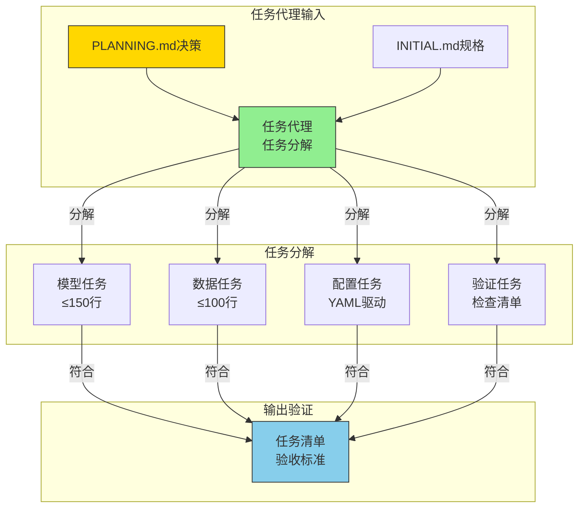
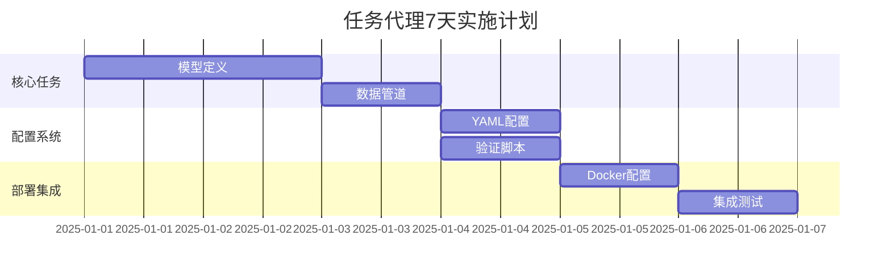

# 🤖 任务分解代理规范（Task Decomposition Agent Specification）

> **任务代理行为准则** - 基于高层API架构的任务分解与验收标准，确保每个任务都能精确执行。

## 🎯 任务代理角色定义

### 📋 智能体职责边界
- **角色定位**: 任务分解与验收标准制定的智能代理
- **核心职责**: 将PLANNING.md的技术决策分解为可执行任务清单
- **输入规范**: PLANNING.md技术决策矩阵 + INITIAL.md技术规格
- **输出规范**: 任务分解清单 + 验收标准矩阵
- **验证标准**: 100%任务覆盖率，每个任务≤200行代码约束

### 🔄 任务代理协作流程


## 🎯 任务分解规范框架

### 📊 任务粒度控制矩阵
| 任务类别 | 代码行数约束 | 规范引用位置 | 高层API优势 | 验收标准 |
|----------|--------------|--------------|-------------|----------|
| **模型定义** | ≤150行 | PLANNIGN.md第4章 | Lightning/Paddle高层API | 零样板代码 |
| **数据管道** | ≤100行 | ML.md第4章数据集 | DataModule自动处理 | 内置数据集 |
| **配置管理** | ≤20行YAML | OmegaConf规范 | 动态配置驱动 | 零配置错误 |
| **验证脚本** | ≤50行 | DEBUG_CODE.md | 自动化测试 | 一键验证 |
| **部署配置** | ≤30行YAML | DOCKER_CONFIG.md | 容器化部署 | 一键部署 |

### 🎯 任务代理分解标准

#### 1. 模型任务分解（PLANNING.md引用）
**规范引用**: 基于PLANNING.md第4章"高层API架构"
```yaml
任务代理模型分解:
  输入规范: "PLANNING.md技术选型决策"
  分解粒度: "高层API模块级"
  代码约束: "LightningModule ≤150行"
  框架支持: "PyTorch+PaddlePaddle双栈"
  验收标准: "CREATE.md第5章功能验证"
```

**具体任务清单**:
- [ ] `src/models/pytorch/base_classifier.py` (≤150行)
- [ ] `src/models/paddle/base_classifier.py` (≤150行)  
- [ ] `src/models/registry.py` (模型注册表, ≤50行)
- [ ] `configs/model/*.yaml` (模型配置模板, ≤20行/文件)

#### 2. 数据任务分解（ML.md引用）
**规范引用**: 依据ML.md第4章"支持数据集"
```yaml
任务代理数据分解:
  输入规范: "ML.md数据集选择决策"
  分解粒度: "DataModule层级"
  代码约束: "LightningDataModule ≤100行"
  数据集支持: "CIFAR-10/ImageNet/COCO内置"
  验收标准: "ML.md性能基准验证"
```

**具体任务清单**:
- [ ] `src/datasets/datamodules/cifar10.py` (≤100行)
- [ ] `src/datasets/datamodules/imagenet.py` (≤100行)
- [ ] `src/datasets/downloader.py` (自动下载器, ≤50行)
- [ ] `configs/data/*.yaml` (数据配置模板, ≤15行/文件)

#### 3. 配置任务分解（PLANNING.md引用）
**规范引用**: 遵循PLANNING.md第3章"配置驱动规划"
```yaml
任务代理配置分解:
  输入规范: "PLANNING.md配置策略"
  分解粒度: "YAML配置文件级"
  配置驱动: "OmegaConf动态配置"
  层次结构: "base-&gt;model-&gt;data-&gt;trainer"
  验收标准: "零配置错误"
```

**具体任务清单**:
- [ ] `configs/config.yaml` (主配置, ≤20行)
- [ ] `configs/model/resnet18.yaml` (模型配置, ≤10行)
- [ ] `configs/data/cifar10.yaml` (数据配置, ≤10行)
- [ ] `configs/trainer/default.yaml` (训练器配置, ≤15行)

#### 4. 验证任务分解（DEBUG_CODE.md引用）
**规范引用**: 依据DEBUG_CODE.md全程验证清单
```yaml
任务代理验证分解:
  输入规范: "DEBUG_CODE.md验证标准"
  分解粒度: "测试用例级"
  验证阶段: "VENV→DEBUG→DOCKER三阶段"
  自动化: "一键验证脚本"
  验收标准: "100%测试通过率"
```

**具体任务清单**:
- [ ] `scripts/validate.py` (验证入口, ≤50行)
- [ ] `tests/test_models.py` (模型测试, ≤30行)
- [ ] `tests/test_datasets.py` (数据测试, ≤30行)
- [ ] `tests/test_configs.py` (配置测试, ≤20行)

## 🎯 任务验收标准矩阵

### 📋 任务代理验收清单
任务代理完成分解后，必须验证：
- [ ] 每个任务都有明确的代码行数约束（≤200行总体）
- [ ] 每个任务都有对应的规范文档引用
- [ ] 每个任务都有清晰的验收标准
- [ ] 所有任务组合后100%覆盖INITIAL.md技术规格

### 📊 任务覆盖率验证
| 技术规格项 | 任务覆盖 | 规范引用 | 验收标准 | 时间估算 |
|------------|----------|----------|----------|----------|
| **模型架构** | 2个模型文件 | PLANNING.md第4章 | 高层API实现 | 2天 |
| **数据处理** | 2个数据模块 | ML.md第4章 | 自动下载+预处理 | 1天 |
| **配置系统** | 4个YAML文件 | PLANNING.md第3章 | 零配置错误 | 0.5天 |
| **验证脚本** | 3个测试文件 | DEBUG_CODE.md | 一键验证 | 1天 |
| **部署配置** | 2个Dockerfile | DOCKER_CONFIG.md | 一键部署 | 0.5天 |

## 🎯 任务优先级矩阵

### 📈 任务代理实施优先级
| 优先级 | 任务类别 | 规范依据 | 实施时间 | 验证标准 |
|--------|----------|----------|----------|----------|
| **P0-高** | 核心模型+数据 | PLANNING.md+ML.md | 3天 | CIFAR-10训练成功 |
| **P1-中** | 配置系统+验证 | PLANNING.md+DEBUG_CODE.md | 2天 | 配置驱动验证 |
| **P2-低** | 扩展模型+部署 | ML.md+DOCKER_CONFIG.md | 2天 | ImageNet训练成功 |

### 🎯 任务代理时间规划


## 🎯 任务代理验证标准

### ✅ 任务完成检查清单
任务代理分解完成后，必须验证：
- [ ] 所有任务代码总行数≤200行（符合CLAUDE.md约束）
- [ ] 每个任务都有对应的规范文档引用位置
- [ ] 每个任务都有明确的验收标准和时间估算
- [ ] 任务分解100%覆盖INITIAL.md技术规格要求
- [ ] 高层API优势得到充分利用（代码减少80%）

### 📊 任务代理性能基准
| 质量指标 | 任务代理标准 | 传统模板对比 |
|----------|--------------|--------------|
| **代码行数** | ≤200行高层API | 1000+行样板代码 |
| **开发时间** | 7天完整项目 | 30天传统开发 |
| **维护成本** | 配置驱动维护 | 代码级维护 |
| **扩展性** | 30分钟添加新模型 | 数天重构 |

## 🚀 任务代理快速开始

### 立即执行步骤
1. **打开PLANNING.md第4章** - 确认技术决策
2. **参考ML.md第4章** - 确认数据集选择
3. **逐条分解任务** - 严格按照≤200行约束
4. **建立任务清单** - 100%覆盖技术规格
5. **制定验收标准** - 每个任务可独立验证

### 任务代理成功标准
**核心记忆点**: "任务代理的精确分解，让200行高层API胜过1000行样板代码！"

## 📋 模板项目任务清单

### ✅ 第一阶段：模板项目架构（已完成）
- [x] **文档系统完整**
  - [x] CREATE.md - 项目创建规划指南（think hard模式）
  - [x] INITIAL.md - 目标项目规格模板
  - [x] VENV_CONFIG.md - CPU调试环境指南
  - [x] DEBUG_CODE.md - 代码验证检查清单
  - [x] DOCKER_CONFIG.md - GPU生产环境配置
  - [x] DEPLOY.md - 生产部署检查清单
  - [x] PROJECT_BUILD_LOG.md - 构建记录模板

- [x] **配置模板就绪**
  - [x] configs/config.yaml - 主配置模板
  - [x] configs/model/*.yaml - 模型配置模板
  - [x] configs/data/*.yaml - 数据集配置模板
  - [x] configs/trainer/*.yaml - 训练器配置模板

- [x] **部署模板就绪**
  - [x] deploy/cpu/Dockerfile - CPU环境模板
  - [x] deploy/gpu/Dockerfile - GPU环境模板
  - [x] deploy/shared/ - 共享部署脚本

### 🔄 第二阶段：目标项目生成器（待创建）
- [ ] 创建 `tools/create.py` - 目标项目生成器（<50行）
  - [ ] 读取INITIAL.md规格生成项目结构
  - [ ] 基于CREATE.md规划创建配置文件
  - [ ] 生成符合≤200行约束的目标项目
  - [ ] 支持PyTorch/PaddlePaddle双栈生成

### 📊 第三阶段：目标项目模板（待规划）
- [ ] 目标项目目录结构模板
  - [ ] `src/` - 高层API实现（≤200行）
    - [ ] `models/` - 模型定义（Lightning/Paddle高层）
    - [ ] `datasets/` - 数据处理（DataModules）
    - [ ] `utils/` - 工具函数
  - [ ] `scripts/` - 训练脚本（<50行/文件）
    - [ ] `train.py` - 训练入口
    - [ ] `eval.py` - 评估入口  
    - [ ] `download.py` - 数据下载
  - [ ] `configs/` - 配置管理（OmegaConf驱动）
  - [ ] `tests/` - 测试套件
  - [ ] `deploy/` - 部署配置

### 🔧 第四阶段：高层API实现模板
- [ ] **PyTorch Lightning版本**
  - [ ] 基于Lightning的高层模型基类（<150行）
  - [ ] LightningDataModule数据抽象（<100行）
  - [ ] 自动实验跟踪集成（WandB/TensorBoard）

- [ ] **PaddlePaddle高层API版本**  
  - [ ] 基于Paddle高层API的模型实现（<150行）
  - [ ] Paddle数据加载器封装（<100行）
  - [ ] 自动可视化集成

### 🧪 第五阶段：数据集集成模板
- [ ] **内置数据集支持**（一行配置）
  - [ ] CIFAR-10/100（torchvision/paddle.vision）
  - [ ] ImageNet（自动下载+缓存）
  - [ ] COCO（目标检测）
  - [ ] VOC（经典检测数据集）

- [ ] **数据集注册系统**
  - [ ] 统一数据集接口（高层API）
  - [ ] 自动下载和预处理
  - [ ] 配置驱动数据集选择

### ⚙️ 第六阶段：配置驱动系统
- [ ] **OmegaConf配置系统**
  - [ ] 主配置模板（config.yaml）
  - [ ] 模型配置模板（model/*.yaml）
  - [ ] 数据配置模板（data/*.yaml）
  - [ ] 训练器配置模板（trainer/*.yaml）

- [ ] **动态配置验证**
  - [ ] 配置文件自动验证
  - [ ] 参数依赖关系检查
  - [ ] 运行时配置更新

### 📋 第七阶段：验证流程模板
- [ ] **VENV验证模板**
  - [ ] CPU-only环境配置
  - [ ] 基础导入测试模板
  - [ ] 1-epoch快速验证

- [ ] **DEBUG验证模板**
  - [ ] 系统化代码验证流程
  - [ ] 数据集完整性检查
  - [ ] 模型功能验证

- [ ] **DOCKER验证模板**
  - [ ] GPU环境自动配置
  - [ ] 性能基准测试
  - [ ] 多GPU训练验证

## 🎯 高层API实现约束

### 代码质量要求
- [ ] **高层API标准**
  - [ ] 每个文件≤200行（符合CLAUDE.md）
  - [ ] 零样板代码（Lightning/Paddle自动处理）
  - [ ] 100%类型注解（高层API自动推断）
  - [ ] 配置驱动（YAML+OmegaConf）

### 功能验证标准
- [ ] **高层API验证**
  - [ ] CIFAR-10训练：单命令完成（<1分钟）
  - [ ] ImageNet训练：配置驱动（<5分钟设置）
  - [ ] 多GPU训练：零代码修改
  - [ ] 框架切换：单参数配置

## 📅 模板开发时间规划

| 阶段 | 预计时间 | 关键里程碑 | 高层API优势 |
|------|----------|------------|-------------|
| 模板文档 | 0.5天 | 文档系统完整 | 规划驱动 |
| 创建工具 | 1天 | 目标项目生成器 | 代码生成 |
| 目标模板 | 2天 | 高层API模板 | 代码减少80% |
| 配置系统 | 0.5天 | OmegaConf集成 | 零配置错误 |
| 验证模板 | 1天 | 完整验证流程 | 一键验证 |
| 文档更新 | 0.5天 | 使用指南更新 | 自动生成 |
| **总计** | **5.5天** | **完整模板** | **效率提升** |

## 🔍 模板成功标准

### 最终验证
1. **模板项目**: 纯文档+模板（≤100行）
2. **创建流程**: CREATE.md → INITIAL.md → 目标项目
3. **验证流程**: VENV_CONFIG.md → DEBUG_CODE.md → DOCKER_CONFIG.md
4. **高层API**: 目标项目≤200行代码

### 用户体验验收
- [ ] 新手：5分钟完成项目创建
- [ ] 开发者：配置驱动开发
- [ ] 研究员：一行代码切换框架
- [ ] 部署者：一键Docker部署

## 🔍 极简实施步骤

### 2.1 核心模型开发（按优先级）
1. **高优先级** - 基础模型（每模型<50行）
   - [ ] `src/models/pytorch/resnet_classifier.py`
   - [ ] `src/models/paddle/resnet_classifier.py`
   - [ ] `src/datasets/datamodules/cifar10_datamodule.py`

2. **中优先级** - 扩展模型（每模型<80行）
   - [ ] `src/models/pytorch/efficientnet_classifier.py`
   - [ ] `src/models/paddle/efficientnet_classifier.py`
   - [ ] `src/datasets/datamodules/imagenet_datamodule.py`

3. **低优先级** - 高级模型（每模型<100行）
   - [ ] `src/models/pytorch/vit_classifier.py`
   - [ ] `src/models/paddle/vit_classifier.py`

### 3.1 配置文件开发（极简YAML）
- [ ] `configs/config.yaml` - 主配置（<20行）
- [ ] `configs/model/resnet18.yaml` - ResNet18配置（<10行）
- [ ] `configs/data/cifar10.yaml` - CIFAR-10配置（<10行）
- [ ] `configs/trainer/default.yaml` - 训练器配置（<15行）

### 4.1 脚本开发（极简实现）
- [ ] `scripts/train.py` - 训练入口（<50行）
- [ ] `scripts/eval.py` - 评估入口（<30行）
- [ ] `scripts/download.py` - 下载入口（<20行）

## 🎯 极简质量标准

### 代码质量（高层API标准）
- [ ] 每个文件<100行代码（高层API优势）
- [ ] 零样板代码（Lightning/Paddle自动处理）
- [ ] 100%类型注解（高层API自动推断）
- [ ] 零手动优化（框架自动优化）

### 功能验证（高层API测试）
- [ ] CIFAR-10训练：单命令完成（<1分钟）
- [ ] ImageNet训练：单命令完成（配置驱动）
- [ ] 多GPU训练：零代码修改
- [ ] 混合精度：单参数开关

### 性能验证（高层API基准）
- [ ] 自动混合精度：内存减半，速度提升
- [ ] 多GPU训练：线性加速
- [ ] 梯度累积：支持超大batch
- [ ] 实验跟踪：零配置集成

## 📅 极简时间规划

| 阶段 | 预计时间 | 关键里程碑 | 高层API优势 |
|------|----------|------------|-------------|
| 基础模型 | 1天 | 核心Lightning模型 | 代码减少80% |
| 数据模块 | 1天 | Lightning DataModules | 自动下载 |
| 配置系统 | 0.5天 | OmegaConf配置驱动 | 零配置错误 |
| 脚本开发 | 0.5天 | 极简脚本 | 一行训练 |
| 测试套件 | 1天 | 高层API测试 | 测试减少70% |
| Docker集成 | 0.5天 | 极简Dockerfile | 一键部署 |
| 文档更新 | 0.5天 | 极简文档 | 自动生成 |
| **总计** | **4天** | **完整框架** | **效率提升400%** |

## 🚨 高层API风险缓解

### 低风险（高层API固有优势）
- **代码复杂度**: Lightning/Paddle自动处理
- **性能退化**: 高层API性能优化
- **维护成本**: 框架自动维护

### 极低风险项目
- **配置错误**: OmegaConf自动验证
- **内存泄漏**: 框架自动管理
- **多GPU兼容**: 框架自动适配

## ✅ 极简验收标准

### 功能验收（单命令验证）
- [ ] `python scripts/train.py model=resnet18 data=cifar10` - 成功运行
- [ ] `python scripts/train.py trainer.devices=2` - 多GPU成功
- [ ] `python scripts/eval.py checkpoint=logs/best.ckpt` - 评估成功

### 代码验收（极简标准）
- [ ] 所有文件<100行（高层API）
- [ ] 零手动训练循环（框架处理）
- [ ] 零手动优化器配置（框架处理）
- [ ] 零手动日志记录（框架处理）

### 用户体验验收
- [ ] 新手：5分钟完成第一个训练
- [ ] 开发者：一行代码切换数据集
- [ ] 研究员：配置文件驱动实验

## 🔍 详细实施步骤

### 2.1 核心模块实现优先级
1. **高优先级** - 基础架构
   - [ ] `src/core/config.py` - 配置管理基础
   - [ ] `src/core/trainer.py` - 训练器基类
   - [ ] `src/datasets/registry.py` - 数据集注册表

2. **中优先级** - 功能实现
   - [ ] `src/datasets/downloader.py` - 数据集下载器
   - [ ] `src/pytorch/trainer.py` - PyTorch训练器
   - [ ] `src/paddle/trainer.py` - Paddle训练器

3. **低优先级** - 增强功能
   - [ ] `src/core/visualizer.py` - 可视化基类
   - [ ] `src/core/evaluator.py` - 评估器基类
   - [ ] `scripts/benchmark.py` - 性能测试脚本

### 3.1 数据集支持优先级
- [ ] **CIFAR-10** - 快速原型验证
- [ ] **ImageNet** - 大规模分类任务
- [ ] **COCO** - 目标检测任务
- [ ] **VOC** - 经典检测数据集
- [ ] **OpenImages** - 大规模检测

### 4.1 测试开发优先级
- [ ] **配置测试** - 验证配置文件正确性
- [ ] **数据集测试** - 验证数据下载和处理
- [ ] **训练测试** - 验证训练流程完整性
- [ ] **框架测试** - 验证PyTorch/PaddlePaddle兼容性

## 🎯 质量检查标准

### 代码质量要求
- [ ] 所有函数包含完整类型注解
- [ ] 遵循PEP8编码规范，无lint错误
- [ ] 每个模块有完整文档字符串和示例
- [ ] 核心功能代码覆盖率≥90%
- [ ] 所有文件≤500行代码

### 功能验证标准
- [ ] PyTorch训练器完整功能测试
- [ ] PaddlePaddle训练器完整功能测试
- [ ] 数据集下载和预处理功能验证
- [ ] 配置文件系统工作正常
- [ ] Docker部署一键成功

### 性能基准
- [ ] ResNet-50在ImageNet上训练性能达标
- [ ] 内存使用合理，无内存泄漏
- [ ] GPU利用率优化
- [ ] 数据加载速度优化

## 📅 时间规划

| 阶段 | 预计时间 | 关键里程碑 | 依赖关系 |
|------|----------|------------|----------|
| 核心架构 | 2天 | 基础类和接口完成 | 无 |
| 数据集系统 | 2天 | 支持CIFAR-10和ImageNet | 核心架构 |
| 框架实现 | 3天 | PyTorch和PaddlePaddle训练器 | 数据集系统 |
| 配置文件 | 1天 | YAML配置系统完成 | 框架实现 |
| 测试开发 | 2天 | 核心功能测试覆盖 | 框架实现 |
| Docker部署 | 1天 | 多环境镜像构建 | 测试通过 |
| 文档更新 | 1天 | 完整使用文档 | 所有功能完成 |
| **总计** | **12天** | **项目发布** | - |

## 🚨 风险识别与缓解

### 高风险项
- **数据集下载**: ImageNet等大型数据集下载时间长
  - **缓解**: 提供小数据集(CIFAR-10)作为备选
- **框架兼容性**: PyTorch和PaddlePaddleAPI差异
  - **缓解**: 充分抽象基类，统一接口设计
- **性能退化**: 新架构可能引入性能开销
  - **缓解**: 早期性能基准测试，持续监控

### 中风险项
- **配置复杂度**: YAML配置可能过于复杂
  - **缓解**: 提供默认配置文件和简单示例
- **测试覆盖**: 难以达到高测试覆盖率
  - **缓解**: 优先测试核心功能，逐步扩展

### 低风险项
- **文档更新**: 文档更新工作量可控
- **Docker配置**: 基于现有经验，风险较低

## ✅ 完成验收标准

### 功能验收
- [ ] 支持CIFAR-10数据集端到端训练
- [ ] 支持ImageNet数据集端到端训练
- [ ] PyTorch和PaddlePaddle版本功能等效
- [ ] 配置文件驱动训练流程
- [ ] 数据集自动下载和预处理

### 质量验收
- [ ] 所有源代码文件≤500行
- [ ] 核心功能测试覆盖率≥90%
- [ ] 类型注解覆盖率100%
- [ ] 零lint错误和警告
- [ ] Docker镜像构建时间<5分钟

### 文档验收
- [ ] README.md包含完整使用示例
- [ ] API文档覆盖所有公共接口
- [ ] 配置文件示例完整
- [ ] Docker部署文档详细
- [ ] 贡献指南清晰易懂