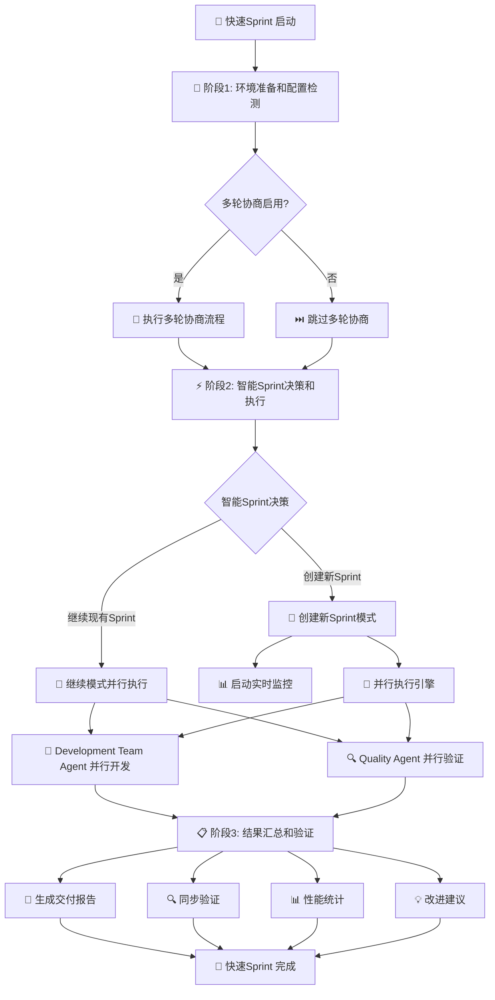
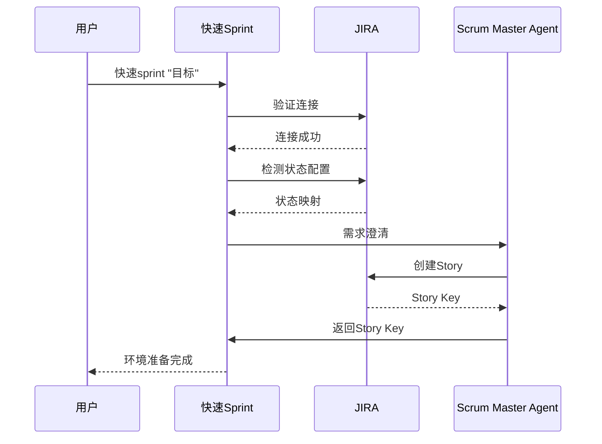
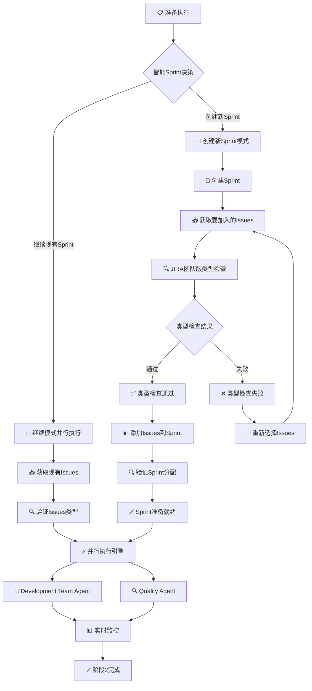
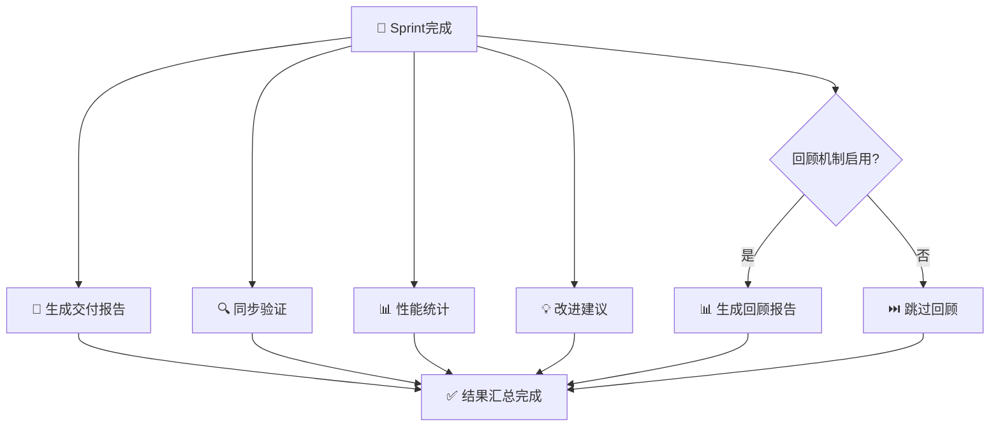
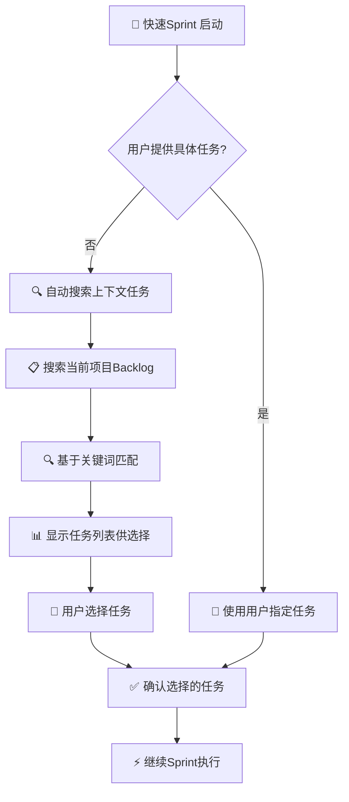
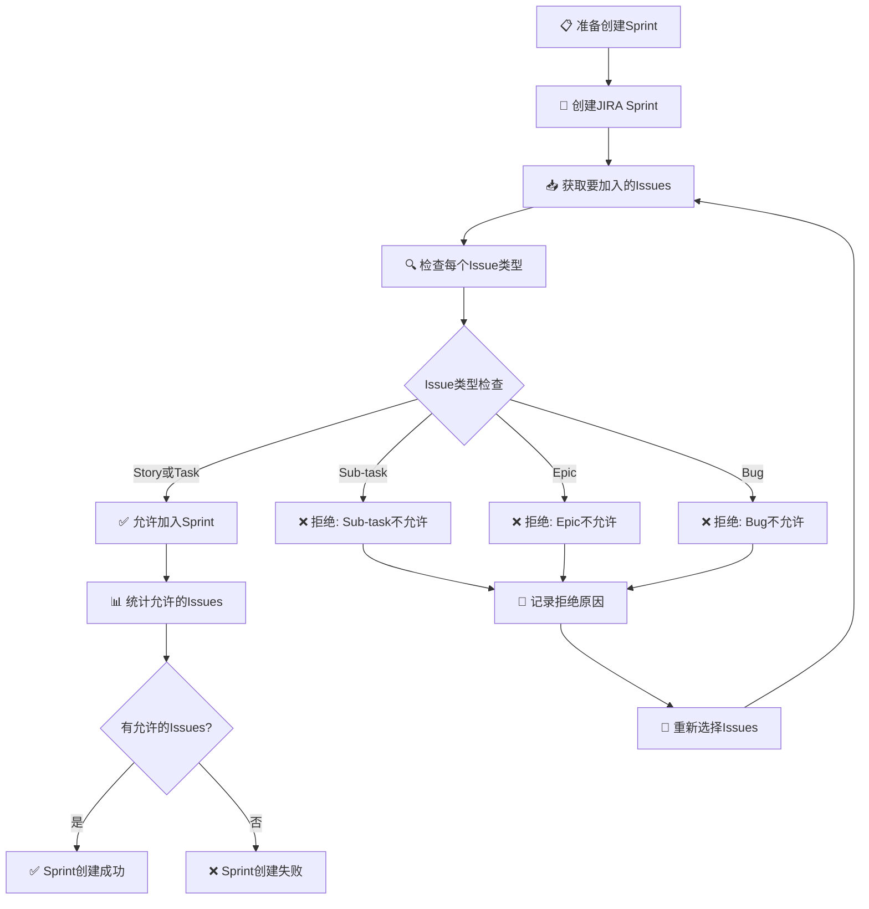
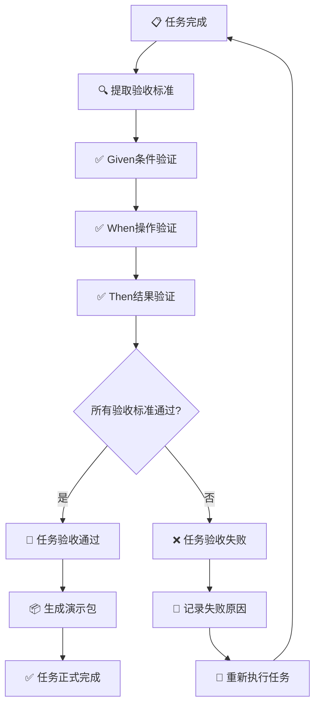
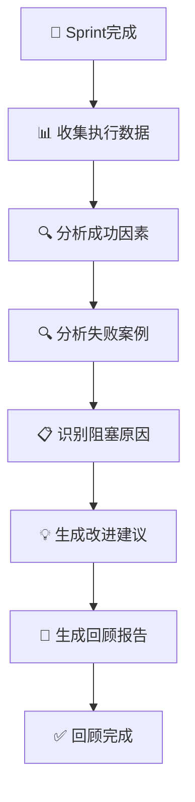
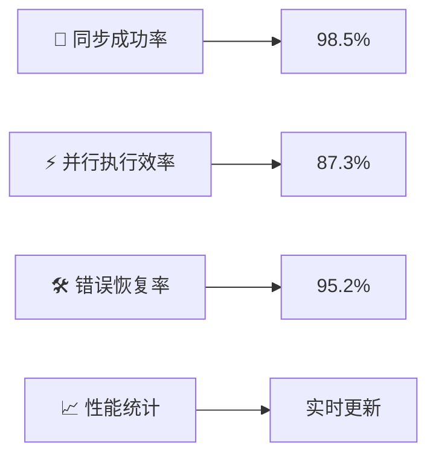

# 快速Sprint Command
> 基于多智能体并行协作的分钟级软件交付工作流

## 🎯 核心特性

### 分钟级交付能力
- **5-8分钟端到端交付**: 从需求澄清到交付验证的完整流程
- **智能并行执行**: 多智能体协作，显著提升效率
- **强制同步协议**: 确保100% JIRA状态同步
- **实时监控**: 可视化进度跟踪和智能错误恢复

### 质量保证机制
- **JIRA团队版合规**: 严格的类型检查约束
- **验收标准驱动**: 基于Given-When-Then的质量保证
- **三可原则分解**: 独立执行、自动化验证、回滚隔离
- **智能状态检测**: 自动识别项目状态配置

### 智能协作系统
- **多轮协商**: 智能体间深度协商和文档落地
- **冲突解决**: 自动检测和解决智能体间冲突
- **回顾机制**: 自动生成改进建议和趋势分析
- **API兼容性**: 自动适配JIRA API版本变更

## 🚀 工作流程概览



### 时间分配优化
- **阶段1**: 环境准备、配置检测和多轮协商 (45秒)
- **阶段2**: 智能决策、并行执行和实时监控 (3-6分钟)
- **阶段3**: 结果汇总、验证和报告生成 (45秒)
- **总耗时**: 5-8分钟完成端到端交付

## 📋 详细工作流程

### 阶段1: 环境准备和配置检测



**关键活动:**
- ✅ **配置读取**: 自动读取JIRA配置信息
- ✅ **连接验证**: 验证JIRA API连接状态
- ✅ **状态检测**: 自动识别项目状态配置
- ✅ **需求澄清**: Scrum Master Agent创建故事
- ✅ **多轮协商**: 智能体间深度协商（可选）

**输出成果:**
- 📄 JIRA Story创建
- 📋 需求澄清文档
- 🔧 技术方案文档
- 📊 任务分解文档

### 阶段2: 智能Sprint决策和执行



**智能决策引擎:**
- 🎯 **继续现有Sprint**: 自动检测并继续执行现有Sprint
- 🚀 **创建新Sprint**: 创建新Sprint并添加合规Issues
- 🔍 **类型检查**: 确保只允许Story和Task类型
- ⚡ **并行执行**: Development Team Agent和Quality Agent并行工作

**JIRA团队版约束:**
- ✅ **允许类型**: Story, Task
- ❌ **禁止类型**: Sub-task, Epic, Bug, Improvement, New Feature
- 🔍 **自动验证**: 系统自动检查Issue类型合规性

### 阶段3: 结果汇总和验证



**验证活动:**
- 📄 **交付报告**: 生成完整的交付成果报告
- 🔍 **同步验证**: 验证所有状态同步操作
- 📊 **性能统计**: 分析执行效率和成功率
- 💡 **改进建议**: 基于执行数据生成优化建议
- 📊 **回顾机制**: 自动生成回顾报告（可选）

## 🎯 核心功能详解

### 1. 用户输入与上下文搜索



**智能搜索能力:**
- 🔍 **自动上下文搜索**: 基于当前项目环境自动搜索相关任务
- 📋 **Backlog分析**: 分析项目Backlog中的待办任务
- 🎯 **关键词匹配**: 基于用户目标智能匹配相关任务
- 👤 **用户确认**: 提供任务列表供用户选择确认

### 2. Sprint创建与类型检查



**类型检查机制:**
- 🔍 **自动验证**: 系统自动检查每个Issue的类型
- ✅ **合规类型**: Story, Task
- ❌ **不合规类型**: Sub-task, Epic, Bug, Improvement, New Feature
- 📝 **错误处理**: 记录拒绝原因并提供重新选择机会


### 3. 验收标准验证



**验收标准格式:**
```
Given [条件], When [操作], Then [结果]
```

**验证过程:**
- ✅ **Given条件验证**: 验证前置条件是否满足
- ✅ **When操作验证**: 验证操作步骤是否正确
- ✅ **Then结果验证**: 验证预期结果是否达成
- 📦 **演示包生成**: 自动生成功能演示包

### 4. 回顾机制



**回顾内容:**
- 📊 **执行数据分析**: 收集和分析所有执行数据
- 🔍 **成功因素分析**: 识别成功的关键因素
- 🔍 **失败案例分析**: 分析失败原因和改进机会
- 📋 **阻塞原因识别**: 识别执行过程中的阻塞点
- 💡 **改进建议生成**: 基于分析结果生成具体改进建议

## 🔧 配置和参数


### 环境配置

**JIRA配置:**
- **域名**: `JIRA_DOMAIN="your-domain.atlassian.net"`
- **API凭据**: `EMAIL="your-email@example.com"`, `API_TOKEN="your-api-token"`
- **项目配置**: `PROJECT_KEY="FC"`

**状态映射:**
- 系统自动检测项目状态配置
- 生成状态ID映射文件
- 支持手动配置状态映射

## 📊 监控和性能

### 实时监控指标



**监控维度:**
- 🔄 **同步状态**: JIRA状态同步成功率
- ⚡ **执行效率**: 并行执行效率统计
- 🛠️ **错误恢复**: 自动错误恢复成功率
- 📈 **性能统计**: 实时性能指标监控

### 智能体状态跟踪

**Development Team Agent:**
- 📋 任务分配状态
- ⏱️ 执行时间统计
- ✅ 完成质量评估

**Quality Agent:**
- 🔍 验证任务状态
- 📊 测试覆盖率
- ✅ 质量评估结果

## 🛠️ 故障排除

### 常见问题解决

**JIRA连接问题:**
- ✅ 检查域名配置
- ✅ 验证API凭据
- ✅ 确认网络连接

**类型检查失败:**
- ✅ 使用合规的Issue类型 (Story/Task)
- ✅ 重新创建合规的Issue
- ✅ 使用`--no-type-check`跳过检查

**验收标准验证失败:**
- ✅ 使用正确的Given-When-Then格式
- ✅ 确保验收标准具体可验证
- ✅ 使用`--no-ac-validation`跳过验证

**智能体执行超时:**
- ✅ 系统自动重置和重试
- ✅ 检查任务复杂度
- ✅ 调整并行执行参数


## 🏗️ 系统架构

```mermaid
graph TB
    subgraph "用户界面层"
        UI[🚀 快速Sprint 命令<br/>用户输入和输出]
    end

    subgraph "协调层"
        SM[🎯 Scrum Master Agent<br/>整体流程协调]
        NEG[🤝 多轮协商协调器<br/>智能体间协商]
        MON[📊 监控恢复系统<br/>实时监控和错误恢复]
    end

    subgraph "执行层"
        DT[🤖 Development Team Agent<br/>代码生成和开发]
        QA[🔍 Quality Agent<br/>质量验证和测试]
        PAR[⚡ 并行执行管理器<br/>智能体负载均衡]
    end

    subgraph "集成层"
        JIRA[🔗 JIRA 集成系统<br/>状态同步和项目管理]
    end

    subgraph "数据层"
        DOC[📄 协商文档系统<br/>需求澄清、技术方案、任务分解]
        LOG[📊 监控日志系统<br/>状态跟踪和性能统计]
    end

    UI --> SM
    SM --> NEG
    SM --> MON
    SM --> PAR

    NEG --> DT
    NEG --> QA
    PAR --> DT
    PAR --> QA
    MON --> DT
    MON --> QA

    DT --> JIRA
    QA --> JIRA
    SM --> JIRA

    NEG --> DOC
    MON --> LOG
    DT --> LOG
    QA --> LOG

    style UI fill:#e1f5fe
    style SM fill:#bbdefb
    style NEG fill:#bbdefb
    style MON fill:#bbdefb
    style DT fill:#c8e6c9
    style QA fill:#c8e6c9
    style PAR fill:#c8e6c9
    style JIRA fill:#fff3e0
    style DOC fill:#f3e5f5
    style LOG fill:#f3e5f5
```



### 架构说明
- **用户界面层**: 快速Sprint 命令提供统一的用户交互接口
- **协调层**: Scrum Master Agent 负责整体流程协调，包括多轮协商和监控恢复
- **执行层**: Development Team Agent 和 Quality Agent 并行执行开发和质量验证
- **集成层**: JIRA 集成系统确保所有状态和进度同步到项目管理工具
- **数据层**: 协商文档和监控日志系统提供完整的可追溯性

### 核心优势
- **分钟级交付**: 5-8分钟完成端到端软件交付
- **智能体协作**: 多智能体并行执行，显著提升效率
- **强制同步**: 100% JIRA 状态同步，确保数据一致性
- **实时监控**: 可视化进度跟踪和智能错误恢复
- **协商机制**: 多轮协商确保需求理解和技术方案一致性

---

**版本**: 1.0.0
**最后更新**: 2025-11-08
**文档类型**: 用户指南和技术规范