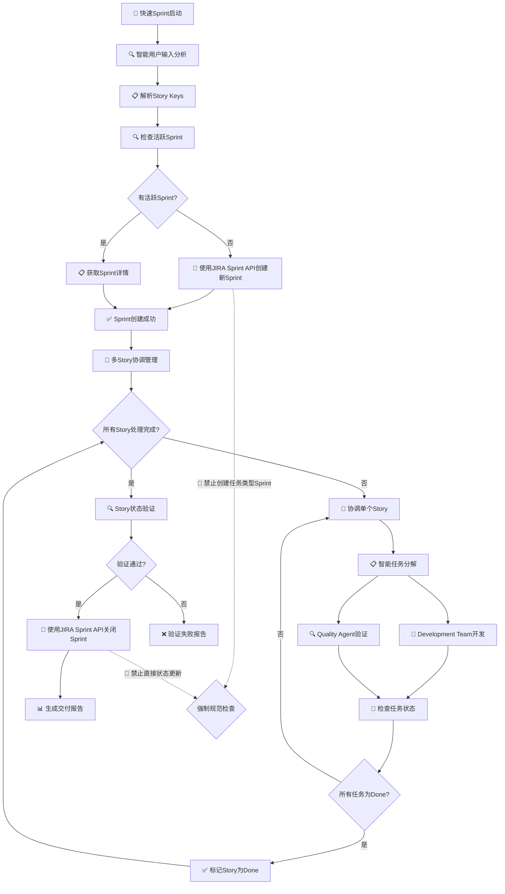
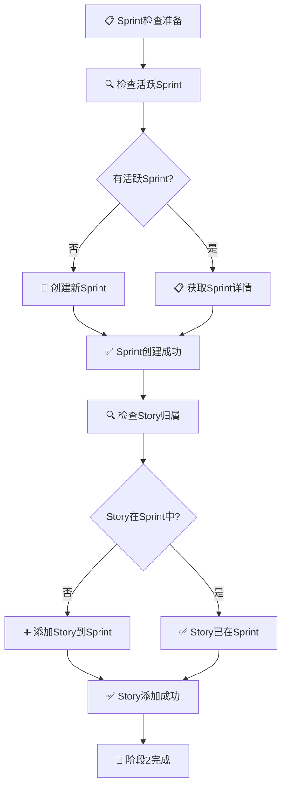
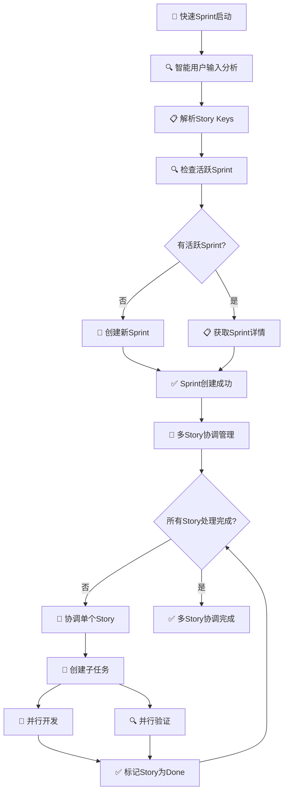
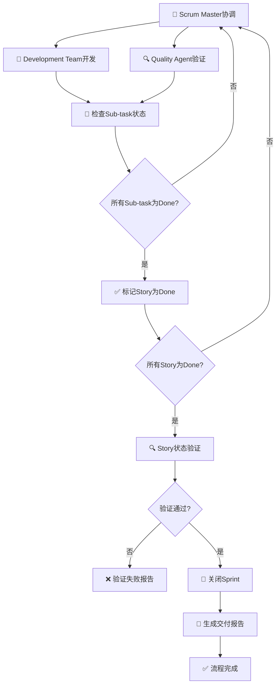

# 快速Sprint Command
> 基于多智能体并行协作的分钟级软件交付工作流

## 📋 Agile Scrum Sprint 文字规范

### Scrum Sprint 定义
根据Scrum指南，Sprint是Scrum的核心，是一个固定时间盒（通常1-4周），在此期间完成"完成"的产品增量。

### Sprint 创建规范
- **必须使用JIRA Sprint API创建**：Sprint必须通过`/rest/agile/1.0/sprint` API创建
- **禁止创建任务类型Sprint**：Sprint不是普通任务，不能作为Issue创建
- **Sprint属性要求**：
  - `name`: Sprint名称（如"Sprint 1 - 即时交付"）
  - `goal`: Sprint目标
  - `startDate`: 开始日期
  - `endDate`: 结束日期
  - `state`: 状态（active/closed）

### 强制规范规则
- 🚫 **禁止任务类型Sprint**：Sprint必须使用正确的JIRA Sprint API创建，禁止创建任务类型的Sprint
- ✅ **强制Sprint类型验证**：创建前验证Sprint类型正确性，确保符合Scrum规范
- 🔍 **强制状态流转**：确保状态流转符合Scrum工作流，基于实际工作成果
- ⚡ **强制智能体协作**：Scrum Master必须协调其他智能体执行实际工作，禁止直接状态更新
- 📋 **强制任务分解**：Story必须分解为可执行的任务单元，确保可独立验证
- 🔄 **强制状态同步**：所有状态变更必须同步到JIRA，确保数据一致性

## 🎯 核心特性

### 分钟级交付能力
- **5-8分钟端到端交付**: 从需求澄清到交付验证的完整流程
- **智能并行执行**: 多智能体协作，显著提升效率
- **强制同步协议**: 确保100% JIRA状态同步
- **实时监控**: 可视化进度跟踪和智能错误恢复

### 质量保证机制
- **JIRA团队版合规**: 严格的类型检查约束
- **验收标准驱动**: 基于Given-When-Then的质量保证
- **三可原则分解**: 独立执行、自动化验证、回滚隔离
- **智能状态检测**: 自动识别项目状态配置
- **Story状态验证**: Sprint关闭前强制验证所有Story状态

### 智能协作系统
- **多轮协商**: 智能体间深度协商和文档落地
- **冲突解决**: 自动检测和解决智能体间冲突
- **回顾机制**: 自动生成改进建议和趋势分析
- **API兼容性**: 自动适配JIRA API版本变更

## 🚀 工作流程概览



### 时间分配优化
- **阶段1**: 环境准备、配置检测和多轮协商 (45秒)
- **阶段2**: 智能决策、并行执行和实时监控 (3-6分钟)
- **阶段3**: 结果汇总、验证和报告生成 (45秒)
- **总耗时**: 5-8分钟完成端到端交付

## 📋 详细工作流程

### 阶段1: 环境准备和配置检测


**关键活动:**
- ✅ **配置读取**: 自动读取JIRA配置信息
- ✅ **连接验证**: 验证JIRA API连接状态
- ✅ **状态检测**: 自动识别项目状态配置
- ✅ **智能输入分析**: Scrum Master Agent解析用户输入中的Story Keys
- ✅ **多Story识别**: 支持多个Story的并行处理
- ✅ **多轮协商**: 智能体间深度协商（可选）

**输出成果:**
- 📄 解析的Story Keys列表
- 📋 多Story协调计划
- 🔧 并行执行策略
- 📊 任务分解文档

### 阶段2: Sprint检查和Story管理



**Sprint检查机制:**
- 🔍 **活跃Sprint检查**: 自动检测项目中的活跃Sprint
- 📝 **新Sprint创建**: 如果没有活跃Sprint，创建新Sprint
- 📋 **Sprint详情获取**: 获取现有Sprint的详细信息
- 🔍 **Story归属检查**: 验证用户指定的Story是否已在Sprint中
- ➕ **Story添加**: 如果Story不在Sprint中，添加到Sprint

**智能决策逻辑:**
- 🎯 **继续现有Sprint**: 使用现有活跃Sprint继续执行
- 🚀 **创建新Sprint**: 创建新Sprint并设置合理的时间范围
- ✅ **Story管理**: 确保目标Story在Sprint中
- 🔄 **状态跟踪**: 持续监控Story和Sub-task状态

### 阶段3: 智能体协调和状态跟踪


**智能体协调机制:**
- 🎯 **Scrum Master协调**: 由Scrum Master Agent负责整体协调和流程管理
- 🤖 **Development Team开发**: 并行执行所有任务的开发工作，确保实际代码实现
- 🔍 **Quality Agent验证**: 并行执行所有任务的质量验证，确保交付质量
- 🔄 **状态检查循环**: 持续检查任务状态直到全部完成，基于实际工作成果
- ✅ **Story完成条件**: 所有相关任务为Done且验证通过时标记Story为Done
- 🔍 **Story状态验证**: 验证所有Story状态确保可以安全关闭Sprint
- 🏁 **Sprint完成条件**: 所有Story为Done且验证通过时使用JIRA Sprint API关闭Sprint

**状态流转逻辑:**
- 🔄 **循环检查**: 持续监控Sub-task状态，直到全部完成
- ✅ **基于实际工作的标记**: Sub-task全部完成且实际工作验证通过时标记Story为Done
- 🔍 **状态验证**: 验证所有Story状态确保Sprint可以安全关闭
- 🏁 **智能关闭**: Story全部完成且验证通过时自动关闭Sprint
- 📊 **报告生成**: 生成完整的交付成果报告

## 🎯 基于Agile理论的智能体强制分工

### 核心原则
根据Scrum敏捷开发最佳实践，智能体必须执行实际工作，禁止直接状态更新：

**强制执行规则:**
- 🚫 **禁止状态欺骗**: Scrum Master Agent不得直接更新JIRA状态而不调用其他智能体
- ✅ **强制实际开发**: Development Team Agent必须执行所有开发工作（代码生成、功能实现）
- ✅ **强制实际测试**: Quality Agent必须执行所有测试验证工作（测试执行、质量保证）
- 🔍 **强制验证机制**: 所有状态更新必须基于实际工作完成验证

### 智能体职责边界


**验证机制:**
- 🔍 **工作成果验证**: 所有状态更新必须基于实际工作成果，禁止状态欺骗
- 📋 **实际工作检查**: Development Team Agent必须执行实际开发工作，确保功能实现
- 🧪 **质量验证执行**: Quality Agent必须执行实际质量验证，确保交付标准
- ✅ **质量门禁**: 只有通过质量验证的状态才能流转，确保交付质量
- 🔄 **状态同步验证**: 所有状态变更必须同步到JIRA，确保数据一致性

## 🎯 核心功能详解

### 1. 智能用户输入分析和多Story管理



**多Story管理能力:**
- 🔍 **智能输入分析**: 自动解析用户输入中的Story Keys，支持多种输入格式
- 📋 **多Story识别**: 支持多种Story标识格式，灵活适应不同项目规范
- 🔄 **多Story协调**: 并行协调多个Story的执行，确保高效资源利用
- 🎯 **单个Story协调**: 为每个Story进行智能任务分解和协调执行
- 📝 **智能任务分解**: 根据Story复杂度自动分解为可执行的任务单元
- 🤖 **并行执行**: Development Team和Quality Agent并行工作，最大化效率
- ✅ **状态跟踪**: 实时监控所有Story和任务状态，确保进度可视化

### 2. 智能体协调和状态跟踪



**智能体协调机制:**
- 🎯 **Scrum Master主导**: Scrum Master Agent负责整体协调和流程管理
- 🤖 **实际开发**: Development Team Agent必须执行所有开发工作，确保功能实现
- 🔍 **实际验证**: Quality Agent必须执行所有质量验证工作，确保交付标准
- 🔄 **状态循环**: 持续检查任务状态直到全部完成，基于实际工作成果
- ✅ **基于实际工作的流转**: 所有任务完成且实际工作验证通过时标记Story为Done
- 🔍 **状态验证**: 验证所有Story状态确保Sprint可以安全关闭
- 🏁 **智能关闭**: Story全部完成且验证通过时使用JIRA Sprint API自动关闭Sprint


### 3. 验收标准验证


**验收标准格式:**
```
Given [条件], When [操作], Then [结果]
```

**验证过程:**
- ✅ **Given条件验证**: 验证前置条件是否满足
- ✅ **When操作验证**: 验证操作步骤是否正确
- ✅ **Then结果验证**: 验证预期结果是否达成
- 📦 **演示包生成**: 自动生成功能演示包

### 4. 回顾机制


**回顾内容:**
- 📊 **执行数据分析**: 收集和分析所有执行数据
- 🔍 **成功因素分析**: 识别成功的关键因素
- 🔍 **失败案例分析**: 分析失败原因和改进机会
- 📋 **阻塞原因识别**: 识别执行过程中的阻塞点
- 💡 **改进建议生成**: 基于分析结果生成具体改进建议

## 🔧 配置和参数


### 环境配置

**JIRA配置:**
- **域名**: `JIRA_DOMAIN="your-domain.atlassian.net"`
- **API凭据**: `EMAIL="your-email@example.com"`, `API_TOKEN="your-api-token"`
- **项目配置**: `PROJECT_KEY="FC"`

**状态映射:**
- 系统自动检测项目状态配置
- 生成状态ID映射文件
- 支持手动配置状态映射

## 📊 监控和性能

### 实时监控指标


**监控维度:**
- 🔄 **同步状态**: JIRA状态同步成功率
- ⚡ **执行效率**: 并行执行效率统计
- 🛠️ **错误恢复**: 自动错误恢复成功率
- 📈 **性能统计**: 实时性能指标监控

### 智能体状态跟踪

**Development Team Agent:**
- 📋 任务分配状态
- ⏱️ 执行时间统计
- ✅ 完成质量评估

**Quality Agent:**
- 🔍 验证任务状态
- 📊 测试覆盖率
- ✅ 质量评估结果

## 🛠️ 故障排除

### 常见问题解决

**JIRA连接问题:**
- ✅ 检查域名配置
- ✅ 验证API凭据
- ✅ 确认网络连接

**类型检查失败:**
- ✅ 使用合规的Issue类型 (Story/Task)
- ✅ 重新创建合规的Issue
- ✅ 使用`--no-type-check`跳过检查

**验收标准验证失败:**
- ✅ 使用正确的Given-When-Then格式
- ✅ 确保验收标准具体可验证
- ✅ 使用`--no-ac-validation`跳过验证

**智能体执行超时:**
- ✅ 系统自动重置和重试
- ✅ 检查任务复杂度
- ✅ 调整并行执行参数


## 🏗️ 系统架构


### 架构说明
- **用户界面层**: 快速Sprint 命令提供统一的用户交互接口
- **协调层**: Scrum Master Agent 负责整体流程协调，包括多轮协商和监控恢复
- **执行层**: Development Team Agent 和 Quality Agent 并行执行开发和质量验证
- **集成层**: JIRA 集成系统确保所有状态和进度同步到项目管理工具
- **数据层**: 协商文档和监控日志系统提供完整的可追溯性

### 核心优势
- **分钟级交付**: 5-8分钟完成端到端软件交付
- **智能体协作**: 多智能体并行执行，显著提升效率
- **强制同步**: 100% JIRA 状态同步，确保数据一致性
- **实时监控**: 可视化进度跟踪和智能错误恢复
- **协商机制**: 多轮协商确保需求理解和技术方案一致性

---

**版本**: 1.0.0
**最后更新**: 2025-11-08
**文档类型**: 用户指南和技术规范