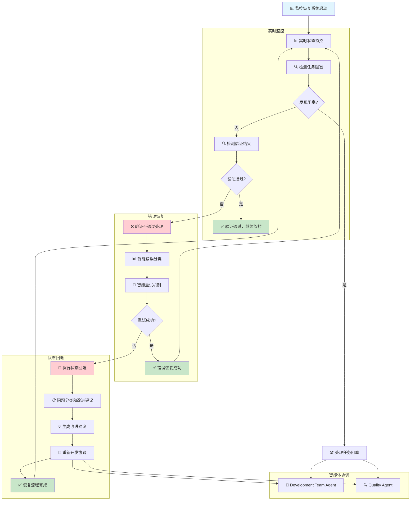

# 监控恢复系统

## 🎯 核心功能
- 实时同步监控和可视化
- 智能错误恢复和重试机制
- 验证不通过检测和处理
- 状态回退和重新开发协调

## 监控恢复工作流程



### 流程说明
- **实时监控**: 持续监控任务状态和验证结果
- **错误恢复**: 智能分类错误类型并自动重试
- **状态回退**: 验证不通过时自动回退状态并重新开发
- **智能体协调**: 协调 Development Team Agent 和 Quality Agent 进行恢复
- **循环监控**: 恢复完成后继续监控，确保系统稳定性

## 实时监控系统

### 1. 监控仪表板
```bash
# 实时状态监控
function realtime_state_monitor() {
    local sprint_id=$1

    echo "📊 启动实时状态监控 - Sprint: $sprint_id"
    echo "========================================"

    local monitoring_active=true
    local last_status=""

    while [ "$monitoring_active" = "true" ]; do
        clear
        echo "🔄 实时状态监控 - $(date '+%H:%M:%S')"
        echo "========================================"

        # 获取Sprint中的所有任务
        local issues=$(get_sprint_issues "$sprint_id")
        local current_status=""

        for issue in $issues; do
            local status=$(get_issue_status "$issue")
            local summary=$(get_issue_summary "$issue")

            case "$status" in
                "To Do")
                    echo "  ⏳ $issue - $summary"
                    ;;
                "In Progress")
                    echo "  🔧 $issue - $summary (开发中)"
                    ;;
                "Done")
                    echo "  ✅ $issue - $summary (已完成)"
                    ;;
                *)
                    echo "  ❓ $issue - $summary ($status)"
                    ;;
            esac

            current_status="$current_status$issue:$status "
        done

        echo ""
        echo "📈 状态统计:"
        local total=$(echo "$issues" | wc -w)
        local done_count=$(echo "$issues" | while read issue; do get_issue_status "$issue"; done | grep -c "^Done$")
        local progress_count=$(echo "$issues" | while read issue; do get_issue_status "$issue"; done | grep -c "^In Progress$")

        echo "  • 总任务数: $total"
        echo "  • 已完成: $done_count"
        echo "  • 进行中: $progress_count"
        echo "  • 完成率: $((done_count * 100 / total))%"

        # 检查状态变化
        if [ "$current_status" != "$last_status" ]; then
            echo ""
            echo "🔄 状态发生变化，重新协调..."
            coordinate_sprint_execution "$sprint_id"
            last_status="$current_status"
        fi

        # 检查是否所有任务都完成
        if [ $done_count -eq $total ]; then
            echo ""
            echo "🎉 Sprint 完成!"
            monitoring_active=false
            break
        fi

        echo ""
        echo "⏰ 5秒后刷新... (Ctrl+C 停止监控)"
        sleep 5
    done
}

# 进度条可视化
function show_progress_bar() {
    local current=$1
    local total=$2
    local width=${3:-50}

    local percentage=$((current * 100 / total))
    local completed=$((current * width / total))
    local remaining=$((width - completed))

    printf "\r[%s%s] %d%%" \
        "$(printf '%*s' "$completed" | tr ' ' '#')" \
        "$(printf '%*s' "$remaining" | tr ' ' '-')" \
        "$percentage"
}

# 监控仪表板
function monitoring_dashboard() {
    local sprint_id=$1

    echo "📊 监控仪表板 - Sprint: $sprint_id"
    echo "========================================"

    local issues=$(get_sprint_issues "$sprint_id")
    local total=$(echo "$issues" | wc -w)

    while true; do
        clear
        echo "🔄 监控仪表板 - $(date '+%H:%M:%S')"
        echo "========================================"

        local done_count=0
        local progress_count=0

        for issue in $issues; do
            local status=$(get_issue_status "$issue")
            local summary=$(get_issue_summary "$issue")

            case "$status" in
                "Done")
                    ((done_count++))
                    echo "  ✅ $issue - $summary"
                    ;;
                "In Progress")
                    ((progress_count++))
                    echo "  🔄 $issue - $summary"
                    ;;
                *)
                    echo "  ⏳ $issue - $summary"
                    ;;
            esac
        done

        echo ""
        echo "📈 进度统计:"
        echo "  • 总任务数: $total"
        echo "  • 已完成: $done_count"
        echo "  • 进行中: $progress_count"
        echo "  • 待完成: $((total - done_count - progress_count))"

        # 显示进度条
        show_progress_bar "$done_count" "$total"
        echo ""

        # 检查完成状态
        if [ $done_count -eq $total ]; then
            echo ""
            echo "🎉 Sprint 完成!"
            break
        fi

        echo ""
        echo "⏰ 10秒后刷新..."
        sleep 10
    done
}
```

### 2. 阻塞检测
```bash
# 检测任务阻塞
function detect_task_blockage() {
    local task_key=$1
    local max_wait_time=${2:-300}  # 默认5分钟

    echo "🔍 检测任务阻塞: $task_key"

    local current_status=$(get_issue_status "$task_key")
    local current_time=$(date +%s)

    # 检查任务是否长时间处于同一状态
    if [ -f "task_status_history.txt" ]; then
        local last_status_time=$(grep "^$task_key|" task_status_history.txt 2>/dev/null | tail -1 | cut -d'|' -f2)

        if [ -n "$last_status_time" ]; then
            local time_diff=$((current_time - last_status_time))

            if [ $time_diff -gt $max_wait_time ]; then
                echo "⚠️ 任务 $task_key 在状态 $current_status 中阻塞超过 $((time_diff/60)) 分钟"

                # 根据状态采取不同措施
                case "$current_status" in
                    "In Progress")
                        echo "  🛠️ 开发可能遇到问题，检查开发进度"
                        ;;
                    "To Do")
                        echo "  ⏳ 等待开发开始时间过长，可能需要手动协调"
                        ;;
                esac

                return 1
            fi
        fi
    fi

    # 记录当前状态时间
    echo "$task_key|$current_time|$current_status" >> task_status_history.txt

    echo "✅ 任务状态正常"
    return 0
}
```

## 错误恢复机制

### 1. 智能错误分类
```bash
# 智能错误分类器
function classify_error() {
    local error_message=$1

    echo "📊 错误分类: $error_message"

    local error_type="unknown"

    # 网络错误
    if echo "$error_message" | grep -qi -E "(timeout|connection refused|network error|无法连接)"; then
        error_type="network"
    # API错误
    elif echo "$error_message" | grep -qi -E "(API error|invalid response|authentication failed|权限不足)"; then
        error_type="api"
    # 状态错误
    elif echo "$error_message" | grep -qi -E "(invalid transition|状态错误|无法更新状态)"; then
        error_type="status"
    # 数据错误
    elif echo "$error_message" | grep -qi -E "(invalid data|数据错误|格式错误)"; then
        error_type="data"
    fi

    echo "📋 错误类型: $error_type"
    echo "$error_type"
}

# 智能重试机制
function smart_retry() {
    local command=$1
    local max_retries=${2:-3}
    local base_delay=${3:-2}

    echo "🔄 智能重试: $command (最大重试: $max_retries)"

    local retry_count=0

    while [ $retry_count -lt $max_retries ]; do
        echo "  尝试 $((retry_count + 1))/$max_retries..."

        # 执行命令
        eval "$command"
        local result=$?

        if [ $result -eq 0 ]; then
            echo "✅ 重试成功"
            return 0
        fi

        # 计算延迟时间（指数退避）
        local delay=$((base_delay * (2 ** retry_count)))
        echo "  ❌ 失败，等待 ${delay}秒后重试..."
        sleep $delay

        ((retry_count++))
    done

    echo "❌ 达到最大重试次数，放弃重试"
    return 1
}
```

### 2. 状态回滚
```bash
# 执行状态回退
function perform_status_rollback() {
    local task_key=$1
    local reason=$2

    echo "🔄 执行状态回退: $task_key"
    echo "原因: $reason"

    # 获取当前状态
    local current_status=$(get_issue_status "$task_key")

    echo "📊 当前状态: $current_status"

    # 根据当前状态决定回退目标
    local target_status=""

    case "$current_status" in
        "In Progress")
            target_status="To Do"
            ;;
        "Done")
            target_status="In Progress"
            ;;
        *)
            echo "⚠️ 无法从状态 $current_status 回退"
            return 1
            ;;
    esac

    if [ -n "$target_status" ]; then
        echo "🎯 回退目标状态: $target_status"

        # 执行状态回退
        sync_checkpoint "Verification Recovery" "验证不通过回退: $reason" "$task_key" "$target_status" "$(get_transition_id "$task_key" "$target_status")"

        # 记录回退历史
        local timestamp=$(date '+%Y-%m-%d %H:%M:%S')
        echo "$timestamp|$task_key|$current_status|$target_status|$reason" >> status_rollback_history.txt

        echo "✅ 状态回退完成: $current_status → $target_status"
        return 0
    else
        echo "❌ 无法确定回退目标状态"
        return 1
    fi
}

# 检查重试次数
function check_retry_count() {
    local task_key=$1
    local max_retries=${2:-3}

    echo "🔢 检查重试次数: $task_key (最大重试: $max_retries)"

    # 统计重试次数
    local retry_count=0
    if [ -f "status_rollback_history.txt" ]; then
        retry_count=$(grep "^.*|$task_key|" status_rollback_history.txt 2>/dev/null | wc -l)
    fi

    echo "📊 当前重试次数: $retry_count"

    if [ $retry_count -ge $max_retries ]; then
        echo "❌ 达到最大重试次数 ($max_retries)"
        return 1
    else
        echo "✅ 可继续重试 (剩余: $((max_retries - retry_count)) 次)"
        return 0
    fi
}
```

## 验证不通过处理

### 1. 验证结果分析
```bash
# 分析验证结果
function analyze_verification_result() {
    local task_key=$1
    local verification_output=$2

    echo "🔍 分析验证结果: $task_key"
    echo "验证输出: $verification_output"

    local verification_passed=false
    local issues_found=()

    # 分析验证输出中的关键词
    local pass_keywords=("✅" "通过" "成功" "PASS" "SUCCESS")
    local fail_keywords=("❌" "失败" "错误" "FAIL" "ERROR" "不通过")

    for keyword in "${pass_keywords[@]}"; do
        if echo "$verification_output" | grep -qi "$keyword"; then
            verification_passed=true
            break
        fi
    done

    for keyword in "${fail_keywords[@]}"; do
        if echo "$verification_output" | grep -qi "$keyword"; then
            verification_passed=false
            # 提取具体问题
            local issue_line=$(echo "$verification_output" | grep -i "$keyword" | head -1)
            issues_found+=("$issue_line")
        fi
    done

    if [ "$verification_passed" = "true" ]; then
        echo "✅ 验证通过"
        return 0
    else
        echo "❌ 验证不通过"
        echo "发现的问题:"
        for issue in "${issues_found[@]}"; do
            echo "  - $issue"
        done
        return 1
    fi
}

# 检测验证不通过
function detect_verification_failure() {
    local task_key=$1

    echo "🔍 检测验证不通过: $task_key"

    # 获取最近的验证评论
    local latest_comment=$(get_latest_verification_comment "$task_key")

    if [ -z "$latest_comment" ]; then
        echo "⚠️ 未找到验证评论"
        return 2  # 未知状态
    fi

    # 分析验证评论
    analyze_verification_result "$task_key" "$latest_comment"
    local verification_status=$?

    # 记录验证结果
    local timestamp=$(date '+%Y-%m-%d %H:%M:%S')
    echo "$timestamp|$task_key|$verification_status|$latest_comment" >> verification_history.txt

    return $verification_status
}
```

### 2. 问题分类和改进建议
```bash
# 问题分类器
function classify_verification_issues() {
    local task_key=$1
    local verification_output=$2

    echo "📊 问题分类: $task_key"

    local issue_categories=()

    # 功能问题
    if echo "$verification_output" | grep -qi -E "(功能|功能缺陷|功能错误|功能不完整)"; then
        issue_categories+=("功能问题")
    fi

    # 代码质量问题
    if echo "$verification_output" | grep -qi -E "(代码规范|代码质量|代码风格|代码重复)"; then
        issue_categories+=("代码质量问题")
    fi

    # 性能问题
    if echo "$verification_output" | grep -qi -E "(性能|响应时间|内存|CPU)"; then
        issue_categories+=("性能问题")
    fi

    # 安全问题
    if echo "$verification_output" | grep -qi -E "(安全|漏洞|注入|权限)"; then
        issue_categories+=("安全问题")
    fi

    # 集成问题
    if echo "$verification_output" | grep -qi -E "(集成|接口|API|依赖)"; then
        issue_categories+=("集成问题")
    fi

    if [ ${#issue_categories[@]} -eq 0 ]; then
        issue_categories+=("未知问题")
    fi

    echo "📋 问题分类结果:"
    for category in "${issue_categories[@]}"; do
        echo "  - $category"
    done

    echo "${issue_categories[@]}"
}

# 生成改进建议
function generate_improvement_suggestions() {
    local task_key=$1
    local issue_categories=$2

    echo "💡 生成改进建议: $task_key"

    local suggestions=()

    IFS=' ' read -ra categories <<< "$issue_categories"

    for category in "${categories[@]}"; do
        case "$category" in
            "功能问题")
                suggestions+=("检查功能逻辑和业务流程")
                suggestions+=("验证用户交互和界面流程")
                suggestions+=("确认数据验证和错误处理")
                ;;
            "代码质量问题")
                suggestions+=("重构代码遵循最佳实践")
                suggestions+=("消除代码重复和复杂逻辑")
                suggestions+=("改进代码注释和文档")
                ;;
            "性能问题")
                suggestions+=("优化数据库查询和索引")
                suggestions+=("改进算法和数据结构")
                suggestions+=("添加缓存和性能监控")
                ;;
            "安全问题")
                suggestions+=("加强输入验证和过滤")
                suggestions+=("改进认证授权机制")
                suggestions+=("修复已知安全漏洞")
                ;;
            "集成问题")
                suggestions+=("检查API接口兼容性")
                suggestions+=("验证第三方服务集成")
                suggestions+=("改进错误处理和重试机制")
                ;;
            "未知问题")
                suggestions+=("详细分析错误日志")
                suggestions+=("检查系统配置和环境")
                suggestions+=("联系技术支持")
                ;;
        esac
    done

    echo "📋 改进建议:"
    for suggestion in "${suggestions[@]}"; do
        echo "  • $suggestion"
    done

    # 保存建议到文件
    local timestamp=$(date '+%Y-%m-%d %H:%M:%S')
    echo "$timestamp|$task_key|${issue_categories// /,}|${suggestions[*]}" >> improvement_suggestions.txt

    echo "${suggestions[@]}"
}
```

## 使用示例

### 基本使用
```bash
# 加载监控恢复系统
source monitoring-recovery-system.md

# 启动实时监控
realtime_state_monitor "123"

# 检测任务阻塞
detect_task_blockage "FC-123" 600

# 处理验证不通过
detect_verification_failure "FC-123"
```

### 错误恢复
```bash
# 智能重试示例
smart_retry "sync_checkpoint 'Test' 'Test Action' 'FC-123' 'Done' '123'"

# 状态回退示例
perform_status_rollback "FC-123" "验证不通过"

# 问题分类示例
local categories=$(classify_verification_issues "FC-123" "验证不通过输出")
generate_improvement_suggestions "FC-123" "$categories"
```

这个监控恢复系统整合了实时监控、错误恢复和验证不通过处理功能，提供了完整的系统监控和故障恢复能力。