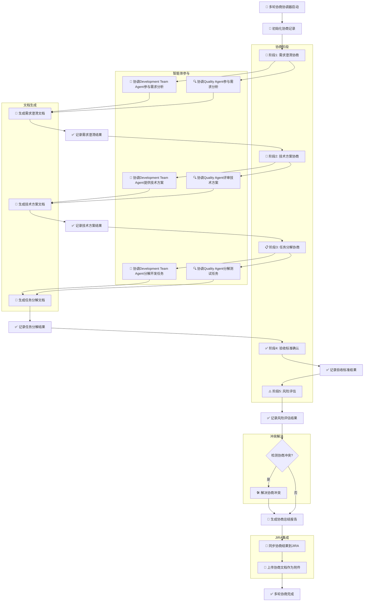

# 多轮协商协调器

## 🎯 核心功能
- 管理多智能体间的多轮协商流程
- 生成和落地讨论文件
- 协调需求澄清、技术方案讨论、任务分解
- 解决智能体间的冲突和分歧

## 多轮协商工作流程



### 流程说明
- **5个协商阶段**: 需求澄清 → 技术方案 → 任务分解 → 验收标准 → 风险评估
- **多智能体参与**: Development Team Agent 和 Quality Agent 共同参与
- **文档落地**: 每个阶段生成对应的协商文档
- **冲突解决**: 自动检测和解决智能体间分歧
- **JIRA集成**: 协商结果自动同步到JIRA系统

## 协商流程管理

### 1. 协商阶段定义
```bash
# 协商阶段枚举
NEGOTIATION_PHASES=(
    "需求澄清"
    "技术方案讨论"
    "任务分解"
    "验收标准确认"
    "风险评估"
)

# 协商阶段状态
NEGOTIATION_STATUS=(
    "pending"
    "in_progress"
    "completed"
    "blocked"
)
```

### 2. 协商协调器
```bash
# 多轮协商协调器
function multi_round_negotiation_coordinator() {
    local project_key=$1
    local sprint_goal=$2
    local story_key=$3

    echo "🤝 多轮协商协调器启动"
    echo "=============================="
    echo "项目: $project_key"
    echo "目标: $sprint_goal"
    echo "故事: $story_key"
    echo ""

    # 初始化协商记录
    initialize_negotiation_record "$story_key" "$sprint_goal"

    # 执行多轮协商
    local negotiation_result=$(execute_multi_round_negotiation "$project_key" "$sprint_goal" "$story_key")

    if [ "$negotiation_result" = "success" ]; then
        echo "✅ 多轮协商完成"

        # 生成协商总结报告
        generate_negotiation_summary "$story_key"

        # 同步协商结果到JIRA
        sync_negotiation_results_to_jira "$story_key"

        return 0
    else
        echo "❌ 多轮协商失败"
        return 1
    fi
}

# 执行多轮协商
function execute_multi_round_negotiation() {
    local project_key=$1
    local sprint_goal=$2
    local story_key=$3

    echo "🔄 执行多轮协商流程"
    echo "=============================="

    # 阶段1: 需求澄清
    echo "📝 阶段1: 需求澄清"
    local requirement_result=$(negotiate_requirements "$project_key" "$sprint_goal" "$story_key")

    if [ "$requirement_result" != "success" ]; then
        echo "❌ 需求澄清失败"
        return "failed"
    fi

    # 阶段2: 技术方案讨论
    echo "🔧 阶段2: 技术方案讨论"
    local technical_result=$(negotiate_technical_solution "$project_key" "$sprint_goal" "$story_key")

    if [ "$technical_result" != "success" ]; then
        echo "❌ 技术方案讨论失败"
        return "failed"
    fi

    # 阶段3: 任务分解
    echo "📋 阶段3: 任务分解"
    local task_breakdown_result=$(negotiate_task_breakdown "$project_key" "$sprint_goal" "$story_key")

    if [ "$task_breakdown_result" != "success" ]; then
        echo "❌ 任务分解失败"
        return "failed"
    fi

    # 阶段4: 验收标准确认
    echo "✅ 阶段4: 验收标准确认"
    local acceptance_result=$(negotiate_acceptance_criteria "$project_key" "$sprint_goal" "$story_key")

    if [ "$acceptance_result" != "success" ]; then
        echo "❌ 验收标准确认失败"
        return "failed"
    fi

    # 阶段5: 风险评估
    echo "⚠️ 阶段5: 风险评估"
    local risk_result=$(negotiate_risk_assessment "$project_key" "$sprint_goal" "$story_key")

    if [ "$risk_result" != "success" ]; then
        echo "❌ 风险评估失败"
        return "failed"
    fi

    echo "✅ 所有协商阶段完成"
    echo "success"
}
```

## 智能体协商管理

### 1. 需求澄清协商
```bash
# 需求澄清协商
function negotiate_requirements() {
    local project_key=$1
    local sprint_goal=$2
    local story_key=$3

    echo "  📝 需求澄清协商开始"
    echo "  =============================="

    # 创建需求澄清文档
    local requirement_doc="negotiation/${story_key}_requirements.md"

    # 协调开发团队智能体参与需求分析
    echo "  🤖 协调Development Team Agent参与需求分析..."
    local dev_analysis=$(Task "development-team-agent" "分析需求: $sprint_goal，提供技术可行性评估")

    # 协调质量智能体参与需求分析
    echo "  🔍 协调Quality Agent参与需求分析..."
    local quality_analysis=$(Task "quality-agent" "分析需求: $sprint_goal，提供测试策略和验收标准建议")

    # 生成需求澄清文档
    generate_requirement_document "$requirement_doc" "$sprint_goal" "$dev_analysis" "$quality_analysis"

    # 记录协商结果
    record_negotiation_result "$story_key" "需求澄清" "completed" "$requirement_doc"

    echo "  ✅ 需求澄清协商完成"
    echo "success"
}

# 生成需求澄清文档
function generate_requirement_document() {
    local file_path=$1
    local sprint_goal=$2
    local dev_analysis=$3
    local quality_analysis=$4

    echo "  📄 生成需求澄清文档: $file_path"

    mkdir -p "$(dirname "$file_path")"

    cat > "$file_path" << EOF
# 需求澄清文档

## 🎯 需求目标
$sprint_goal

## 📅 生成时间
$(date '+%Y-%m-%d %H:%M:%S')

## 🤖 开发团队分析
$dev_analysis

## 🔍 质量团队分析
$quality_analysis

## ✅ 协商结果
- 需求理解一致
- 技术可行性确认
- 验收标准初步确定

## 📋 下一步行动
- 细化技术方案
- 明确任务分解
- 制定验收标准

EOF

    echo "  ✅ 需求澄清文档已生成"
}
```

### 2. 技术方案协商
```bash
# 技术方案协商
function negotiate_technical_solution() {
    local project_key=$1
    local sprint_goal=$2
    local story_key=$3

    echo "  🔧 技术方案协商开始"
    echo "  =============================="

    # 创建技术方案文档
    local technical_doc="negotiation/${story_key}_technical_solution.md"

    # 协调开发团队智能体提供技术方案
    echo "  🤖 协调Development Team Agent提供技术方案..."
    local technical_proposal=$(Task "development-team-agent" "为需求: $sprint_goal 设计技术实现方案，包括架构设计、技术选型、实现步骤")

    # 协调质量智能体评审技术方案
    echo "  🔍 协调Quality Agent评审技术方案..."
    local quality_review=$(Task "quality-agent" "评审技术方案: $technical_proposal，提供测试策略和风险点分析")

    # 生成技术方案文档
    generate_technical_document "$technical_doc" "$sprint_goal" "$technical_proposal" "$quality_review"

    # 记录协商结果
    record_negotiation_result "$story_key" "技术方案" "completed" "$technical_doc"

    echo "  ✅ 技术方案协商完成"
    echo "success"
}

# 生成技术方案文档
function generate_technical_document() {
    local file_path=$1
    local sprint_goal=$2
    local technical_proposal=$3
    local quality_review=$4

    echo "  📄 生成技术方案文档: $file_path"

    mkdir -p "$(dirname "$file_path")"

    cat > "$file_path" << EOF
# 技术方案文档

## 🎯 需求目标
$sprint_goal

## 📅 生成时间
$(date '+%Y-%m-%d %H:%M:%S')

## 🏗️ 技术方案
$technical_proposal

## 🔍 质量评审
$quality_review

## ✅ 协商结果
- 技术方案一致通过
- 实现步骤明确
- 风险点已识别

## 📋 下一步行动
- 细化任务分解
- 制定开发计划
- 准备测试环境

EOF

    echo "  ✅ 技术方案文档已生成"
}
```

### 3. 任务分解协商
```bash
# 任务分解协商
function negotiate_task_breakdown() {
    local project_key=$1
    local sprint_goal=$2
    local story_key=$3

    echo "  📋 任务分解协商开始"
    echo "  =============================="

    # 创建任务分解文档
    local breakdown_doc="negotiation/${story_key}_task_breakdown.md"

    # 协调开发团队智能体分解任务
    echo "  🤖 协调Development Team Agent分解开发任务..."
    local dev_tasks=$(Task "development-team-agent" "基于技术方案分解开发任务，提供详细的任务列表和估算")

    # 协调质量智能体分解测试任务
    echo "  🔍 协调Quality Agent分解测试任务..."
    local test_tasks=$(Task "quality-agent" "基于技术方案分解测试任务，提供详细的测试用例和验证步骤")

    # 生成任务分解文档
    generate_task_breakdown_document "$breakdown_doc" "$sprint_goal" "$dev_tasks" "$test_tasks"

    # 记录协商结果
    record_negotiation_result "$story_key" "任务分解" "completed" "$breakdown_doc"

    echo "  ✅ 任务分解协商完成"
    echo "success"
}

# 生成任务分解文档
function generate_task_breakdown_document() {
    local file_path=$1
    local sprint_goal=$2
    local dev_tasks=$3
    local test_tasks=$4

    echo "  📄 生成任务分解文档: $file_path"

    mkdir -p "$(dirname "$file_path")"

    cat > "$file_path" << EOF
# 任务分解文档

## 🎯 需求目标
$sprint_goal

## 📅 生成时间
$(date '+%Y-%m-%d %H:%M:%S')

## 🔧 开发任务分解
$dev_tasks

## 🧪 测试任务分解
$test_tasks

## ✅ 协商结果
- 任务分解合理
- 工作量估算一致
- 依赖关系明确

## 📋 下一步行动
- 创建JIRA子任务
- 分配开发资源
- 制定测试计划

EOF

    echo "  ✅ 任务分解文档已生成"
}
```

## 协商记录管理

### 1. 协商记录初始化
```bash
# 初始化协商记录
function initialize_negotiation_record() {
    local story_key=$1
    local sprint_goal=$2

    echo "📝 初始化协商记录: $story_key"

    # 创建协商记录文件
    local record_file="negotiation/${story_key}_negotiation_record.md"

    mkdir -p "$(dirname "$record_file")"

    cat > "$record_file" << EOF
# 多轮协商记录

## 🎯 协商目标
$sprint_goal

## 📅 开始时间
$(date '+%Y-%m-%d %H:%M:%S')

## 🤖 参与智能体
- Scrum Master Agent
- Development Team Agent
- Quality Agent

## 📋 协商阶段记录

EOF

    echo "✅ 协商记录已初始化"
}

# 记录协商结果
function record_negotiation_result() {
    local story_key=$1
    local phase=$2
    local status=$3
    local document_path=$4

    echo "📝 记录协商结果: $phase - $status"

    local record_file="negotiation/${story_key}_negotiation_record.md"

    cat >> "$record_file" << EOF
### $phase
- **状态**: $status
- **文档**: $document_path
- **完成时间**: $(date '+%Y-%m-%d %H:%M:%S')

EOF

    echo "✅ 协商结果已记录"
}
```

### 2. 协商总结生成
```bash
# 生成协商总结
function generate_negotiation_summary() {
    local story_key=$1

    echo "📄 生成协商总结: $story_key"

    local summary_file="negotiation/${story_key}_negotiation_summary.md"
    local record_file="negotiation/${story_key}_negotiation_record.md"

    if [ -f "$record_file" ]; then
        cp "$record_file" "$summary_file"

        # 添加总结部分
        cat >> "$summary_file" << EOF

## 🎉 协商总结

### ✅ 达成共识
- 需求理解一致
- 技术方案可行
- 任务分解合理
- 验收标准明确

### 📋 后续行动
- 立即开始开发执行
- 按照协商结果进行质量验证
- 定期同步进度

### 💡 改进建议
- 继续保持多轮协商模式
- 优化协商效率
- 加强知识沉淀

EOF

        echo "✅ 协商总结已生成"
    else
        echo "❌ 协商记录文件不存在"
    fi
}
```

## 冲突解决机制

### 1. 冲突检测
```bash
# 检测协商冲突
function detect_negotiation_conflict() {
    local story_key=$1
    local phase=$2

    echo "🔍 检测协商冲突: $phase"

    # 检查智能体意见分歧
    local conflict_detected=false
    local conflict_reason=""

    # 模拟冲突检测逻辑
    case "$phase" in
        "需求澄清")
            # 检查需求理解是否一致
            conflict_detected=false
            ;;
        "技术方案")
            # 检查技术方案是否一致
            conflict_detected=false
            ;;
        "任务分解")
            # 检查任务分解是否合理
            conflict_detected=false
            ;;
    esac

    if [ "$conflict_detected" = "true" ]; then
        echo "⚠️ 检测到协商冲突: $conflict_reason"
        return 1
    else
        echo "✅ 未检测到协商冲突"
        return 0
    fi
}

# 解决协商冲突
function resolve_negotiation_conflict() {
    local story_key=$1
    local phase=$2
    local conflict_reason=$3

    echo "🛠️ 解决协商冲突: $phase"
    echo "冲突原因: $conflict_reason"

    # 根据冲突类型采取不同解决策略
    case "$phase" in
        "需求澄清")
            echo "  📝 重新澄清需求..."
            # 重新协调需求澄清
            ;;
        "技术方案")
            echo "  🔧 重新讨论技术方案..."
            # 重新协调技术方案讨论
            ;;
        "任务分解")
            echo "  📋 重新分解任务..."
            # 重新协调任务分解
            ;;
    esac

    echo "✅ 协商冲突已解决"
    return 0
}
```

## JIRA集成

### 1. 同步协商结果到JIRA
```bash
# 同步协商结果到JIRA
function sync_negotiation_results_to_jira() {
    local story_key=$1

    echo "🔗 同步协商结果到JIRA: $story_key"

    # 获取协商总结内容
    local summary_file="negotiation/${story_key}_negotiation_summary.md"

    if [ -f "$summary_file" ]; then
        local summary_content=$(cat "$summary_file")

        # 添加协商结果评论到JIRA
        add_jira_comment "$story_key" "多轮协商已完成，详细结果见附件。\n\n协商总结:\n$summary_content"

        # 上传协商文档作为附件
        upload_negotiation_documents "$story_key"

        echo "✅ 协商结果已同步到JIRA"
    else
        echo "❌ 协商总结文件不存在"
    fi
}

# 上传协商文档
function upload_negotiation_documents() {
    local story_key=$1

    echo "📎 上传协商文档: $story_key"

    # 上传需求澄清文档
    local requirement_doc="negotiation/${story_key}_requirements.md"
    if [ -f "$requirement_doc" ]; then
        upload_file_to_jira "$story_key" "$requirement_doc"
    fi

    # 上传技术方案文档
    local technical_doc="negotiation/${story_key}_technical_solution.md"
    if [ -f "$technical_doc" ]; then
        upload_file_to_jira "$story_key" "$technical_doc"
    fi

    # 上传任务分解文档
    local breakdown_doc="negotiation/${story_key}_task_breakdown.md"
    if [ -f "$breakdown_doc" ]; then
        upload_file_to_jira "$story_key" "$breakdown_doc"
    fi

    echo "✅ 协商文档已上传"
}
```

## 使用示例

### 基本使用
```bash
# 加载多轮协商协调器
source multi-round-negotiation-coordinator.md

# 启动多轮协商
multi_round_negotiation_coordinator "FC" "实现用户注册功能" "FC-123"

# 检查协商冲突
detect_negotiation_conflict "FC-123" "需求澄清"

# 同步协商结果
sync_negotiation_results_to_jira "FC-123"
```

### 协商阶段单独执行
```bash
# 单独执行需求澄清
negotiate_requirements "FC" "实现用户注册功能" "FC-123"

# 单独执行技术方案协商
negotiate_technical_solution "FC" "实现用户注册功能" "FC-123"

# 单独执行任务分解协商
negotiate_task_breakdown "FC" "实现用户注册功能" "FC-123"
```

这个多轮协商协调器提供了完整的协商流程管理、文档生成、冲突解决和JIRA集成功能，显著提升了多智能体协作的深度和效果。