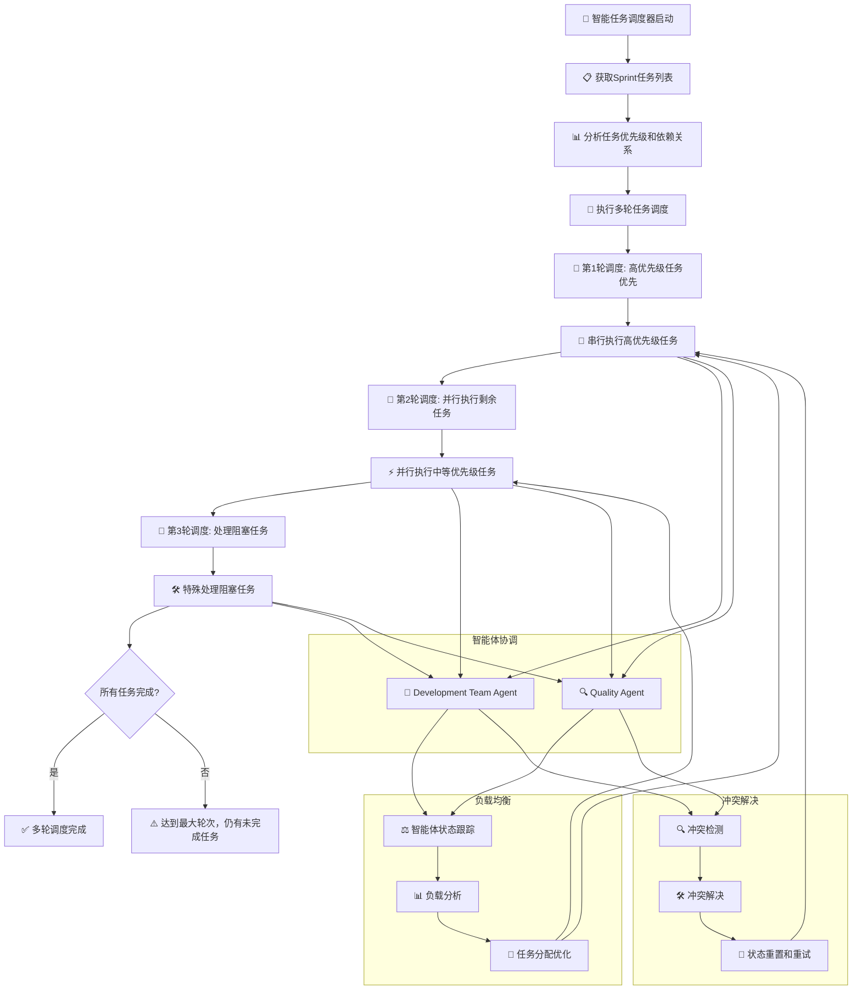

# 并行执行管理器

## 🎯 核心功能
- 多智能体并行执行引擎
- 智能负载均衡和任务分配
- 任务依赖关系管理
- 冲突检测和解决机制

## 并行执行工作流程



### 流程说明
- **智能调度**: 基于优先级和依赖关系的多轮调度策略
- **负载均衡**: 实时监控智能体状态，优化任务分配
- **冲突解决**: 自动检测和解决智能体间冲突
- **并行执行**: Development Team Agent 和 Quality Agent 并行工作

## 智能体协调管理

### 1. 智能体状态跟踪
```bash
# 智能体状态跟踪器
function track_agent_status() {
    local agent_name=$1
    local task_key=$2
    local status=$3

    echo "📊 跟踪智能体状态: $agent_name - $task_key - $status"

    local timestamp=$(date '+%Y-%m-%d %H:%M:%S')
    echo "$timestamp|$agent_name|$task_key|$status" >> agent_status_log.txt

    # 更新当前状态
    echo "$agent_name|$task_key|$status|$timestamp" > "agent_${agent_name}_current_status.txt"

    echo "✅ 智能体状态已记录"
}

# 获取智能体当前状态
function get_agent_current_status() {
    local agent_name=$1

    if [ -f "agent_${agent_name}_current_status.txt" ]; then
        cat "agent_${agent_name}_current_status.txt"
    else
        echo "$agent_name|N/A|Idle|$(date '+%Y-%m-%d %H:%M:%S')"
    fi
}

# 检查智能体是否可用
function is_agent_available() {
    local agent_name=$1

    local current_status=$(get_agent_current_status "$agent_name")
    local status=$(echo "$current_status" | cut -d'|' -f3)

    if [ "$status" = "Idle" ] || [ "$status" = "Completed" ]; then
        echo "✅ 智能体 $agent_name 可用"
        return 0
    else
        echo "⏳ 智能体 $agent_name 忙碌中 (状态: $status)"
        return 1
    fi
}
```

### 2. 智能负载均衡
```bash
# 智能体负载均衡器
function balance_agent_load() {
    local task_type=$1  # "development" 或 "quality"
    local task_key=$2

    echo "⚖️ 智能体负载均衡: $task_type - $task_key"

    # 获取可用智能体列表
    local available_agents=()

    if [ "$task_type" = "development" ]; then
        available_agents=("Development Team Agent")
    elif [ "$task_type" = "quality" ]; then
        available_agents=("Quality Agent")
    else
        echo "❌ 未知的任务类型: $task_type"
        return 1
    fi

    # 选择可用的智能体
    for agent in "${available_agents[@]}"; do
        if is_agent_available "$agent"; then
            echo "🎯 选择智能体: $agent"
            track_agent_status "$agent" "$task_key" "Assigned"
            echo "$agent"
            return 0
        fi
    done

    echo "❌ 没有可用的智能体"
    return 1
}

# 智能体任务分配
function assign_task_to_agent() {
    local task_key=$1
    local task_type=$2

    echo "📋 分配任务到智能体: $task_key - $task_type"

    # 负载均衡选择智能体
    local selected_agent=$(balance_agent_load "$task_type" "$task_key")

    if [ -n "$selected_agent" ]; then
        echo "✅ 任务分配给: $selected_agent"

        # 执行任务
        case "$selected_agent" in
            "Development Team Agent")
                track_agent_status "$selected_agent" "$task_key" "Developing"
                development_agent "$task_key" "Development"
                track_agent_status "$selected_agent" "$task_key" "Completed"
                ;;
            "Quality Agent")
                track_agent_status "$selected_agent" "$task_key" "Testing"
                quality_agent "$task_key" "Quality"
                track_agent_status "$selected_agent" "$task_key" "Completed"
                ;;
        esac

        return 0
    else
        echo "❌ 无法分配任务，没有可用智能体"
        return 1
    fi
}
```

## 任务依赖管理

### 1. 依赖关系定义
```bash
# 定义任务依赖关系
function define_task_dependencies() {
    local task_key=$1
    local dependencies=$2

    echo "🔗 定义任务依赖关系: $task_key"
    echo "依赖任务: $dependencies"

    # 保存依赖关系到文件
    echo "$task_key|$dependencies" >> task_dependencies.txt

    echo "✅ 依赖关系已定义"
}

# 检查任务依赖是否满足
function check_task_dependencies() {
    local task_key=$1

    echo "🔍 检查任务依赖: $task_key"

    # 读取依赖关系
    local dependencies=$(grep "^$task_key|" task_dependencies.txt 2>/dev/null | cut -d'|' -f2)

    if [ -z "$dependencies" ]; then
        echo "✅ 无依赖关系，可以执行"
        return 0
    fi

    # 检查每个依赖任务的状态
    IFS=',' read -ra deps <<< "$dependencies"
    local all_deps_met=true

    for dep in "${deps[@]}"; do
        local dep_status=$(get_issue_status "$dep")

        if [ "$dep_status" != "Done" ]; then
            echo "  ⏳ 依赖任务 $dep 状态: $dep_status (等待完成)"
            all_deps_met=false
        else
            echo "  ✅ 依赖任务 $dep 状态: $dep_status (已完成)"
        fi
    done

    if [ "$all_deps_met" = "true" ]; then
        echo "✅ 所有依赖已满足，可以执行"
        return 0
    else
        echo "❌ 依赖未满足，等待依赖任务完成"
        return 1
    fi
}
```

### 2. 智能体执行协调
```bash
# 协调Development Team Agent执行
function coordinate_development_agent() {
    local task_key=$1

    echo "🤖 协调Development Team Agent执行: $task_key"

    # 检查依赖关系
    if ! check_task_dependencies "$task_key"; then
        echo "⏳ 等待依赖任务完成..."
        return 1
    fi

    # 检查当前状态
    local current_status=$(get_issue_status "$task_key")

    if [ "$current_status" != "Ready for Dev" ]; then
        echo "⚠️ 任务状态为 $current_status，需要先设置为 Ready for Dev"
        return 1
    fi

    echo "✅ 依赖检查通过，启动Development Team Agent"

    # 启动Development Team Agent
    development_agent "$task_key" "Development"

    return $?
}

# 协调Quality Agent执行
function coordinate_quality_agent() {
    local task_key=$1

    echo "🔍 协调Quality Agent执行: $task_key"

    # 检查开发是否完成
    local current_status=$(get_issue_status "$task_key")

    if [ "$current_status" != "Ready for Test" ]; then
        echo "⏳ 开发尚未完成，当前状态: $current_status"
        return 1
    fi

    echo "✅ 开发已完成，启动Quality Agent"

    # 启动Quality Agent
    quality_agent "$task_key" "Quality"

    return $?
}
```

## 多轮任务调度

### 1. 多轮调度管理器
```bash
# 多轮任务调度管理器
function multi_round_scheduling_manager() {
    local sprint_id=$1
    local max_rounds=${2:-3}

    echo "🔄 多轮任务调度管理器启动 - Sprint: $sprint_id"
    echo "============================================"

    local current_round=1
    local all_tasks_completed=false

    while [ $current_round -le $max_rounds ] && [ "$all_tasks_completed" = "false" ]; do
        echo ""
        echo "🔄 第 $current_round 轮调度"
        echo "========================"

        # 执行当前轮次调度
        execute_scheduling_round "$sprint_id" "$current_round"

        # 检查是否所有任务完成
        all_tasks_completed=$(check_sprint_completion "$sprint_id")

        if [ "$all_tasks_completed" = "true" ]; then
            echo "✅ 所有任务已完成，结束调度"
            break
        fi

        ((current_round++))
    done

    if [ "$all_tasks_completed" = "false" ]; then
        echo "⚠️ 达到最大调度轮次 ($max_rounds)，仍有任务未完成"
        handle_incomplete_tasks "$sprint_id"
    fi

    echo "✅ 多轮调度完成"
}

# 执行调度轮次
function execute_scheduling_round() {
    local sprint_id=$1
    local round=$2

    echo "🔄 执行第 $round 轮调度..."

    # 根据轮次采用不同策略
    case $round in
        1)
            echo "🎯 第一轮策略：高优先级任务优先"
            schedule_high_priority_tasks "$sprint_id"
            ;;
        2)
            echo "🔄 第二轮策略：并行执行剩余任务"
            schedule_remaining_tasks "$sprint_id"
            ;;
        3)
            echo "🛠️ 第三轮策略：处理阻塞任务"
            schedule_blocked_tasks "$sprint_id"
            ;;
        *)
            echo "⚡ 额外轮次：全面并行执行"
            schedule_all_remaining_tasks "$sprint_id"
            ;;
    esac

    # 等待当前轮次任务完成
    wait_for_round_completion "$sprint_id"

    echo "✅ 第 $round 轮调度完成"
}

# 调度高优先级任务
function schedule_high_priority_tasks() {
    local sprint_id=$1

    echo "🎯 调度高优先级任务..."

    # 获取高优先级任务
    local high_priority_tasks=$(get_high_priority_tasks "$sprint_id")

    if [ -n "$high_priority_tasks" ]; then
        echo "📋 高优先级任务: $high_priority_tasks"

        # 串行执行高优先级任务以确保质量
        for task in $high_priority_tasks; do
            echo "  🚀 执行高优先级任务: $task"
            assign_task_to_agent "$task" "development"
            assign_task_to_agent "$task" "quality"
        done
    else
        echo "⏭️ 无高优先级任务"
    fi
}

# 调度剩余任务
function schedule_remaining_tasks() {
    local sprint_id=$1

    echo "🔄 调度剩余任务..."

    # 获取未完成的任务
    local remaining_tasks=$(get_remaining_tasks "$sprint_id")

    if [ -n "$remaining_tasks" ]; then
        echo "📋 剩余任务: $remaining_tasks"

        # 并行执行剩余任务
        local pids=()

        for task in $remaining_tasks; do
            (
                echo "  🚀 并行执行任务: $task"
                assign_task_to_agent "$task" "development"
                assign_task_to_agent "$task" "quality"
            ) &
            pids+=($!)
        done

        # 等待所有并行任务完成
        for pid in "${pids[@]}"; do
            wait "$pid"
        done
    else
        echo "⏭️ 无剩余任务"
    fi
}

# 调度阻塞任务
function schedule_blocked_tasks() {
    local sprint_id=$1

    echo "🛠️ 调度阻塞任务..."

    # 获取阻塞任务
    local blocked_tasks=$(get_blocked_tasks "$sprint_id")

    if [ -n "$blocked_tasks" ]; then
        echo "📋 阻塞任务: $blocked_tasks"

        # 特殊处理阻塞任务
        for task in $blocked_tasks; do
            echo "  🛠️ 处理阻塞任务: $task"
            handle_blocked_task "$task"
        done
    else
        echo "⏭️ 无阻塞任务"
    fi
}

# 获取高优先级任务
function get_high_priority_tasks() {
    local sprint_id=$1

    echo "🔍 获取高优先级任务..."

    # 这里应该实现实际的优先级判断逻辑
    # 暂时返回空值
    echo ""
}

# 获取剩余任务
function get_remaining_tasks() {
    local sprint_id=$1

    echo "🔍 获取剩余任务..."

    # 这里应该实现实际的剩余任务获取逻辑
    # 暂时返回空值
    echo ""
}

# 获取阻塞任务
function get_blocked_tasks() {
    local sprint_id=$1

    echo "🔍 获取阻塞任务..."

    # 这里应该实现实际的阻塞任务检测逻辑
    # 暂时返回空值
    echo ""
}

# 处理阻塞任务
function handle_blocked_task() {
    local task_key=$1

    echo "🛠️ 处理阻塞任务: $task_key"

    # 分析阻塞原因
    local block_reason=$(analyze_block_reason "$task_key")

    echo "📋 阻塞原因: $block_reason"

    # 根据阻塞原因采取不同措施
    case "$block_reason" in
        "dependency")
            echo "  🔗 解决依赖问题..."
            resolve_dependency_issue "$task_key"
            ;;
        "technical")
            echo "  🔧 解决技术问题..."
            resolve_technical_issue "$task_key"
            ;;
        "resource")
            echo "  👥 解决资源问题..."
            resolve_resource_issue "$task_key"
            ;;
        *)
            echo "  ❓ 未知阻塞原因，重新分配任务..."
            reassign_task "$task_key"
            ;;
    esac
}

# 检查Sprint完成状态
function check_sprint_completion() {
    local sprint_id=$1

    echo "🔍 检查Sprint完成状态..."

    # 这里应该实现实际的完成状态检查逻辑
    # 暂时返回false
    echo "false"
}

# 处理未完成任务
function handle_incomplete_tasks() {
    local sprint_id=$1

    echo "⚠️ 处理未完成任务..."

    # 这里应该实现未完成任务的处理逻辑
    echo "📋 未完成任务已记录，需要人工干预"
}
```

## 智能并行执行

### 1. 执行时间预估
```bash
# 执行时间预估器
function estimate_execution_time() {
    local task_type=$1
    local complexity=$2  # "simple", "medium", "complex"

    echo "⏱️ 预估执行时间: $task_type - $complexity"

    # 基于历史数据的预估时间（秒）
    declare -A dev_times=(
        ["simple"]=60
        ["medium"]=120
        ["complex"]=180
    )

    declare -A quality_times=(
        ["simple"]=30
        ["medium"]=60
        ["complex"]=90
    )

    local estimated_time=0

    case "$task_type" in
        "development")
            estimated_time=${dev_times[$complexity]}
            ;;
        "quality")
            estimated_time=${quality_times[$complexity]}
            ;;
        *)
            echo "❌ 未知的任务类型: $task_type"
            return 1
            ;;
    esac

    echo "📊 预估执行时间: ${estimated_time}秒"
    echo "$estimated_time"
}

# 任务复杂度分析
function analyze_task_complexity() {
    local task_summary=$1

    echo "🔍 分析任务复杂度: $task_summary"

    # 基于关键词的复杂度分析
    local simple_keywords=("bug fix" "small change" "minor update")
    local complex_keywords=("new feature" "major refactor" "architecture" "integration")

    local complexity="medium"  # 默认中等复杂度

    for keyword in "${simple_keywords[@]}"; do
        if echo "$task_summary" | grep -qi "$keyword"; then
            complexity="simple"
            break
        fi
    done

    for keyword in "${complex_keywords[@]}"; do
        if echo "$task_summary" | grep -qi "$keyword"; then
            complexity="complex"
            break
        fi
    done

    echo "📊 任务复杂度: $complexity"
    echo "$complexity"
}
```

### 2. 智能任务调度器
```bash
# 智能任务调度器
function smart_task_scheduler() {
    local sprint_id=$1

    echo "🎯 智能任务调度器启动 - Sprint: $sprint_id"
    echo "=========================================="

    # 获取Sprint中的所有任务
    local issues=$(get_sprint_issues "$sprint_id")

    # 构建任务队列
    local development_queue=()
    local quality_queue=()

    for issue in $issues; do
        local status=$(get_issue_status "$issue")
        local summary=$(get_issue_summary "$issue")

        echo "📋 调度任务: $issue - $summary (状态: $status)"

        case "$status" in
            "Ready for Dev")
                echo "  🤖 加入开发队列"
                development_queue+=("$issue")
                ;;
            "Ready for Test")
                echo "  🔍 加入质量验证队列"
                quality_queue+=("$issue")
                ;;
            "In Progress"|"Testing")
                echo "  🔄 任务进行中，跳过调度"
                ;;
            "Done")
                echo "  ✅ 任务已完成，跳过调度"
                ;;
            *)
                echo "  ❓ 未知状态，需要检查"
                ;;
        esac
    done

    echo ""
    echo "📊 调度队列统计:"
    echo "  • 开发队列: ${#development_queue[@]} 个任务"
    echo "  • 质量验证队列: ${#quality_queue[@]} 个任务"

    # 执行调度
    schedule_tasks "${development_queue[@]}" "${quality_queue[@]}"
}

# 任务调度执行
function schedule_tasks() {
    local development_tasks=("$@")
    local quality_tasks=()

    # 分离参数
    local split_index=0
    for i in "${!development_tasks[@]}"; do
        if [ "${development_tasks[$i]}" = "--" ]; then
            split_index=$i
            break
        fi
    done

    if [ $split_index -gt 0 ]; then
        quality_tasks=("${development_tasks[@]:$((split_index+1))}")
        development_tasks=("${development_tasks[@]:0:$split_index}")
    fi

    echo "🔄 执行任务调度..."

    # 并行执行开发任务
    if [ ${#development_tasks[@]} -gt 0 ]; then
        echo "🤖 并行执行开发任务..."
        local dev_pids=()

        for task in "${development_tasks[@]}"; do
            (
                echo "  🚀 启动开发: $task"
                assign_task_to_agent "$task" "development"
            ) &
            dev_pids+=($!)
        done

        # 等待开发任务完成
        echo "⏳ 等待开发任务完成..."
        for pid in "${dev_pids[@]}"; do
            wait "$pid"
        done
        echo "✅ 所有开发任务完成"
    fi

    # 并行执行质量验证任务
    if [ ${#quality_tasks[@]} -gt 0 ]; then
        echo "🔍 并行执行质量验证任务..."
        local qa_pids=()

        for task in "${quality_tasks[@]}"; do
            (
                echo "  🚀 启动质量验证: $task"
                assign_task_to_agent "$task" "quality"
            ) &
            qa_pids+=($!)
        done

        # 等待质量验证任务完成
        echo "⏳ 等待质量验证任务完成..."
        for pid in "${qa_pids[@]}"; do
            wait "$pid"
        done
        echo "✅ 所有质量验证任务完成"
    fi

    echo "🎉 任务调度完成"
}
```

## 冲突检测和解决

### 1. 冲突检测
```bash
# 智能体冲突检测
function detect_agent_conflicts() {
    echo "🔍 检测智能体冲突..."

    local conflicts_found=0

    # 检查重复任务分配
    if [ -f "agent_status_log.txt" ]; then
        local duplicate_assignments=$(sort agent_status_log.txt | cut -d'|' -f3 | uniq -d)

        if [ -n "$duplicate_assignments" ]; then
            echo "⚠️ 发现重复任务分配:"
            echo "$duplicate_assignments"
            ((conflicts_found++))
        fi
    fi

    # 检查智能体状态冲突
    local agents=("Development Team Agent" "Quality Agent")

    for agent in "${agents[@]}"; do
        if [ -f "agent_${agent}_current_status.txt" ]; then
            local status_info=$(cat "agent_${agent}_current_status.txt")
            local task_key=$(echo "$status_info" | cut -d'|' -f2)
            local status=$(echo "$status_info" | cut -d'|' -f3)
            local timestamp=$(echo "$status_info" | cut -d'|' -f4)

            # 检查长时间运行的任务
            local current_time=$(date +%s)
            local task_start_time=$(date -d "$timestamp" +%s 2>/dev/null || echo "0")
            local duration=$((current_time - task_start_time))

            if [ $duration -gt 600 ] && [ "$status" != "Idle" ] && [ "$status" != "Completed" ]; then
                echo "⚠️ 智能体 $agent 任务 $task_key 运行时间过长: $((duration/60)) 分钟"
                ((conflicts_found++))
            fi
        fi
    done

    if [ $conflicts_found -eq 0 ]; then
        echo "✅ 未检测到冲突"
        return 0
    else
        echo "❌ 检测到 $conflicts_found 个冲突"
        return 1
    fi
}

# 冲突解决器
function resolve_agent_conflicts() {
    echo "🛠️ 解决智能体冲突..."

    # 重置长时间运行的任务
    local agents=("Development Team Agent" "Quality Agent")

    for agent in "${agents[@]}"; do
        if [ -f "agent_${agent}_current_status.txt" ]; then
            local status_info=$(cat "agent_${agent}_current_status.txt")
            local task_key=$(echo "$status_info" | cut -d'|' -f2)
            local status=$(echo "$status_info" | cut -d'|' -f3)
            local timestamp=$(echo "$status_info" | cut -d'|' -f4)

            local current_time=$(date +%s)
            local task_start_time=$(date -d "$timestamp" +%s 2>/dev/null || echo "0")
            local duration=$((current_time - task_start_time))

            if [ $duration -gt 600 ] && [ "$status" != "Idle" ] && [ "$status" != "Completed" ]; then
                echo "🔄 重置智能体 $agent 的状态"
                track_agent_status "$agent" "$task_key" "Reset"
                track_agent_status "$agent" "N/A" "Idle"

                # 重新分配任务
                local task_status=$(get_issue_status "$task_key")
                if [ "$task_status" = "In Progress" ]; then
                    echo "🔄 重新分配开发任务: $task_key"
                    assign_task_to_agent "$task_key" "development" &
                elif [ "$task_status" = "Testing" ]; then
                    echo "🔄 重新分配质量验证任务: $task_key"
                    assign_task_to_agent "$task_key" "quality" &
                fi
            fi
        fi
    done

    echo "✅ 冲突解决完成"
}
```

## 使用示例

### 基本使用
```bash
# 加载并行执行管理器
source parallel-execution-manager.md

# 启动智能调度
smart_task_scheduler "123"

# 手动分配任务
assign_task_to_agent "FC-123" "development"
assign_task_to_agent "FC-123" "quality"

# 检测和解决冲突
detect_agent_conflicts
resolve_agent_conflicts
```

### 监控智能体状态
```bash
# 查看智能体状态
get_agent_current_status "Development Team Agent"
get_agent_current_status "Quality Agent"

# 预估执行时间
estimate_execution_time "development" "medium"
analyze_task_complexity "实现用户注册功能"
```

这个并行执行管理器整合了多智能体协调、任务依赖管理、负载均衡和冲突解决功能，提供了完整的并行执行能力。